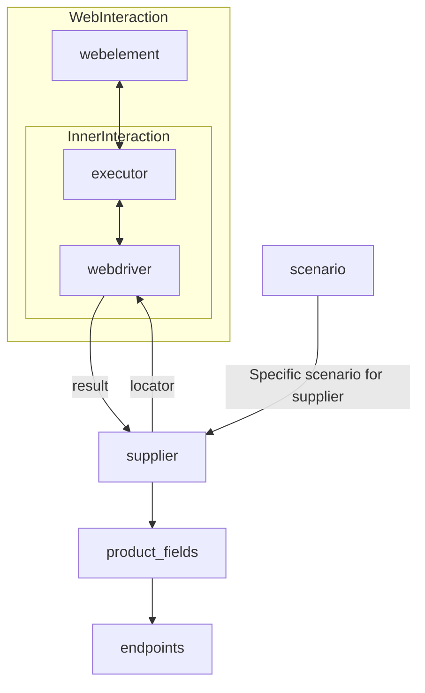

# Модуль `Supplier`

## Обзор

Модуль `Supplier` предоставляет базовый класс для всех поставщиков. В контексте кода, `Supplier` представляет собой поставщика информации. Поставщик может быть производителем товаров, данных или информации. Источники поставщика включают в себя целевую страницу веб-сайта, документ, базу данных или таблицу. Этот класс объединяет различных поставщиков под стандартизированным набором операций. У каждого поставщика есть уникальный префикс. [Подробности о префиксах](prefixes.md).

Класс `Supplier` служит основой для управления взаимодействием с поставщиками. Он обрабатывает инициализацию, настройку, аутентификацию и выполнение рабочих процессов для различных источников данных, таких как `amazon.com`, `walmart.com`, `mouser.com` и `digikey.com`. Клиенты также могут определять дополнительных поставщиков.

---

## Оглавление

1.  [Класс `Supplier`](#класс-supplier)
2.  [Атрибуты](#атрибуты)
3.  [Методы](#методы)
    -   [`__init__`](#__init__)
    -   [`_payload`](#_payload)
    -   [`login`](#login)
    -   [`run_scenario_files`](#run_scenario_files)
    -   [`run_scenarios`](#run_scenarios)
4.  [Принцип работы](#как-это-работает)

---

## Класс `Supplier`

### Базовый класс для всех поставщиков

*В контексте кода, `Supplier` представляет собой поставщика информации.
Поставщик может быть производителем товаров, данных или информации.
Источники поставщика включают в себя целевую страницу веб-сайта, документ, базу данных или таблицу.
Этот класс объединяет различных поставщиков под стандартизированным набором операций.
У каждого поставщика есть уникальный префикс. ([Подробности о префиксах](prefixes.md))*

Класс `Supplier` служит основой для управления взаимодействием с поставщиками.
Он обрабатывает инициализацию, настройку, аутентификацию и выполнение рабочих процессов для различных источников данных, таких как `amazon.com`, `walmart.com`, `mouser.com` и `digikey.com`. Клиенты также могут определять дополнительных поставщиков.

---

## Список реализованных поставщиков:

[aliexpress](aliexpress) - Реализовано с двумя рабочими процессами: `webdriver` и `api`

[amazon](amazon) - `webdriver`

[bangood](bangood) - `webdriver`

[cdata](cdata) - `webdriver`

[chat_gpt](chat_gpt) - Взаимодействует с интерфейсом ChatGPT (НЕ С МОДЕЛЬЮ!)

[ebay](ebay) - `webdriver`

[etzmaleh](etzmaleh) - `webdriver`

[gearbest](gearbest) - `webdriver`

[grandadvance](grandadvance) - `webdriver`

[hb](hb) - `webdriver`

[ivory](ivory) - `webdriver`

[ksp](ksp) - `webdriver`

[kualastyle](kualastyle) `webdriver`

[morlevi](morlevi) `webdriver`

[visualdg](visualdg) `webdriver`

[wallashop](wallashop) `webdriver`

[wallmart](wallmart) `webdriver`

[Подробности о WebDriver :class: `Driver`](../webdriver)
[Подробности о рабочих процессах :class: `Scenario`](../scenarios)

---



## Атрибуты

- **`supplier_id`** *(int)*: Уникальный идентификатор поставщика.
- **`supplier_prefix`** *(str)*: Префикс поставщика, например, `'amazon'`, `'aliexpress'`.
- **`supplier_settings`** *(dict)*: Настройки поставщика, загруженные из JSON-файла.
- **`locale`** *(str)*: Код локализации (по умолчанию: `'en'`).
- **`price_rule`** *(str)*: Правила для расчетов цен (например, правила НДС).
- **`related_modules`** *(module)*: Вспомогательные модули для специфических операций поставщика.
- **`scenario_files`** *(list)*: Список файлов сценариев для выполнения.
- **`current_scenario`** *(dict)*: Сценарий, выполняемый в данный момент.
- **`login_data`** *(dict)*: Данные для аутентификации.
- **`locators`** *(dict)*: Словарь локаторов веб-элементов.
- **`driver`** *(Driver)*: Экземпляр WebDriver для взаимодействия с веб-сайтом поставщика.
- **`parsing_method`** *(str)*: Метод разбора данных (например, `'webdriver'`, `'api'`, `'xls'`, `'csv'`).

---

## Методы

### `__init__`

**Конструктор класса `Supplier`.**

```python
def __init__(self, supplier_prefix: str, locale: str = 'en', webdriver: str | Driver | bool = 'default', *attrs, **kwargs):
    """Инициализирует экземпляр класса Supplier.

    Args:
        supplier_prefix (str): Префикс поставщика.
        locale (str, optional): Код локализации. По умолчанию 'en'.
        webdriver (str | Driver | bool, optional): Тип WebDriver. По умолчанию 'default'.

    Raises:
        DefaultSettingsException: Если настройки по умолчанию настроены неправильно.
    """
```

### `_payload`

**Загружает настройки поставщика и инициализирует WebDriver.**

```python
def _payload(self, webdriver: str | Driver | bool, *attrs, **kwargs) -> bool:
    """Загружает настройки, локаторы и инициализирует WebDriver.

    Args:
        webdriver (str | Driver | bool): Тип WebDriver.

    Returns:
        bool: Возвращает `True`, если загрузка прошла успешно.
    """
```

### `login`

**Обрабатывает аутентификацию на веб-сайте поставщика.**

```python
def login(self) -> bool:
    """Аутентифицирует пользователя на веб-сайте поставщика.

    Returns:
        bool: Возвращает `True`, если вход в систему выполнен успешно.
    """
```

### `run_scenario_files`

**Выполняет один или несколько файлов сценариев.**

```python
def run_scenario_files(self, scenario_files: str | List[str] = None) -> bool:
    """Запускает предоставленные файлы сценариев.

    Args:
        scenario_files (str | List[str], optional): Список или путь к файлам сценариев.

    Returns:
        bool: Возвращает `True`, если сценарии выполнены успешно.
    """
```

### `run_scenarios`

**Выполняет указанные сценарии.**

```python
def run_scenarios(self, scenarios: dict | list[dict]) -> bool:
    """Выполняет указанные сценарии.

    Args:
        scenarios (dict | list[dict]): Сценарии для выполнения.

    Returns:
        bool: Возвращает `True`, если все сценарии выполнены успешно.
    """
```

---

## Как это работает

1. **Инициализация**:
    - Метод `__init__` устанавливает префикс поставщика, локализацию и WebDriver.
    Пример:
    ```python
    supplier = Supplier(supplier_prefix='aliexpress', locale='en', webdriver='chrome')
    ```

2. **Загрузка настроек**:
    - `_payload` загружает конфигурацию, инициализирует локаторы и WebDriver.
    Пример:
    ```python
    supplier._payload(webdriver='firefox')
    ```

3. **Аутентификация**:
    - `login` выполняет вход пользователя на веб-сайт поставщика.
    Пример:
    ```python
    supplier.login()
    ```

4. **Выполнение сценариев**:
    - **Запуск файлов сценариев**:
    ```python
    supplier.run_scenario_files(['example_scenario.json'])
    ```
    - **Запуск конкретных сценариев**:
    ```python
    supplier.run_scenarios([{'action': 'scrape', 'target': 'product_list'}])
    ```