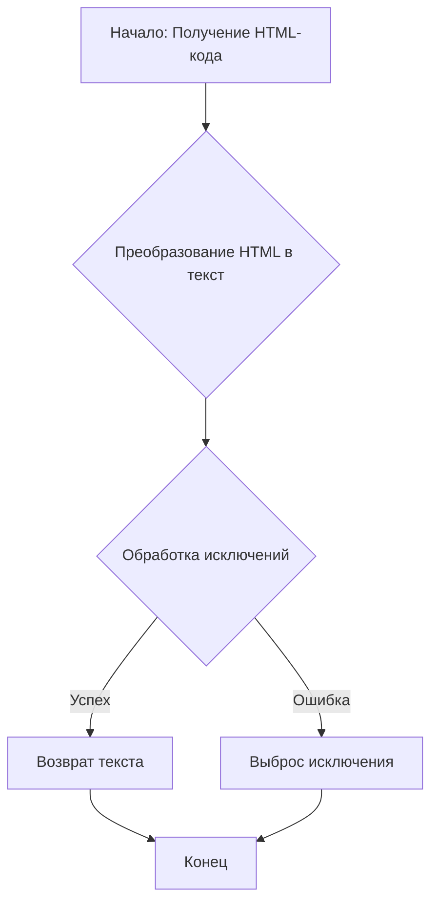
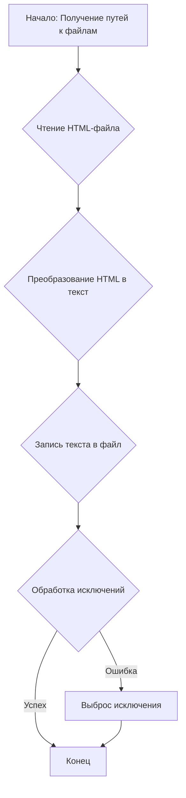

# Модуль для конвертации HTML в текст (экспериментальная версия)

## Обзор

Модуль `html2text.py` предназначен для конвертации HTML-контента в текстовый формат. Он включает в себя функции для чтения HTML-файлов, преобразования HTML в текст и сохранения полученного текста в файл. Этот модуль является частью экспериментов по конвертации данных в проекте `hypotez`.

## Подробней

Данный модуль предоставляет функциональность для извлечения текстового содержимого из HTML-документов. Он использует сторонние библиотеки и собственные реализации для обеспечения этой конвертации. Модуль предназначен для использования в задачах, где необходимо анализировать и обрабатывать текст, извлеченный из HTML-страниц.

## Функции

### `html2text`

```python
def html2text(html: str) -> str:
    """Конвертирует HTML в текст.
    Args:
        html (str): HTML для конвертации.

    Returns:
        str: Текст, полученный из HTML.

    Raises:
        Exception: Если возникает ошибка при конвертации.
    """
    ...
```

**Назначение**: Конвертирует HTML-строку в текстовый формат.

**Параметры**:
- `html` (str): HTML-код, который необходимо преобразовать в текст.

**Возвращает**:
- `str`: Текстовое представление HTML-кода.

**Вызывает исключения**:
- `Exception`: В случае возникновения ошибки в процессе конвертации HTML в текст.

**Как работает функция**:
1. Функция принимает HTML-код в виде строки.
2. Она использует стороннюю библиотеку или собственный алгоритм для преобразования HTML в чистый текст.
3. Возвращает полученный текст.



**Примеры**:
```python
from src.utils.convertors import html2text

html_code = "<p>Это <b>пример</b> HTML.</p>"
text = html2text(html_code)
print(text)  # Вывод: "Это пример HTML."
```

### `html2text_file`

```python
def html2text_file(html_file: str, text_file: str) -> None:
    """Конвертирует HTML-файл в текст.
    Args:
        html_file (str): Путь к HTML-файлу.
        text_file (str): Путь к текстовому файлу для сохранения результата.

    Returns:
        None

    Raises:
        Exception: Если возникает ошибка при чтении или записи файлов.
    """
    ...
```

**Назначение**: Конвертирует содержимое HTML-файла в текст и сохраняет результат в текстовый файл.

**Параметры**:
- `html_file` (str): Путь к HTML-файлу, который нужно конвертировать.
- `text_file` (str): Путь к текстовому файлу, в который будет сохранен результат конвертации.

**Возвращает**:
- `None`: Функция ничего не возвращает.

**Вызывает исключения**:
- `Exception`: В случае возникновения ошибки при чтении HTML-файла или записи в текстовый файл.

**Как работает функция**:
1. Функция принимает пути к HTML-файлу и текстовому файлу.
2. Она считывает содержимое HTML-файла.
3. Преобразует HTML-содержимое в текст с использованием сторонней библиотеки или собственного алгоритма.
4. Записывает полученный текст в указанный текстовый файл.



**Примеры**:
```python
from src.utils.convertors import html2text_file

html_file_path = "example.html"
text_file_path = "example.txt"
html2text_file(html_file_path, text_file_path)
```

## Пример использования

```python
import header
from src import gs
from src.utils.convertors import html2text, html2text_file
from src.utils.file import read_text_file, save_text_file

html = read_text_file(gs.path.google_drive / 'html2text' / 'index.html')
text_from_html = html2text(html)
save_text_file(text_from_html, gs.path.google_drive / 'html2text' / 'index.txt')
...
```

В этом примере HTML-файл читается, преобразуется в текст и сохраняется в текстовый файл.