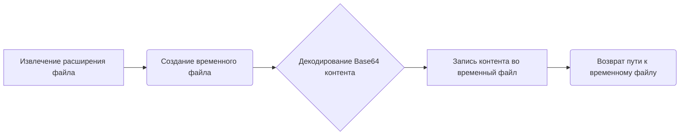
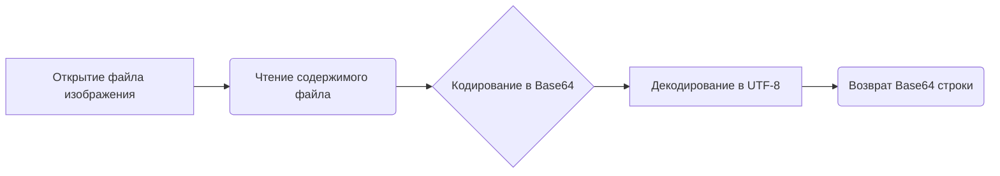

# Модуль для преобразования Base64 в файл

## Обзор

Модуль `src.utils.convertors.base64` предоставляет функции для работы с кодировкой Base64.
Он позволяет преобразовывать контент, закодированный в Base64, во временные файлы.

## Подробней

Модуль содержит функции для декодирования Base64 контента и записи его во временный файл с указанным расширением. Это может быть полезно, когда необходимо временно сохранить данные, полученные в формате Base64, например, изображения или другие файлы, для последующей обработки.

## Функции

### `base64_to_tmpfile`

```python
def base64_to_tmpfile(content: str, file_name: str) -> str:
    """
    Convert Base64 encoded content to a temporary file.

    This function decodes the Base64 encoded content and writes it to a temporary file with the same extension as the provided file name. 
    The path to the temporary file is returned.

    Args:
        content (str): Base64 encoded content to be decoded and written to the file.
        file_name (str): Name of the file used to extract the file extension for the temporary file.

    Returns:
        str: Path to the temporary file.

    Example:
        >>> base64_content = "SGVsbG8gd29ybGQh"  # Base64 encoded content "Hello world!"
        >>> file_name = "example.txt"
        >>> tmp_file_path = base64_to_tmpfile(base64_content, file_name)
        >>> print(f"Temporary file created at: {tmp_file_path}")
        Temporary file created at: /tmp/tmpfile.txt
    """
    ...
```

**Назначение**: Преобразует Base64-закодированный контент во временный файл.

**Параметры**:
- `content` (str): Base64-закодированный контент, который необходимо декодировать и записать в файл.
- `file_name` (str): Имя файла, используемое для извлечения расширения для временного файла.

**Возвращает**:
- `str`: Путь к созданному временному файлу.

**Как работает функция**:

1.  **Извлечение расширения файла**: Из имени файла (`file_name`) извлекается расширение.
2.  **Создание временного файла**: Создается временный файл с использованием модуля `tempfile`. Файл создается с расширением, полученным на предыдущем шаге. Параметр `delete=False` указывает, что файл не должен быть автоматически удален после закрытия.
3.  **Декодирование и запись контента**: Base64-закодированный контент (`content`) декодируется с помощью `base64.b64decode()` и записывается во временный файл.
4.  **Сохранение пути к файлу**: Путь к созданному временному файлу сохраняется в переменной `path`.
5.  **Возврат пути**: Функция возвращает путь к созданному временному файлу.



**Примеры**:

```python
>>> base64_content = "SGVsbG8gd29ybGQh"  # Base64 encoded content "Hello world!"
>>> file_name = "example.txt"
>>> tmp_file_path = base64_to_tmpfile(base64_content, file_name)
>>> print(f"Temporary file created at: {tmp_file_path}")
Temporary file created at: /tmp/tmpfile.txt
```

### `base64encode`

```python
def base64encode(image_path):
    # Function to encode the image
  with open(image_path, "rb") as image_file:
    return base64.b64encode(image_file.read()).decode('utf-8')
```

**Назначение**: Кодирует изображение в формат Base64.

**Параметры**:
- `image_path` (str): Путь к изображению, которое необходимо закодировать.

**Возвращает**:
- `str`: Base64-представление изображения.

**Как работает функция**:

1.  **Открытие файла изображения**: Открывает файл изображения, расположенный по пути `image_path`, в режиме чтения байтов (`"rb"`).
2.  **Чтение содержимого файла**: Считывает все содержимое файла изображения.
3.  **Кодирование в Base64**: Кодирует содержимое файла изображения в формат Base64 с помощью функции `base64.b64encode()`.
4.  **Декодирование в UTF-8**: Декодирует полученное Base64-представление в строку UTF-8, чтобы вернуть его в виде текста.
5.  **Возврат закодированной строки**: Возвращает Base64-закодированную строку.



**Примеры**:

```python
>>> image_path = "example.png"
>>> base64_string = base64encode(image_path)
>>> print(f"Base64 string: {base64_string[:100]}...")
Base64 string: iVBORw0KGgoAAAANSUhEUgAAA...