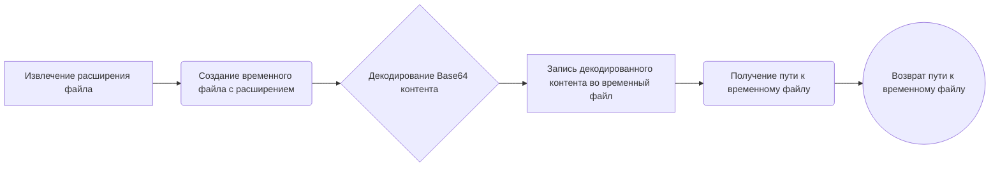
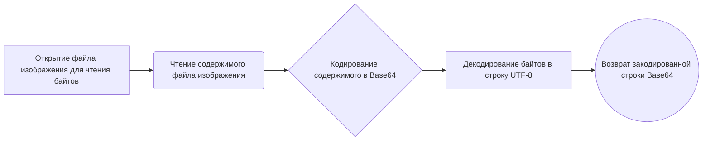

# Модуль для конвертации Base64 в файлы
## Обзор

Модуль `base64` предназначен для конвертации контента, закодированного в формате Base64, во временный файл. Он предоставляет функции для декодирования Base64 и записи полученных данных во временный файл с указанным расширением. Это может быть полезно, когда необходимо обработать закодированные данные, например, изображения или другие файлы, полученные в виде Base64-строки.

## Подробней

Модуль содержит функции для декодирования Base64-контента и записи его во временный файл. Он использует модуль `tempfile` для создания временных файлов и модуль `os` для работы с путями к файлам.
Этот код используется в проекте для обработки данных, которые передаются в закодированном виде, например, для сохранения изображений, полученных в формате Base64.

## Функции

### `base64_to_tmpfile`

```python
def base64_to_tmpfile(content: str, file_name: str) -> str:
    """
    Convert Base64 encoded content to a temporary file.

    This function decodes the Base64 encoded content and writes it to a temporary file with the same extension as the provided file name. 
    The path to the temporary file is returned.

    Args:
        content (str): Base64 encoded content to be decoded and written to the file.
        file_name (str): Name of the file used to extract the file extension for the temporary file.

    Returns:
        str: Path to the temporary file.

    Example:
        >>> base64_content = "SGVsbG8gd29ybGQh"  # Base64 encoded content "Hello world!"
        >>> file_name = "example.txt"
        >>> tmp_file_path = base64_to_tmpfile(base64_content, file_name)
        >>> print(f"Temporary file created at: {tmp_file_path}")
        Temporary file created at: /tmp/tmpfile.txt
    """
    ...
```

**Назначение**: Преобразует содержимое, закодированное в Base64, во временный файл.

**Параметры**:
- `content` (str): Содержимое, закодированное в Base64, которое необходимо декодировать и записать в файл.
- `file_name` (str): Имя файла, используемое для извлечения расширения файла для временного файла.

**Возвращает**:
- `str`: Путь к созданному временному файлу.

**Как работает функция**:

1.  **Получение расширения файла**: Из имени файла извлекается расширение.
2.  **Создание временного файла**: Создается временный файл с использованием модуля `tempfile`. Файл создается с расширением, полученным из имени исходного файла.
3.  **Декодирование и запись данных**: Содержимое, закодированное в Base64, декодируется и записывается во временный файл.
4.  **Получение пути к файлу**: Из временного файла извлекается путь к файлу.
5.  **Возврат пути к файлу**: Функция возвращает путь к созданному временному файлу.



**Примеры**:

```python
>>> base64_content = "SGVsbG8gd29ybGQh"  # Base64 encoded content "Hello world!"
>>> file_name = "example.txt"
>>> tmp_file_path = base64_to_tmpfile(base64_content, file_name)
>>> print(f"Temporary file created at: {tmp_file_path}")
Temporary file created at: /tmp/tmpfile.txt
```

### `base64encode`

```python
def base64encode(image_path):
    # Function to encode the image
  with open(image_path, "rb") as image_file:
    return base64.b64encode(image_file.read()).decode('utf-8')
```

**Назначение**: Кодирует изображение в формат Base64.

**Параметры**:
- `image_path` (str): Путь к файлу изображения, который необходимо закодировать.

**Возвращает**:
- `str`: Строка, представляющая закодированное в Base64 содержимое изображения.

**Как работает функция**:

1.  **Открытие файла изображения**: Открывает файл изображения по указанному пути в режиме чтения байтов (`"rb"`).
2.  **Чтение содержимого файла**: Читает все содержимое файла изображения.
3.  **Кодирование в Base64**: Кодирует прочитанное содержимое в формат Base64 с помощью функции `base64.b64encode()`.
4.  **Декодирование в UTF-8**: Декодирует полученные байты в строку UTF-8, чтобы вернуть строковое представление закодированного содержимого.
5.  **Возврат закодированной строки**: Возвращает строку, содержащую Base64 представление изображения.



**Примеры**:

```python
image_path = "example.jpg"
encoded_string = base64encode(image_path)
print(f"Encoded string: {encoded_string[:100]}...")  # Вывод первых 100 символов закодированной строки