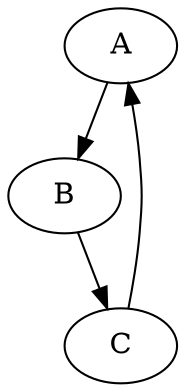

# Модуль hypotez/src/utils/convertors/dot.py

## Обзор

Модуль `dot.py` предоставляет функцию `dot2png` для конвертации файлов формата DOT в PNG изображения с использованием библиотеки Graphviz.  Модуль предназначен для обработки входных DOT-файлов и сохранения результатов в выходных PNG-файлах.  Он использует библиотеку `graphviz` для визуализации данных.  Модуль принимает на вход имя файла DOT и имя файла PNG,  а также обрабатывает потенциальные ошибки, связанные с отсутствием файла DOT и другими проблемами во время конвертации.


## Функции

### `dot2png`

**Описание**: Функция преобразует файл DOT в изображение PNG.

**Параметры**:
- `dot_file` (str): Путь к входному файлу DOT.
- `png_file` (str): Путь для сохранения выходного файла PNG.

**Возвращает**:
-  `None`

**Вызывает исключения**:
- `FileNotFoundError`: Возникает, если входной файл DOT не найден.
- `Exception`: Возникает при других ошибках во время преобразования.

**Пример использования**:

```python
dot2png('example.dot', 'output.png')
```

**Детали реализации**:
1. Функция открывает файл DOT для чтения.
2. Создает объект `Source` из содержимого файла DOT.
3. Устанавливает формат `png` для объекта `Source`.
4. Использует метод `render` для сохранения результата в файл PNG, и опционально очищает временные файлы.
5. Обрабатывает исключение `FileNotFoundError` для обработки случая отсутствия файла.
6. Обрабатывает общее исключение `Exception` для обработки других возможных ошибок.


## Использование из командной строки

Модуль можно использовать из командной строки:

```bash
python dot2png.py <input_dot_file> <output_png_file>
```

где `<input_dot_file>` - имя входного файла DOT, а `<output_png_file>` - имя выходного файла PNG.


## Пример содержимого файла `example.dot`



Этот DOT файл описывает направленный граф с узлами A, B, C.


```