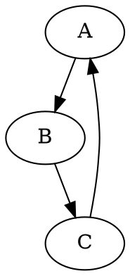

# Модуль `dot`

## Обзор

Модуль `dot` предназначен для конвертации файлов в формате DOT в изображения PNG с использованием библиотеки Graphviz. Он предоставляет функцию `dot2png`, которая принимает путь к DOT-файлу и путь для сохранения PNG-изображения.

## Подробней

Этот модуль используется для автоматического создания визуализаций графов, определенных в формате DOT. Он может быть полезен для генерации диаграмм, блок-схем и других графических представлений данных. Функция `dot2png` считывает содержимое DOT-файла, создает объект `Source` из библиотеки `graphviz`, и затем рендерит его в PNG-изображение.

## Функции

### `dot2png`

```python
def dot2png(dot_file: str, png_file: str) -> None:
    """ Converts a DOT file to a PNG image.

    Args:
        dot_file (str): The path to the input DOT file.
        png_file (str): The path where the output PNG file will be saved.

    Raises:
        FileNotFoundError: If the DOT file does not exist.
        Exception: For other errors during conversion.

    Example:
        >>> dot2png('example.dot', 'output.png')
        
        This converts the DOT file 'example.dot' into a PNG image named 'output.png'.
        
        Sample DOT content for 'example.dot':
        
        ```dot
        digraph G {
            A -> B;
            B -> C;
            C -> A;
        }
        ```
        
        To run the script from the command line:
        
        ```bash
        python dot2png.py example.dot output.png
        ```

        This command will create a PNG file named 'output.png' from the graph defined in 'example.dot'.
    """
```

**Описание**: Преобразует DOT-файл в PNG-изображение.

**Параметры**:
- `dot_file` (str): Путь к входному DOT-файлу.
- `png_file` (str): Путь, по которому будет сохранено выходное PNG-изображение.

**Возвращает**: None

**Вызывает исключения**:
- `FileNotFoundError`: Если DOT-файл не существует.
- `Exception`: При возникновении других ошибок во время конвертации.

**Примеры**:

```python
dot2png('example.dot', 'output.png')
```

Этот вызов преобразует файл `example.dot` в изображение `output.png`. Содержимое файла `example.dot` может быть следующим:



Для запуска скрипта из командной строки:

```bash
python dot2png.py example.dot output.png
```

Эта команда создаст PNG-файл с именем `output.png` из графа, определенного в `example.dot`.