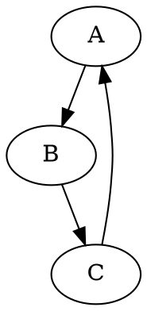

# Модуль `dot`

## Обзор

Модуль `dot` предоставляет функциональность для преобразования файлов в формате DOT в изображения PNG с использованием библиотеки Graphviz.

## Содержание

- [Обзор](#обзор)
- [Функции](#функции)
    - [`dot2png`](#dot2png)

## Функции

### `dot2png`

**Описание**: Преобразует файл DOT в изображение PNG.

**Параметры**:
- `dot_file` (str): Путь к входному файлу DOT.
- `png_file` (str): Путь, куда будет сохранен выходной файл PNG.

**Вызывает исключения**:
- `FileNotFoundError`: Если файл DOT не существует.
- `Exception`: В случае других ошибок во время преобразования.

**Пример использования**:

```python
dot2png('example.dot', 'output.png')
```
Этот код преобразует файл DOT `example.dot` в изображение PNG `output.png`.

Пример содержимого файла `example.dot`:


Для запуска скрипта из командной строки:
```bash
python dot2png.py example.dot output.png
```
Эта команда создаст PNG файл `output.png` на основе графа, определенного в `example.dot`.
```