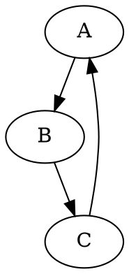

# Модуль `dot`

## Обзор

Модуль `dot` предназначен для конвертации файлов в формате DOT в изображения PNG с использованием библиотеки Graphviz.

## Оглавление

- [Обзор](#обзор)
- [Функции](#функции)
    - [`dot2png`](#dot2png)

## Функции

### `dot2png`

**Описание**: Конвертирует файл DOT в изображение PNG.

**Параметры**:
- `dot_file` (str): Путь к входному файлу DOT.
- `png_file` (str): Путь, по которому будет сохранен выходной файл PNG.

**Возвращает**:
- `None`: Функция ничего не возвращает.

**Вызывает исключения**:
- `FileNotFoundError`: Если файл DOT не существует.
- `Exception`: При возникновении других ошибок во время конвертации.

**Пример:**

```python
dot2png('example.dot', 'output.png')
```

Эта команда конвертирует файл DOT 'example.dot' в изображение PNG с именем 'output.png'.

Пример содержимого DOT-файла `example.dot`:



Для запуска скрипта из командной строки:

```bash
python dot2png.py example.dot output.png
```

Эта команда создаст файл PNG с именем 'output.png' из графа, определенного в 'example.dot'.