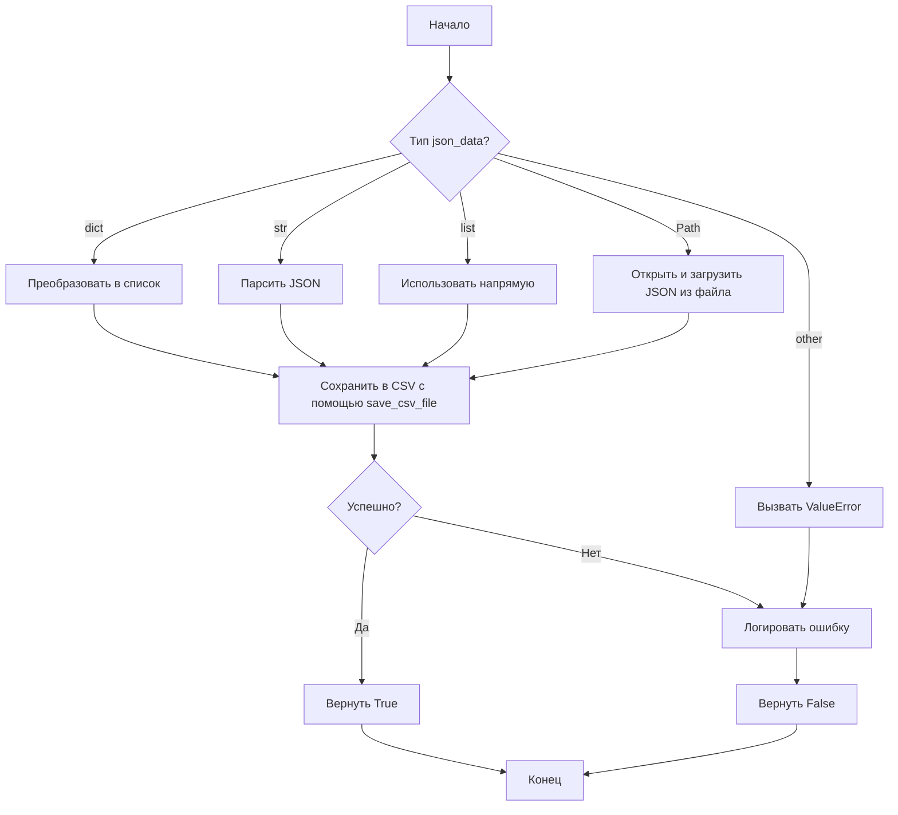
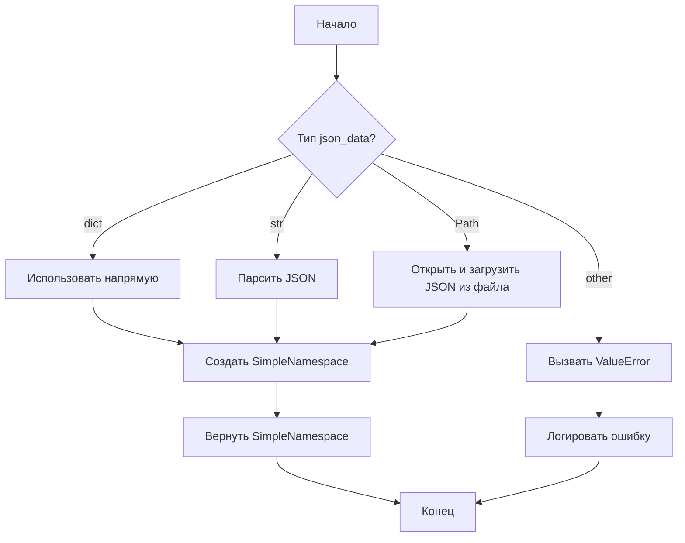
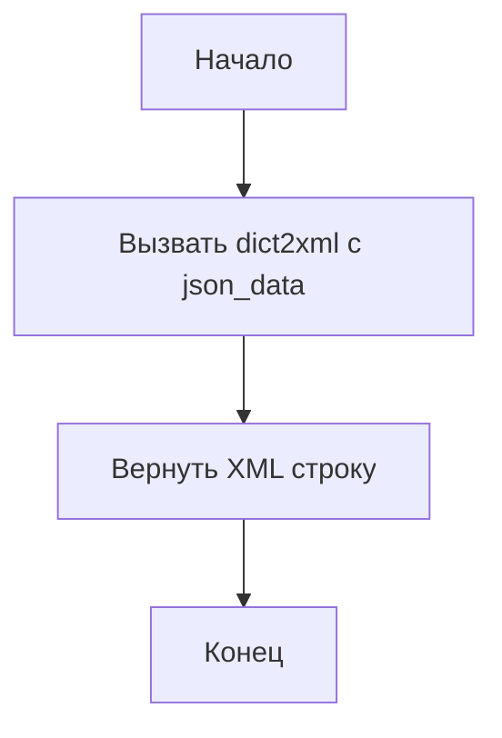
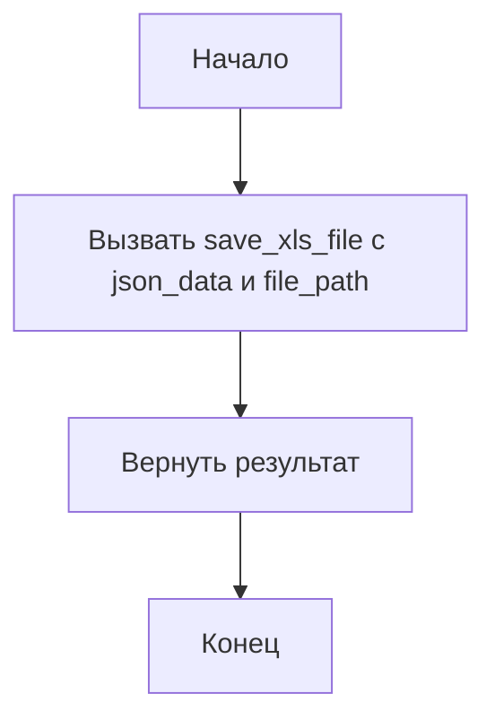

# Модуль для конвертации JSON данных в различные форматы

## Обзор

Модуль `src.utils.convertors.json` предоставляет функции для преобразования JSON данных в различные форматы, такие как CSV, SimpleNamespace, XML и XLS. Это позволяет удобно интегрировать и использовать JSON данные в различных приложениях и системах.

## Подробней

Этот модуль содержит функции, которые позволяют преобразовывать JSON данные или JSON файлы в другие форматы. 
Функции включают:

- Преобразование в формат CSV с помощью разделителя-запятой.
- Преобразование в объект SimpleNamespace.
- Преобразование в формат XML.
- Преобразование в формат XLS.

Модуль использует другие утилиты, такие как `save_csv_file` из `src.utils.csv`, `j_dumps` из `src.utils.jjson`, `save_xls_file` из `src.utils.xls` и `dict2xml` из `src.utils.convertors.dict`. Он также использует модуль `logger` из `src.logger.logger` для регистрации ошибок.

## Функции

### `json2csv`

```python
def json2csv(json_data: str | list | dict | Path, csv_file_path: str | Path) -> bool:
    """
    Convert JSON data or JSON file to CSV format with a comma delimiter.

    Args:
        json_data (str | list | dict | Path): JSON data as a string, list of dictionaries, or file path to a JSON file.
        csv_file_path (str | Path): Path to the CSV file to write.

    Returns:
        bool: True if successful, False otherwise.

    Raises:
        ValueError: If unsupported type for json_data.
        Exception: If unable to parse JSON or write CSV.
    """
```

**Назначение**: Преобразует JSON данные или JSON файл в формат CSV с использованием запятой в качестве разделителя.

**Параметры**:
- `json_data` (str | list | dict | Path): JSON данные в виде строки, списка словарей или пути к JSON файлу.
- `csv_file_path` (str | Path): Путь к CSV файлу для записи.

**Возвращает**:
- `bool`: `True`, если преобразование прошло успешно, `False` в противном случае.

**Вызывает исключения**:
- `ValueError`: Если передан неподдерживаемый тип для `json_data`.
- `Exception`: Если не удается распарсить JSON или записать CSV.

**Как работает функция**:

1. **Загрузка JSON данных**: Функция сначала определяет тип входных данных (`json_data`).
2. **Обработка данных**:
   - Если `json_data` является словарем, он преобразуется в список, содержащий этот словарь.
   - Если `json_data` является строкой, она парсится как JSON.
   - Если `json_data` является списком, он используется напрямую.
   - Если `json_data` является путем к файлу, файл открывается и JSON данные загружаются из него.
   - Если тип `json_data` не поддерживается, вызывается исключение `ValueError`.
3. **Сохранение в CSV**: Далее, полученные данные передаются в функцию `save_csv_file` для сохранения в CSV файл.
4. **Обработка ошибок**: Если в процессе возникают ошибки, они логируются с использованием `logger.error`.



**Примеры**:

```python
from pathlib import Path
import json

# Пример 1: Преобразование JSON строки в CSV файл
json_string = '[{"name": "John", "age": 30}, {"name": "Jane", "age": 25}]'
csv_file = "output.csv"
result = json2csv(json_string, csv_file)
print(f"Результат преобразования JSON строки в CSV: {result}")

# Пример 2: Преобразование JSON файла в CSV файл
json_file_path = Path("data.json")
with open(json_file_path, 'w', encoding='utf-8') as f:
    json.dump([{"name": "Alice", "age": 28}, {"name": "Bob", "age": 32}], f)
csv_file = "output2.csv"
result = json2csv(json_file_path, csv_file)
print(f"Результат преобразования JSON файла в CSV: {result}")

# Пример 3: Преобразование словаря в CSV файл
json_dict = {"name": "Eve", "age": 22}
csv_file = "output3.csv"
result = json2csv(json_dict, csv_file)
print(f"Результат преобразования словаря в CSV: {result}")
```

### `json2ns`

```python
def json2ns(json_data: str | dict | Path) -> SimpleNamespace:
    """
    Convert JSON data or JSON file to SimpleNamespace object.

    Args:
        json_data (str | dict | Path): JSON data as a string, dictionary, or file path to a JSON file.

    Returns:
        SimpleNamespace: Parsed JSON data as a SimpleNamespace object.
    
    Raises:
        ValueError: If unsupported type for json_data.
        Exception: If unable to parse JSON.
    """
```

**Назначение**: Преобразует JSON данные или JSON файл в объект `SimpleNamespace`.

**Параметры**:
- `json_data` (str | dict | Path): JSON данные в виде строки, словаря или пути к JSON файлу.

**Возвращает**:
- `SimpleNamespace`: Объект `SimpleNamespace`, представляющий JSON данные.

**Вызывает исключения**:
- `ValueError`: Если передан неподдерживаемый тип для `json_data`.
- `Exception`: Если не удается распарсить JSON.

**Как работает функция**:

1. **Определение типа входных данных**: Функция определяет тип входных данных (`json_data`).
2. **Преобразование данных**:
   - Если `json_data` является словарем, он используется напрямую.
   - Если `json_data` является строкой, она парсится как JSON.
   - Если `json_data` является путем к файлу, файл открывается и JSON данные загружаются из него.
   - Если тип `json_data` не поддерживается, вызывается исключение `ValueError`.
3. **Создание SimpleNamespace**: Создается объект `SimpleNamespace` на основе полученных JSON данных.
4. **Обработка ошибок**: Если в процессе возникают ошибки, они логируются с использованием `logger.error`.



**Примеры**:

```python
from pathlib import Path
import json
from types import SimpleNamespace

# Пример 1: Преобразование JSON строки в SimpleNamespace
json_string = '{"name": "John", "age": 30}'
result = json2ns(json_string)
print(f"Результат преобразования JSON строки в SimpleNamespace: {result.name}, {result.age}")

# Пример 2: Преобразование JSON файла в SimpleNamespace
json_file_path = Path("data.json")
with open(json_file_path, 'w', encoding='utf-8') as f:
    json.dump({"name": "Alice", "age": 28}, f)
result = json2ns(json_file_path)
print(f"Результат преобразования JSON файла в SimpleNamespace: {result.name}, {result.age}")

# Пример 3: Преобразование словаря в SimpleNamespace
json_dict = {"name": "Eve", "age": 22}
result = json2ns(json_dict)
print(f"Результат преобразования словаря в SimpleNamespace: {result.name}, {result.age}")
```

### `json2xml`

```python
def json2xml(json_data: str | dict | Path, root_tag: str = "root") -> str:
    """
    Convert JSON data or JSON file to XML format.

    Args:
        json_data (str | dict | Path): JSON data as a string, dictionary, or file path to a JSON file.
        root_tag (str): The root element tag for the XML.

    Returns:
        str: The resulting XML string.

    Raises:
        ValueError: If unsupported type for json_data.
        Exception: If unable to parse JSON or convert to XML.
    """
```

**Назначение**: Преобразует JSON данные или JSON файл в формат XML.

**Параметры**:
- `json_data` (str | dict | Path): JSON данные в виде строки, словаря или пути к JSON файлу.
- `root_tag` (str): Корневой элемент XML (по умолчанию "root").

**Возвращает**:
- `str`: XML строка.

**Вызывает исключения**:
- `ValueError`: Если передан неподдерживаемый тип для `json_data`.
- `Exception`: Если не удается распарсить JSON или преобразовать в XML.

**Как работает функция**:

1. **Преобразование в XML**: Функция вызывает функцию `dict2xml` из модуля `src.utils.convertors.dict`, передавая ей `json_data` для преобразования в XML.
2. **Возврат XML**: Возвращает полученную XML строку.



**Примеры**:

```python
from pathlib import Path
import json

# Пример 1: Преобразование JSON строки в XML
json_string = '{"name": "John", "age": 30}'
result = json2xml(json_string)
print(f"Результат преобразования JSON строки в XML: {result}")

# Пример 2: Преобразование JSON файла в XML
json_file_path = Path("data.json")
with open(json_file_path, 'w', encoding='utf-8') as f:
    json.dump({"name": "Alice", "age": 28}, f)
result = json2xml(json_file_path)
print(f"Результат преобразования JSON файла в XML: {result}")

# Пример 3: Преобразование словаря в XML
json_dict = {"name": "Eve", "age": 22}
result = json2xml(json_dict)
print(f"Результат преобразования словаря в XML: {result}")
```

### `json2xls`

```python
def json2xls(json_data: str | list | dict | Path, xls_file_path: str | Path) -> bool:
    """
    Convert JSON data or JSON file to XLS format.

    Args:
        json_data (str | list | dict | Path): JSON data as a string, list of dictionaries, or file path to a JSON file.
        xls_file_path (str | Path): Path to the XLS file to write.

    Returns:
        bool: True if successful, False otherwise.

    Raises:
        ValueError: If unsupported type for json_data.
        Exception: If unable to parse JSON or write XLS.
    """
```

**Назначение**: Преобразует JSON данные или JSON файл в формат XLS.

**Параметры**:
- `json_data` (str | list | dict | Path): JSON данные в виде строки, списка словарей или пути к JSON файлу.
- `xls_file_path` (str | Path): Путь к XLS файлу для записи.

**Возвращает**:
- `bool`: `True`, если преобразование прошло успешно, `False` в противном случае.

**Вызывает исключения**:
- `ValueError`: Если передан неподдерживаемый тип для `json_data`.
- `Exception`: Если не удается распарсить JSON или записать XLS.

**Как работает функция**:

1. **Преобразование в XLS**: Функция вызывает функцию `save_xls_file` из модуля `src.utils.xls`, передавая ей `json_data` и `file_path` для сохранения в формате XLS.
2. **Возврат результата**: Возвращает результат выполнения функции `save_xls_file`.



**Примеры**:

```python
from pathlib import Path
import json

# Пример 1: Преобразование JSON строки в XLS файл
json_string = '[{"name": "John", "age": 30}, {"name": "Jane", "age": 25}]'
xls_file = "output.xls"
result = json2xls(json_string, xls_file)
print(f"Результат преобразования JSON строки в XLS: {result}")

# Пример 2: Преобразование JSON файла в XLS файл
json_file_path = Path("data.json")
with open(json_file_path, 'w', encoding='utf-8') as f:
    json.dump([{"name": "Alice", "age": 28}, {"name": "Bob", "age": 32}], f)
xls_file = "output2.xls"
result = json2xls(json_file_path, xls_file)
print(f"Результат преобразования JSON файла в XLS: {result}")

# Пример 3: Преобразование словаря в XLS файл
json_dict = {"name": "Eve", "age": 22}
xls_file = "output3.xls"
result = json2xls(json_dict, xls_file)
print(f"Результат преобразования словаря в XLS: {result}")