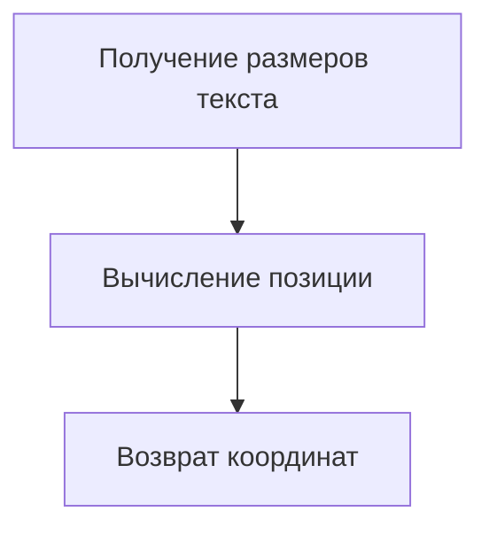
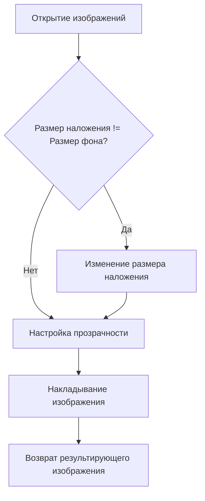
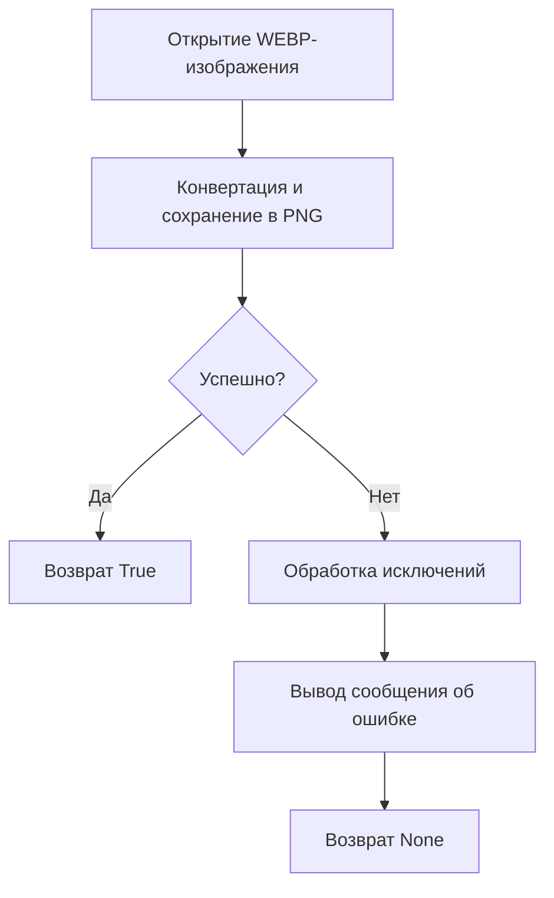

# Модуль для конвертации изображений в формат PNG

## Обзор

Модуль `png.py` предоставляет функциональность для генерации PNG-изображений из текстовых строк. Он включает класс `TextToImageGenerator`, который позволяет создавать изображения с настраиваемыми параметрами, такими как размер холста, шрифт, цвета и отступы. Также, модуль содержит функцию `webp2png` для конвертации изображений из формата WEBP в PNG.

## Подробнее

Модуль предназначен для автоматического создания PNG-изображений на основе текста, что может быть полезно для различных целей, таких как создание превью, водяных знаков или визуализации данных. Класс `TextToImageGenerator` предоставляет гибкие настройки для кастомизации внешнего вида изображений. Функция `webp2png` расширяет функциональность модуля, позволяя конвертировать изображения из формата WEBP в PNG.

## Классы

### `TextToImageGenerator`

**Описание**: Класс для генерации PNG-изображений из текстовых строк.

**Принцип работы**:
Класс инициализируется с настройками по умолчанию для размера холста, отступов, цветов фона и текста, а также уровня логирования.
Он предоставляет методы для генерации изображений на основе заданных параметров, центрирования текста на холсте и наложения одного изображения на другое.

**Методы**:

- `__init__`: Инициализирует класс `TextToImageGenerator` с настройками по умолчанию.
- `generate_images`: Генерирует PNG-изображения из предоставленных текстовых строк.
- `generate_png`: Создает PNG-изображение с заданным текстом, шрифтом и цветами.
- `center_text_position`: Вычисляет позицию для центрирования текста на холсте.
- `overlay_images`: Накладывает одно PNG-изображение на другое в указанной позиции.

#### `__init__`

**Описание**: Инициализирует класс `TextToImageGenerator` с настройками по умолчанию.

#### `generate_images`

**Описание**: Генерирует PNG-изображения из предоставленных текстовых строк.

**Параметры**:

- `lines` (List[str]): Список строк, содержащих текст для генерации изображений.
- `output_dir` (str | Path, optional): Директория для сохранения выходных изображений. По умолчанию "./output".
- `font` (str | ImageFont.ImageFont, optional): Шрифт для использования в тексте. По умолчанию "sans-serif".
- `canvas_size` (Tuple[int, int], optional): Размер холста в пикселях. По умолчанию (1024, 1024).
- `padding` (float, optional): Процент размера холста для использования в качестве пустой границы. По умолчанию 0.10.
- `background_color` (str, optional): Цвет фона для изображений. По умолчанию "white".
- `text_color` (str, optional): Цвет текста. По умолчанию "black".
- `log_level` (int | str | bool, optional): Уровень детализации логирования. По умолчанию "WARNING".
- `clobber` (bool, optional): Если `True`, перезаписывает существующие файлы. По умолчанию `False`.

**Возвращает**:

- `List[Path]`: Список путей к сгенерированным PNG-изображениям.

**Как работает функция**:

1.  **Инициализация**: Функция получает параметры и инициализирует переменные, такие как выходная директория и уровень логирования.
2.  **Настройка параметров по умолчанию**: Если какие-либо параметры не заданы, используются значения по умолчанию.
3.  **Цикл по строкам**: Функция проходит по каждой строке текста из списка `lines`.
4.  **Формирование пути к файлу**: Для каждой строки формируется путь к файлу, в котором будет сохранено изображение.
5.  **Проверка существования файла**: Если файл уже существует и параметр `clobber` установлен в `False`, то изображение не генерируется, и выводится предупреждение в лог.
6.  **Генерация изображения**: Если файл не существует или параметр `clobber` установлен в `True`, то вызывается функция `generate_png` для создания изображения.
7.  **Сохранение изображения**: Сгенерированное изображение сохраняется в указанном пути.
8.  **Добавление пути к изображению в список**: Путь к сгенерированному изображению добавляется в список `generated_images`.
9.  **Возврат списка изображений**: После обработки всех строк функция возвращает список путей к сгенерированным изображениям.

```mermaid
graph TD
    A[Инициализация] --> B{Параметры заданы?}
    B -- Нет --> C[Использовать значения по умолчанию]
    B -- Да --> D[Использовать заданные параметры]
    C --> E[Цикл по строкам текста]
    D --> E
    E --> F[Формирование пути к файлу]
    F --> G{Файл существует и clobber=False?}
    G -- Да --> H[Лог: Файл существует, пропуск]
    G -- Нет --> I[Генерация изображения (generate_png)]
    I --> J[Сохранение изображения]
    J --> K[Добавление пути к изображению в список]
    K --> L{Все строки обработаны?}
    L -- Нет --> E
    L -- Да --> M[Возврат списка изображений]
```

**Примеры**:

```python
generator = TextToImageGenerator()
lines = ["Текст 1", "Текст 2", "Текст 3"]
output_dir = "./output"
images = await generator.generate_images(lines, output_dir=output_dir)
print(images)
```

#### `generate_png`

**Описание**: Создает PNG-изображение с заданным текстом, шрифтом и цветами.

**Параметры**:

- `text` (str): Текст для отображения на изображении.
- `canvas_size` (Tuple[int, int]): Размер холста в пикселях.
- `padding` (float): Процент отступа для использования в качестве границы.
- `background_color` (str): Цвет фона изображения.
- `text_color` (str): Цвет текста.
- `font` (str | ImageFont.ImageFont): Шрифт для использования в тексте.

**Возвращает**:

- `Image`: Сгенерированное PNG-изображение.

**Как работает функция**:

1.  **Создание нового изображения**: Создается новое изображение с заданным размером холста и цветом фона.
2.  **Создание объекта Draw**: Создается объект `ImageDraw.Draw` для рисования на изображении.
3.  **Определение шрифта**: Определяется шрифт для использования в тексте, вызывается функция `get_font_size` для определения размера шрифта на основе размера холста и отступа.
4.  **Определение позиции текста**: Вызывается функция `center_text_position` для определения позиции текста на холсте.
5.  **Отображение текста**: Текст отображается на изображении с использованием заданного шрифта, цвета и позиции.
6.  **Возврат изображения**: Сгенерированное изображение возвращается.

```mermaid
graph TD
    A[Создание нового изображения] --> B[Создание объекта Draw]
    B --> C[Определение шрифта (get_font_size)]
    C --> D[Определение позиции текста (center_text_position)]
    D --> E[Отображение текста]
    E --> F[Возврат изображения]
```

#### `center_text_position`

**Описание**: Вычисляет позицию для центрирования текста на холсте.

**Параметры**:

- `draw` (ImageDraw.Draw): Экземпляр `ImageDraw` для рисования.
- `text` (str): Текст для центрирования.
- `font` (ImageFont.ImageFont): Шрифт, используемый для текста.
- `canvas_size` (Tuple[int, int]): Размер холста в пикселях.

**Возвращает**:

- `Tuple[int, int]`: Координаты для центрирования текста.

**Как работает функция**:

1.  **Получение размеров текста**: Функция получает ширину и высоту текста с использованием заданного шрифта.
2.  **Вычисление позиции**: Вычисляется позиция для центрирования текста путем вычитания ширины и высоты текста из ширины и высоты холста, соответственно, и деления результата на 2.
3.  **Возврат координат**: Функция возвращает кортеж с координатами x и y для центрирования текста.



#### `overlay_images`

**Описание**: Накладывает одно PNG-изображение на другое в указанной позиции.

**Параметры**:

- `background_path` (str | Path): Путь к фоновому PNG-изображению.
- `overlay_path` (str | Path): Путь к накладываемому PNG-изображению.
- `position` (tuple[int, int], optional): Координаты (x, y), где будет размещено наложение. По умолчанию (0, 0).
- `alpha` (float, optional): Уровень прозрачности накладываемого изображения (0.0 - 1.0). По умолчанию 1.0.

**Возвращает**:

- `Image`: Результирующее изображение с наложением.

**Как работает функция**:

1.  **Открытие изображений**: Открываются фоновое и накладываемое изображения, преобразуются в формат RGBA.
2.  **Изменение размера наложения**: Если размер накладываемого изображения отличается от размера фонового, оно изменяется до размера фонового изображения.
3.  **Настройка прозрачности**: Настраивается прозрачность накладываемого изображения на основе значения параметра `alpha`.
4.  **Накладывание изображения**: Накладываемое изображение накладывается на фоновое изображение в указанной позиции.
5.  **Возврат результирующего изображения**: Возвращается результирующее изображение с наложением.



**Примеры**:

```python
result_image = overlay_images("background.png", "overlay.png", position=(50, 50), alpha=0.8)
result_image.save("result.png")
```

## Функции

### `webp2png`

**Описание**: Конвертирует изображение из формата WEBP в формат PNG.

**Параметры**:

- `webp_path` (str): Путь к входному WEBP-файлу.
- `png_path` (str): Путь для сохранения конвертированного PNG-файла.

**Возвращает**:

- `bool`: `True`, если конвертация прошла успешно, в противном случае `None`.

**Как работает функция**:

1.  **Открытие WEBP-изображения**: Открывается WEBP-изображение по указанному пути.
2.  **Конвертация и сохранение в PNG**: Изображение конвертируется в формат PNG и сохраняется по указанному пути.
3.  **Обработка исключений**: Если в процессе конвертации возникает исключение, выводится сообщение об ошибке и возвращается `None`.



**Примеры**:

```python
webp2png('image.webp', 'image.png')