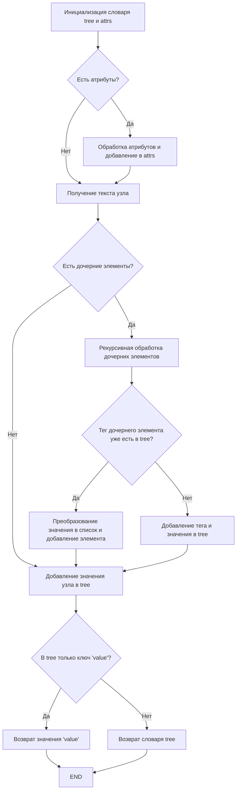
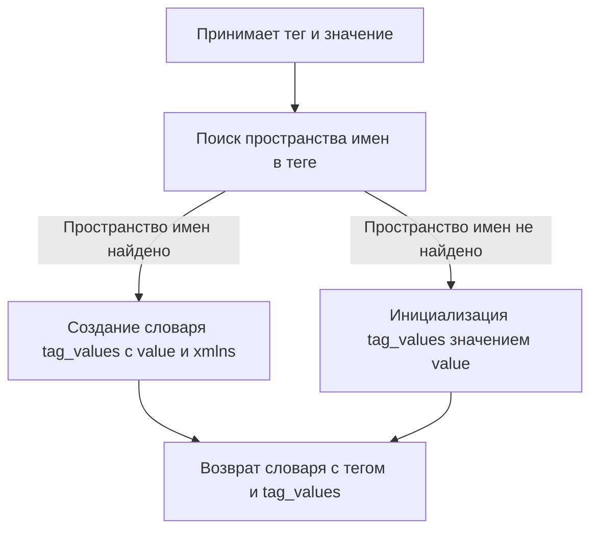
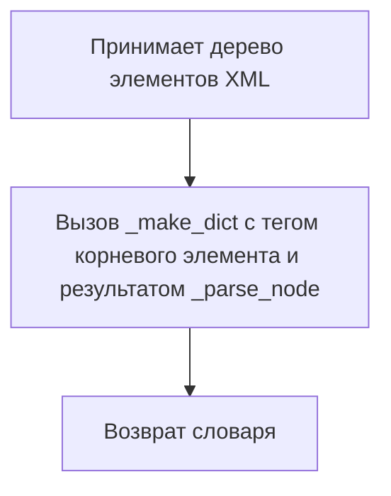

# Модуль для конвертации XML в словарь
## Обзор

Модуль `xml2dict.py` предоставляет инструменты для преобразования данных из формата XML в формат словаря Python. Это упрощает обработку XML-данных, делая их более доступными для анализа и манипуляций в коде Python. Модуль содержит функции для парсинга XML-строк и преобразования XML-деревьев элементов в словарные представления.

## Подробнее

Этот модуль полезен в сценариях, где необходимо обрабатывать XML-данные, например, при работе с API, конфигурационными файлами или другими источниками данных в формате XML. Преобразование XML в словарь позволяет удобно извлекать и использовать информацию.

## Функции

### `_parse_node`

```python
def _parse_node(node: ET.Element) -> dict | str:
    """Функция преобразует XML-узел в словарь.

    Args:
        node (ET.Element): XML-элемент для преобразования.

    Returns:
        dict | str: Словарь, представляющий XML-узел, или строка, если у узла нет атрибутов или дочерних элементов.
    """
    ...
```

**Назначение**: Преобразует XML-узел в словарь, рекурсивно обрабатывая атрибуты и дочерние элементы.

**Параметры**:
- `node` (ET.Element): XML-элемент, который нужно преобразовать в словарь.

**Возвращает**:
- `dict | str`: Словарь, представляющий XML-узел, или строка, если у узла нет атрибутов или дочерних элементов.

**Как работает функция**:

1.  Инициализация словаря `tree` для хранения результата.
2.  Инициализация словаря `attrs` для хранения атрибутов узла.
3.  Цикл по атрибутам узла:
    *   Проверка, не является ли атрибут ссылкой `href` (если является, то пропускается).
    *   Обновление словаря `attrs` результатом вызова функции `_make_dict` для каждого атрибута.
4.  Получение текста узла и удаление пробельных символов с начала и конца строки.
5.  Если есть атрибуты, они добавляются в словарь `tree` под ключом `'attrs'`.
6.  Цикл по дочерним элементам узла:
    *   Рекурсивный вызов `_parse_node` для каждого дочернего элемента.
    *   Создание словаря `cdict` с помощью `_make_dict` для дочернего элемента.
    *   Если `ctree` не пуст, то значение `value` устанавливается в пустую строку.
    *   Если тег дочернего элемента встречается впервые, то он добавляется в словарь `tree`.
    *   Если тег дочернего элемента встречается несколько раз, то значение преобразуется в список и добавляется новый элемент.
7.  Если у узла нет дочерних элементов, то значение узла добавляется в словарь `tree` под ключом `'value'`.
8.  Если в словаре `tree` есть только ключ `'value'`, то возвращается значение этого ключа.
9.  Возвращается словарь `tree`.



**Примеры**:

```python
import xml.etree.ElementTree as ET

# Пример 1: Узел с атрибутами и значением
node_xml = '<root attr1="value1">text</root>'
node = ET.fromstring(node_xml)
result = _parse_node(node)
print(result)  # {'attrs': {'root': {'value': 'value1', 'xmlns': None}}, 'value': 'text'}

# Пример 2: Узел с дочерними элементами
node_xml = '<root><child1>text1</child1><child2>text2</child2></root>'
node = ET.fromstring(node_xml)
result = _parse_node(node)
print(result)  # {'child1': {'value': 'text1'}, 'child2': {'value': 'text2'}}

# Пример 3: Узел без атрибутов и дочерних элементов
node_xml = '<root>text</root>'
node = ET.fromstring(node_xml)
result = _parse_node(node)
print(result)  # text
```

### `_make_dict`

```python
def _make_dict(tag: str, value: any) -> dict:
    """Создает новый словарь с тегом и значением.

    Args:
        tag (str): Имя тега XML-элемента.
        value (any): Значение, связанное с тегом.

    Returns:
        dict: Словарь с именем тега в качестве ключа и значением в качестве значения словаря.
    """
    ...
```

**Назначение**: Создает словарь, где ключ - это тег XML-элемента, а значение - значение этого элемента. Если тег содержит пространство имен, оно также добавляется в словарь.

**Параметры**:
- `tag` (str): Имя тега XML-элемента.
- `value` (any): Значение, которое необходимо связать с тегом.

**Возвращает**:
- `dict`: Словарь, где ключ - это тег, а значение - переданное значение или словарь со значением и пространством имен (если есть).

**Как работает функция**:

1.  Принимает тег и значение.
2.  Инициализирует `tag_values` значением `value`.
3.  Использует регулярное выражение для поиска пространства имен в теге.
4.  Если пространство имен найдено:
    *   Создает словарь `tag_values` с ключом `value` и переданным значением.
    *   Добавляет пространство имен в `tag_values` под ключом `xmlns`.
    *   Обновляет значение `tag` значением из регулярного выражения (без пространства имен).
5.  Возвращает словарь с тегом в качестве ключа и `tag_values` в качестве значения.



**Примеры**:

```python
# Пример 1: Без пространства имен
tag = 'root'
value = 'value'
result = _make_dict(tag, value)
print(result)  # {'root': 'value'}

# Пример 2: С пространством имен
tag = '{http://www.w3.org/1999/xlink}href'
value = 'http://example.com'
result = _make_dict(tag, value)
print(result)  # {'href': {'value': 'http://example.com', 'xmlns': 'http://www.w3.org/1999/xlink'}}
```

### `xml2dict`

```python
def xml2dict(xml: str) -> dict:
    """Преобразует XML-строку в словарь.

    Args:
        xml (str): XML-строка для преобразования.

    Returns:
        dict: Словарь, представляющий XML.
    """
    ...
```

**Назначение**: Преобразует XML-строку в словарь Python, используя `ET.fromstring` для парсинга строки и `ET2dict` для преобразования дерева элементов в словарь.

**Параметры**:
- `xml` (str): XML-строка, которую необходимо преобразовать.

**Возвращает**:
- `dict`: Словарь, представляющий XML.

**Как работает функция**:

1.  Принимает XML-строку.
2.  Использует `ET.fromstring(xml)` для преобразования XML-строки в дерево элементов.
3.  Вызывает функцию `ET2dict` для преобразования дерева элементов в словарь.
4.  Возвращает полученный словарь.

```mermaid
graph TD
    A[Принимает XML-строку] --> B[Преобразование XML-строки в дерево элементов (ET.fromstring)];
    B --> C[Преобразование дерева элементов в словарь (ET2dict)];
    C --> D[Возврат словаря];
```

**Примеры**:

```python
# Пример 1
xml_string = '<root><child>value</child></root>'
result = xml2dict(xml_string)
print(result)  # {'root': {'child': {'value': 'value'}}}

# Пример 2
xml_string = '<root attr="test">value</root>'
result = xml2dict(xml_string)
print(result)  # {'root': {'attrs': {'root': {'value': 'test', 'xmlns': None}}, 'value': 'value'}}
```

### `ET2dict`

```python
def ET2dict(element_tree: ET.Element) -> dict:
    """Преобразует XML-дерево элементов в словарь.

    Args:
        element_tree (ET.Element): XML-дерево элементов.

    Returns:
        dict: Словарь, представляющий XML-дерево элементов.
    """
    ...
```

**Назначение**: Преобразует дерево элементов XML (ElementTree) в словарь Python.

**Параметры**:
- `element_tree` (ET.Element): Дерево элементов XML, которое нужно преобразовать.

**Возвращает**:
- `dict`: Словарь, представляющий XML-дерево элементов.

**Как работает функция**:

1.  Принимает дерево элементов XML (`element_tree`).
2.  Вызывает функцию `_make_dict`, передавая тег корневого элемента и результат вызова функции `_parse_node` для всего дерева.
3.  Возвращает полученный словарь.



**Примеры**:

```python
import xml.etree.ElementTree as ET

# Пример 1
xml_string = '<root><child>value</child></root>'
element_tree = ET.fromstring(xml_string)
result = ET2dict(element_tree)
print(result)  # {'root': {'child': {'value': 'value'}}}

# Пример 2
xml_string = '<root attr="test">value</root>'
element_tree = ET.fromstring(xml_string)
result = ET2dict(element_tree)
print(result)  # {'root': {'attrs': {'root': {'value': 'test', 'xmlns': None}}, 'value': 'value'}}