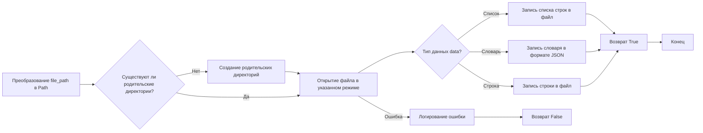
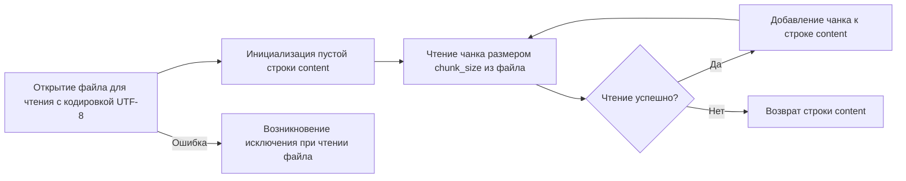
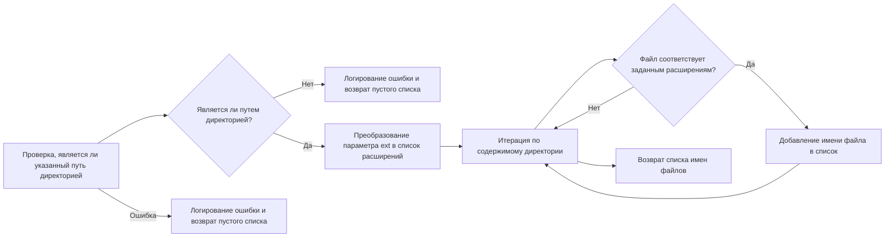

# Модуль `src.utils.file`

## Обзор

Модуль `src.utils.file` предоставляет набор утилит для работы с файлами, включая чтение, запись и поиск файлов по заданным критериям. Модуль поддерживает обработку файлов различных типов, включая текстовые файлы и JSON. Он также предоставляет функциональность для рекурсивного обхода директорий и фильтрации файлов по шаблонам. Модуль предназначен для упрощения операций с файлами и директориями, обеспечивая удобный интерфейс для работы с файловой системой.

## Подробнее

Модуль содержит функции для сохранения данных в текстовый файл, чтения содержимого файлов (с использованием генераторов для экономии памяти), получения списков файлов в директориях, рекурсивного поиска файлов и удаления BOM (Byte Order Mark) из файлов. Он также включает функции для работы с директориями, такие как получение списка имен директорий.

## Функции

### `save_text_file`

```python
def save_text_file(
    file_path: str | Path,
    data: str | list[str] | dict,
    mode: str = 'w'
) -> bool:
    """
    Сохраняет данные в текстовый файл.

    Args:
        file_path (str | Path): Путь к файлу для сохранения.
        data (str | list[str] | dict): Данные для записи. Могут быть строкой, списком строк или словарем.
        mode (str, optional): Режим записи файла ('w' для записи, 'a' для добавления).

    Returns:
        bool: `True`, если файл успешно сохранен, `False` в противном случае.

    Raises:
        Exception: При возникновении ошибки при записи в файл.

    Example:
        >>> from pathlib import Path
        >>> file_path = Path('example.txt')
        >>> data = 'Пример текста'
        >>> result = save_text_file(file_path, data)
        >>> print(result)
        True
    """
```

**Назначение**: Сохраняет предоставленные данные в текстовый файл. Поддерживает запись строк, списков строк и словарей в файл.

**Параметры**:
- `file_path` (str | Path): Путь к файлу, в который будут записаны данные.
- `data` (str | list[str] | dict): Данные для записи в файл. Может быть строкой, списком строк или словарем.
- `mode` (str, optional): Режим открытия файла. `"w"` - запись (перезапись), `"a"` - добавление. По умолчанию `"w"`.

**Возвращает**:
- `bool`: Возвращает `True`, если запись в файл прошла успешно, и `False` в противном случае.

**Вызывает исключения**:
- `Exception`: Вызывается при возникновении ошибок при записи данных в файл.

**Как работает функция**:
1. Преобразует `file_path` в объект `Path`.
2. Создает родительские директории, если они не существуют.
3. Открывает файл в указанном режиме (`mode`) и кодировке (`utf-8`).
4. Записывает данные в файл в зависимости от их типа:
   - Если `data` - список, записывает каждый элемент списка в отдельную строку файла.
   - Если `data` - словарь, записывает его в формате JSON с отступами.
   - Если `data` - строка, записывает её в файл.
5. Возвращает `True` при успешной записи или `False` в случае ошибки.



**Примеры**:

```python
from pathlib import Path
# Пример 1: Запись строки в файл
file_path = Path('example.txt')
data = 'Пример текста'
result = save_text_file(file_path, data)
print(result) # Вывод: True

# Пример 2: Запись списка строк в файл
file_path = Path('example.txt')
data = ['Строка 1', 'Строка 2', 'Строка 3']
result = save_text_file(file_path, data)
print(result) # Вывод: True

# Пример 3: Запись словаря в файл
file_path = Path('example.json')
data = {'ключ1': 'значение1', 'ключ2': 'значение2'}
result = save_text_file(file_path, data)
print(result) # Вывод: True
```

### `read_text_file_generator`

```python
def read_text_file_generator(
    file_path: str | Path,
    as_list: bool = False,
    extensions: Optional[list[str]] = None,
    chunk_size: int = 8192,
    recursive: bool = False,
    patterns: Optional[str | list[str]] = None,
) -> Generator[str, None, None] | str | list[str] | None:
    """
    Читает содержимое файла(ов) или директории.

        Args:
            file_path (str | Path): Путь к файлу или директории.
            as_list (bool, optional): Если `True`, то возвращает генератор строк или список строк, в зависимости от типа вывода.
            extensions (list[str], optional): Список расширений файлов для включения при чтении директории.
            chunk_size (int, optional): Размер чанка для чтения файла в байтах.
            recursive (bool, optional): Если `True`, то поиск файлов выполняется рекурсивно.
            patterns (str | list[str], optional): Шаблоны для фильтрации файлов при рекурсивном поиске.

        Returns:
            Generator[str, None, None] | str | list[str] | None:
            - Если `as_list` is True и `file_path` является файлом, возвращает генератор строк.
            - Если `as_list` is True и `file_path` является директорией и `recursive` is True, возвращает список строк.
            - Если `as_list` is False и `file_path` является файлом, возвращает строку.
            - Если `as_list` is False и `file_path` является директорией, возвращает объединенную строку.
            - Возвращает `None` в случае ошибки.
        Raises:
            Exception: При возникновении ошибки при чтении файла.

        Example:
            >>> from pathlib import Path
            >>> file_path = Path('example.txt')
            >>> content = read_text_file(file_path)
            >>> if content:
            ...    print(f'File content: {content[:100]}...')
            File content: Пример текста...
    Функция read_text_file может возвращать несколько разных типов данных в зависимости от входных параметров:\

    Возвращаемые значения:
    ----------------------

    - Generator[str, None, None] (Генератор строк):
        Генератор при итерации выдаёт строки из файла(ов) по одной. Эффективно для работы с большими файлами, так как они не загружаются полностью в память.
        - Когда:
            file_path – это файл и as_list равен True.
            file_path – это директория, recursive равен True и as_list равен True. При этом в генератор попадают строки из всех найденных файлов.\
            file_path – это директория, recursive равен False и as_list равен True. При этом в генератор попадают строки из всех найденных файлов в текущей директории.\
        \

    - str (Строка):
        Содержимое файла или объединенное содержимое всех файлов в виде одной строки.\
        - Когда:
            file_path – это файл и as_list равен False.
            file_path – это директория, recursive равен False и as_list равен False. При этом возвращается объединенная строка, состоящая из содержимого всех файлов в директории, разделенных символами новой строки (\\n).\
            file_path – это директория, recursive равен True и as_list равен False. При этом возвращается объединенная строка, состоящая из содержимого всех файлов в директории и её поддиректориях, разделенных символами новой строки (\\n).\

    - list[str] (Список строк):
        Этот тип явно не возвращается функцией, однако когда file_path – это директория, recursive равен True и as_list равен True - функция возвращает генератор, который можно преобразовать в список при помощи list()\
        - Когда:
            file_path – не является ни файлом, ни директорией.\
            Произошла ошибка при чтении файла или директории (например, файл не найден, ошибка доступа и т.п.).\


    Note:\
        Если вы хотите прочитать содержимое файла построчно (особенно для больших файлов) используйте as_list = True. В этом случае вы получите генератор строк.\
        Если вы хотите получить всё содержимое файла в виде одной строки используйте as_list = False.\
        Если вы работаете с директорией, recursive = True будет обходить все поддиректории.\
        extensions и patterns позволят вам фильтровать файлы при работе с директорией.\
        chunk_size позволяет оптимизировать работу с большими файлами при чтении их по частям.\
        None будет возвращён в случае ошибок.\

    Важно помнить:\
        В случае чтения директории, если as_list=False, функция объединяет все содержимое найденных файлов в одну строку. Это может потребовать много памяти, если файлов много или они большие.\
        Функция полагается на другие функции-помощники (_read_file_lines_generator, _read_file_content, recursively_get_file_path, yield_text_from_files), которые здесь не определены и их поведение влияет на результат read_text_file.\


    """
```

**Назначение**: Читает содержимое файла или файлов в директории, используя генератор для экономии памяти.

**Параметры**:
- `file_path` (str | Path): Путь к файлу или директории.
- `as_list` (bool, optional): Если `True`, возвращает генератор строк (для файлов) или список строк (для директорий с `recursive=True`). По умолчанию `False`.
- `extensions` (list[str], optional): Список расширений файлов для включения при чтении директории. По умолчанию `None`.
- `chunk_size` (int, optional): Размер чанка для чтения файла в байтах. По умолчанию 8192.
- `recursive` (bool, optional): Если `True`, выполняет рекурсивный поиск файлов в директории. По умолчанию `False`.
- `patterns` (str | list[str], optional): Шаблоны для фильтрации файлов при рекурсивном поиске. По умолчанию `None`.

**Возвращает**:
- `Generator[str, None, None] | str | list[str] | None`:
  - Если `as_list` is `True` и `file_path` является файлом, возвращает генератор строк.
  - Если `as_list` is `True` и `file_path` является директорией и `recursive` is `True`, возвращает список строк.
  - Если `as_list` is `False` и `file_path` является файлом, возвращает строку.
  - Если `as_list` is `False` и `file_path` является директорией, возвращает объединенную строку.
  - Возвращает `None` в случае ошибки.

**Вызывает исключения**:
- `Exception`: При возникновении ошибки при чтении файла или директории.

**Внутренние функции**:
- _read_file_lines_generator
- _read_file_content
- recursively_get_file_path
- yield_text_from_files

**Как работает функция**:
1. Преобразует `file_path` в объект `Path`.
2. Проверяет, является ли `file_path` файлом или директорией.
3. Если это файл:
   - Если `as_list` равно `True`, возвращает генератор строк, используя `_read_file_lines_generator`.
   - Если `as_list` равно `False`, возвращает содержимое файла в виде строки, используя `_read_file_content`.
4. Если это директория:
   - Если `recursive` равно `True`, выполняет рекурсивный поиск файлов с использованием `recursively_get_file_path`.
   - Если `recursive` равно `False`, итерируется по файлам в текущей директории.
   - В зависимости от значения `as_list`, возвращает либо генератор строк (если `True`), либо объединенную строку из содержимого всех файлов (если `False`).
5. Если `file_path` не является ни файлом, ни директорией, логирует ошибку и возвращает `None`.
6. В случае возникновения исключения при чтении файла или директории, логирует ошибку и возвращает `None`.

```mermaid
graph LR
    A[Преобразование file_path в Path] --> B{Является ли file_path файлом?}
    B -- Да --> C{as_list is True?}
    C -- Да --> D[Возврат генератора строк из _read_file_lines_generator]
    C -- Нет --> E[Возврат содержимого файла в виде строки из _read_file_content]
    B -- Нет --> F{Является ли file_path директорией?}
    F -- Да --> G{recursive is True?}
    G -- Да --> H{patterns is None?}
    H -- Да --> I[Получение списка файлов с помощью rglob]
    H -- Нет --> J[Получение списка файлов с помощью recursively_get_file_path]
    I --> K{as_list is True?}
    J --> K{as_list is True?}
    K -- Да --> L[Возврат генератора строк из yield_text_from_files для каждого файла]
    K -- Нет --> M[Объединение содержимого всех файлов в строку и возврат]
    G -- Нет --> N[Получение списка файлов в текущей директории]
    N --> O{as_list is True?}
    O -- Да --> P[Возврат генератора строк из read_text_file для каждого файла]
    O -- Нет --> Q[Объединение содержимого всех файлов в строку и возврат]
    F -- Нет --> R[Логирование ошибки "Путь не является файлом или директорией" и возврат None]
    B -- Ошибка --> S[Логирование ошибки при чтении файла/директории и возврат None]
    F -- Ошибка --> S[Логирование ошибки при чтении файла/директории и возврат None]
```

**Примеры**:

```python
from pathlib import Path

# Пример 1: Чтение файла как генератора строк
file_path = Path('example.txt')
with open(file_path, 'w', encoding='utf-8') as f:
    f.write('Строка 1\nСтрока 2\nСтрока 3')

for line in read_text_file_generator(file_path, as_list=True):
    print(line)

# Пример 2: Чтение файла как одной строки
file_path = Path('example.txt')
content = read_text_file_generator(file_path, as_list=False)
print(content)

# Пример 3: Чтение директории рекурсивно в виде списка строк
root_dir = Path('./')
patterns = ['*.txt']
contents = read_text_file_generator(root_dir, patterns=patterns, as_list=True, recursive=True)
if contents:
    for line in contents:
        print(line)
```

### `read_text_file`

```python
def read_text_file(
    file_path: Union[str, Path],
    as_list: bool = False,
    extensions: Optional[list[str]] = None,
    exc_info: bool = True,
) -> str | list[str] | None:
    """
    Read the contents of a file.

    Args:
        file_path (str | Path): Path to the file or directory.
        as_list (bool, optional): If True, returns content as list of lines. Defaults to False.
        extensions (list[str], optional): List of file extensions to include if reading a directory. Defaults to None.
        exc_info (bool, optional): If True, logs traceback on error. Defaults to True.

    Returns:
        str | list[str] | None: File content as a string or list of lines, or None if an error occurs.
    """
```

**Назначение**: Читает содержимое файла и возвращает его в виде строки или списка строк.

**Параметры**:
- `file_path` (str | Path): Путь к файлу или директории.
- `as_list` (bool, optional): Если `True`, возвращает содержимое в виде списка строк. По умолчанию `False`.
- `extensions` (list[str], optional): Список расширений файлов для включения при чтении директории. По умолчанию `None`.
- `exc_info` (bool, optional): Если `True`, логирует traceback при ошибке. По умолчанию `True`.

**Возвращает**:
- `str | list[str] | None`: Содержимое файла в виде строки или списка строк, или `None`, если произошла ошибка.

**Как работает функция**:
1. Преобразует `file_path` в объект `Path`.
2. Проверяет, является ли `file_path` файлом или директорией.
3. Если это файл:
   - Открывает файл в режиме чтения с кодировкой `utf-8`.
   - Возвращает список строк, если `as_list` равен `True`, иначе возвращает содержимое файла в виде строки.
4. Если это директория:
   - Рекурсивно получает список файлов с заданными расширениями с использованием `rglob`.
   - Рекурсивно вызывает `read_text_file` для каждого файла.
   - Возвращает список списков строк, если `as_list` равен `True`, иначе возвращает объединенную строку из содержимого всех файлов.
5. Если `file_path` не является ни файлом, ни директорией, логирует предупреждение и возвращает `None`.
6. В случае возникновения исключения, логирует ошибку и возвращает `None`.

```mermaid
graph LR
    A[Преобразование file_path в Path] --> B{Является ли file_path файлом?}
    B -- Да --> C[Открытие файла в режиме чтения]
    C --> D{as_list is True?}
    D -- Да --> E[Возврат содержимого как списка строк (readlines)]
    D -- Нет --> F[Возврат содержимого как строки (read)]
    B -- Нет --> G{Является ли file_path директорией?}
    G -- Да --> H[Рекурсивное получение списка файлов с расширениями]
    H --> I[Рекурсивный вызов read_text_file для каждого файла]
    I --> J{as_list is True?}
    J -- Да --> K[Возврат списка списков строк]
    J -- Нет --> L[Возврат объединенной строки]
    G -- Нет --> M[Логирование предупреждения "Некорректный путь" и возврат None]
    B -- Ошибка --> N[Логирование ошибки и возврат None]
    G -- Ошибка --> N[Логирование ошибки и возврат None]
```

**Примеры**:

```python
from pathlib import Path

# Пример 1: Чтение файла как списка строк
file_path = Path('example.txt')
with open(file_path, 'w', encoding='utf-8') as f:
    f.write('Строка 1\nСтрока 2\nСтрока 3')
content = read_text_file(file_path, as_list=True)
print(content)

# Пример 2: Чтение файла как одной строки
file_path = Path('example.txt')
content = read_text_file(file_path, as_list=False)
print(content)

# Пример 3: Чтение директории рекурсивно в виде списка строк
root_dir = Path('./')
with open("test1.txt", "w") as f:
    f.write("test1\n")
with open("test2.txt", "w") as f:
    f.write("test2\n")

patterns = ['*.txt']
contents = read_text_file(root_dir, extensions=patterns, as_list=True)
if contents:
    for line in contents:
        print(line)
```

### `yield_text_from_files`

```python
def yield_text_from_files(
    file_path: str | Path,
    as_list: bool = False,
    chunk_size: int = 8192
) -> Generator[str, None, None] | str | None:
    """
    Читает содержимое файла и возвращает его в виде генератора строк или одной строки.

    Args:
        file_path (str | Path): Путь к файлу.
        as_list (bool, optional): Если True, возвращает генератор строк. По умолчанию False.
        chunk_size (int, optional): Размер чанка для чтения файла в байтах.

    Returns:
        Generator[str, None, None] | str | None: Генератор строк, объединенная строка или None в случае ошибки.

    Yields:
       str: Строки из файла, если as_list is True.

    Example:
        >>> from pathlib import Path
        >>> file_path = Path('example.txt')
        >>> for line in yield_text_from_files(file_path, as_list=True):\
        ...     print(line)
        Первая строка файла
        Вторая строка файла
    """
```

**Назначение**: Читает содержимое файла и возвращает его в виде генератора строк или одной строки.

**Параметры**:
- `file_path` (str | Path): Путь к файлу.
- `as_list` (bool, optional): Если `True`, возвращает генератор строк. По умолчанию `False`.
- `chunk_size` (int, optional): Размер чанка для чтения файла в байтах.

**Возвращает**:
- `Generator[str, None, None] | str | None`: Генератор строк, объединенная строка или `None` в случае ошибки.

**Yields**:
- `str`: Строки из файла, если `as_list` is `True`.

**Как работает функция**:
1. Преобразует `file_path` в объект `Path`.
2. Проверяет, является ли `file_path` файлом.
3. Если это файл:
   - Если `as_list` равно `True`, возвращает генератор строк, вызывая `_read_file_lines_generator`.
   - Если `as_list` равно `False`, возвращает содержимое файла в виде строки, вызывая `_read_file_content`.
4. Если `file_path` не является файлом, логирует ошибку и возвращает `None`.
5. В случае возникновения исключения, логирует ошибку и возвращает `None`.

```mermaid
graph LR
    A[Преобразование file_path в Path] --> B{Является ли file_path файлом?}
    B -- Да --> C{as_list is True?}
    C -- Да --> D[Возврат генератора строк из _read_file_lines_generator]
    C -- Нет --> E[Возврат содержимого как строки из _read_file_content]
    B -- Нет --> F[Логирование ошибки "Путь не является файлом" и возврат None]
    B -- Ошибка --> G[Логирование ошибки и возврат None]
```

**Примеры**:

```python
from pathlib import Path

# Пример 1: Чтение файла как генератора строк
file_path = Path('example.txt')
with open(file_path, 'w', encoding='utf-8') as f:
    f.write('Строка 1\nСтрока 2\nСтрока 3')

for line in yield_text_from_files(file_path, as_list=True):
    print(line)

# Пример 2: Чтение файла как одной строки
file_path = Path('example.txt')
with open(file_path, 'w', encoding='utf-8') as f:
    f.write('Строка 1\nСтрока 2\nСтрока 3')
for content in yield_text_from_files(file_path, as_list=False):
    print(content)
```

### `_read_file_content`

```python
def _read_file_content(file_path: Path, chunk_size: int) -> str:
    """
    Читает содержимое файла по чанкам и возвращает как строку.

    Args:
        file_path (Path): Путь к файлу для чтения.
        chunk_size (int): Размер чанка для чтения файла в байтах.
    Returns:
        str: Содержимое файла в виде строки.
    Raises:
        Exception: При возникновении ошибки при чтении файла.
    """
```

**Назначение**: Читает содержимое файла по частям (чанкам) и возвращает его в виде одной строки.

**Параметры**:
- `file_path` (Path): Путь к файлу для чтения.
- `chunk_size` (int): Размер чанка (порции) данных для чтения из файла.

**Возвращает**:
- `str`: Содержимое файла в виде одной строки.

**Вызывает исключения**:
- `Exception`: Вызывается при возникновении ошибки при чтении файла.

**Как работает функция**:
1. Открывает файл для чтения в текстовом режиме с кодировкой UTF-8.
2. В цикле читает файл по частям размером `chunk_size`.
3. Добавляет каждый прочитанный чанк к общей строке `content`.
4. Завершает цикл, когда достигнут конец файла.
5. Возвращает полную строку, содержащую всё содержимое файла.



### `_read_file_lines_generator`

```python
def _read_file_lines_generator(file_path: Path, chunk_size: int) -> Generator[str, None, None]:
    """
    Читает файл по строкам с помощью генератора.

    Args:
        file_path (Path): Путь к файлу для чтения.
        chunk_size (int): Размер чанка для чтения файла в байтах.
    Yields:
        str: Строки из файла.
    Raises:
        Exception: При возникновении ошибки при чтении файла.
    """
```

**Назначение**: Читает файл построчно, используя генератор для экономии памяти.

**Параметры**:
- `file_path` (Path): Путь к файлу для чтения.
- `chunk_size` (int): Размер чанка для чтения файла в байтах.

**Yields**:
- `str`: Строки из файла.

**Вызывает исключения**:
- `Exception`: При возникновении ошибки при чтении файла.

**Как работает функция**:
1. Открывает файл в режиме чтения с кодировкой UTF-8.
2. Читает файл по частям размером `chunk_size`.
3. Разбивает каждый чанк на строки с помощью `splitlines()`.
4. Если чанк не закончился полной строкой (нет символа новой строки в конце), добавляет последнюю строку из `lines` к следующему чанку.
5. Использует `yield from lines` для генерации строк.

```mermaid
graph LR
    A[Открытие файла для чтения с кодировкой UTF-8] --> B[Чтение чанка размером chunk_size из файла]
    B --> C{Чтение успешно?}
    C -- Да --> D[Разбиение чанка на строки (splitlines)]
    D --> E{Чанк заканчивается символом новой строки?}
    E -- Нет --> F[Чтение одного символа из следующего чанка]
    F --> G[Добавление символа к последней строке]
    G --> H[Генерация строк (yield from lines)]
    E -- Да --> H[Генерация строк (yield from lines)]
    B -- Нет --> I[Конец файла, выход из цикла]
    I --> J[Завершение]
```

### `get_filenames_from_directory`

```python
def get_filenames_from_directory(
    directory: str | Path, ext: str | list[str] = '*'
) -> list[str]:
    """
    Возвращает список имен файлов в директории, опционально отфильтрованных по расширению.

    Args:
        directory (str | Path): Путь к директории для поиска.
        ext (str | list[str], optional): Расширения для фильтрации.
            По умолчанию '*'.

    Returns:
        list[str]: Список имен файлов, найденных в директории.

    Example:
        >>> from pathlib import Path
        >>> directory = Path('.')
        >>> get_filenames_from_directory(directory, ['.txt', '.md'])
        ['example.txt', 'readme.md']
    """
```

**Назначение**: Возвращает список имен файлов в указанной директории, с возможностью фильтрации по расширению.

**Параметры**:
- `directory` (str | Path): Путь к директории, в которой нужно получить список файлов.
- `ext` (str | list[str], optional): Расширение или список расширений для фильтрации файлов. Если указано `'*'`, то возвращаются все файлы. По умолчанию `'*'`.

**Возвращает**:
- `list[str]`: Список имен файлов в директории.

**Как работает функция**:
1. Проверяет, является ли указанный путь (`directory`) директорией. Если нет, логирует ошибку и возвращает пустой список.
2. Преобразует параметр `ext` в список расширений, если он задан как строка. Если `ext` равен `'*'`, то список расширений остается пустым (что означает отсутствие фильтрации).
3. Итерируется по содержимому директории и выбирает только файлы, которые соответствуют заданным расширениям (если они указаны).
4. Возвращает список имен файлов.
5. В случае возникновения исключения, логирует ошибку и возвращает пустой список.



**Примеры**:

```python
from pathlib import Path

# Пример 1: Получение списка всех файлов в текущей директории
directory = Path('.')
filenames = get_filenames_from_directory(directory)
print(filenames)

# Пример 2: Получение списка файлов с расширениями .txt и .md
directory = Path('.')
filenames = get_filenames_from_directory(directory, ['.txt', '.md'])
print(filenames)
```

### `recursively_yield_file_path`

```python
def recursively_yield_file_path(
    root_dir: str | Path, patterns: str | list[str] = '*'
) -> Generator[Path, None, None]:
    """
    Рекурсивно возвращает пути ко всем файлам, соответствующим заданным шаблонам, в указанной директории.

    Args:
        root_dir (str | Path): Корневая директория для поиска.
        patterns (str | list[str]): Шаблоны для фильтрации файлов.

    Yields:
        Path: Путь к файлу, соответствующему шаблону.

    Example:
        >>> from pathlib import Path
        >>> root_dir = Path('.')
        >>> for path in recursively_yield_file_path(root_dir, ['*.txt', '*.md']):
        ...    print(path)
        ./example.txt
        ./readme.md
    """
```

**Назначение**: Рекурсивно генерирует пути ко всем файлам, соответствующим заданным шаблонам, в указанной директории.

**Параметры**:
- `root_dir` (str | Path): Корневая директория для поиска.
- `patterns` (str | list[str], optional): Шаблоны для фильтрации файлов. По умолчанию `'*'`.

**Yields**:
- `Path`: Путь к файлу, соответствующему шаблону.

**Как работает функция**:
1. Преобразует `patterns` в список, если это строка.
2. Итерируется по шаблонам.
3. Для каждого шаблона использует `rglob` для рекурсивного поиска файлов, соответствующих шаблону.
4. Генерирует пути к найденным файлам.
5. В случае возникновения исключения, логирует ошибку.

```mermaid
graph LR
    A[Преобразование patterns в список, если это строка] --> B[Итерация по шаблонам]
    B --> C[Рекурсивный поиск файлов, соответствующих шаблону (rglob)]