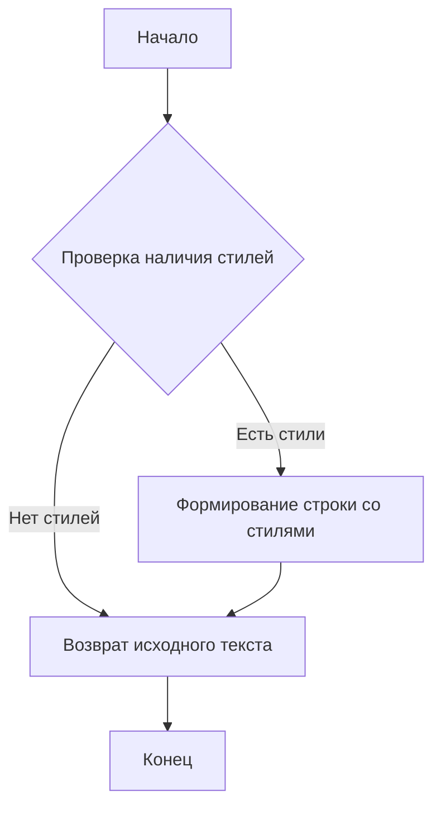
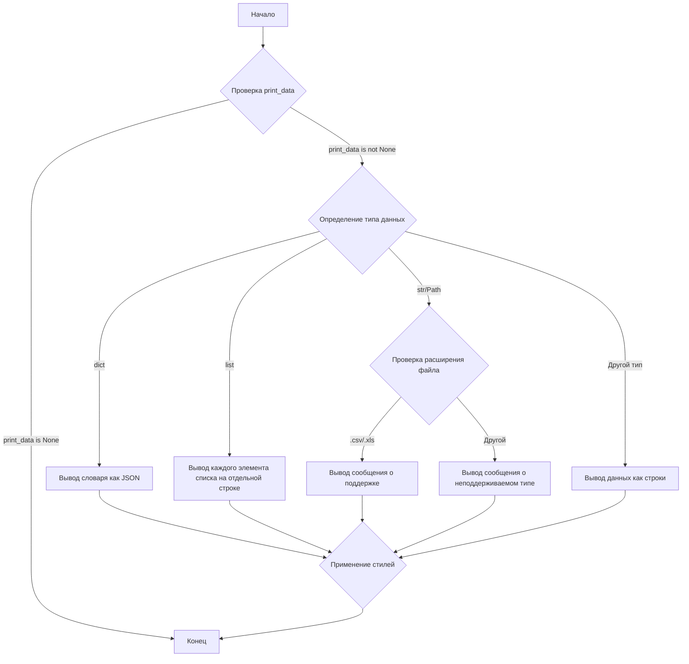

# Модуль `src.utils.printer`

## Обзор

Модуль `src.utils.printer` предоставляет утилиты для форматированного вывода данных в консоль, включая стилизацию текста с использованием цветов, фона и шрифтов. Модуль предназначен для улучшения читаемости выводимой информации.

## Подробней

Модуль содержит функции для стилизации текста с использованием ANSI escape-кодов, позволяющих изменять цвет текста, фона и стиль шрифта. Основная функция `pprint` принимает данные различных типов (словари, списки, строки, пути к файлам) и выводит их в консоль с применением указанных стилей.

## Константы

### `RESET`

```python
RESET = "\\033[0m"
```

Код ANSI escape для сброса всех стилей текста.

### `TEXT_COLORS`

```python
TEXT_COLORS = {
    "red": "\\033[31m",
    "green": "\\033[32m",
    "blue": "\\033[34m",
    "yellow": "\\033[33m",
    "white": "\\033[37m",
    "cyan": "\\033[36m",
    "magenta": "\\033[35m",
    "light_gray": "\\033[37m",
    "dark_gray": "\\033[90m",
    "light_red": "\\033[91m",
    "light_green": "\\033[92m",
    "light_blue": "\\033[94m",
    "light_yellow": "\\033[93m",
}
```

Словарь, сопоставляющий названия цветов текста с соответствующими ANSI escape-кодами.

### `BG_COLORS`

```python
BG_COLORS = {
    "bg_red": "\\033[41m",
    "bg_green": "\\033[42m",
    "bg_blue": "\\033[44m",
    "bg_yellow": "\\033[43m",
    "bg_white": "\\033[47m",
    "bg_cyan": "\\033[46m",
    "bg_magenta": "\\033[45m",
    "bg_light_gray": "\\033[47m",
    "bg_dark_gray": "\\033[100m",
    "bg_light_red": "\\033[101m",
    "bg_light_green": "\\033[102m",
    "bg_light_blue": "\\033[104m",
    "bg_light_yellow": "\\033[103m",
}
```

Словарь, сопоставляющий названия цветов фона с соответствующими ANSI escape-кодами.

### `FONT_STYLES`

```python
FONT_STYLES = {
    "bold": "\\033[1m",
    "underline": "\\033[4m",
}
```

Словарь, сопоставляющий названия стилей шрифта с соответствующими ANSI escape-кодами.

## Функции

### `_color_text`

```python
def _color_text(text: str, text_color: str = "", bg_color: str = "", font_style: str = "") -> str:
    """Apply color, background, and font styling to the text.

    This helper function applies the provided color and font styles to the given text using ANSI escape codes.

    :param text: The text to be styled.
    :param text_color: The color to apply to the text. Default is an empty string, meaning no color.
    :param bg_color: The background color to apply. Default is an empty string, meaning no background color.
    :param font_style: The font style to apply to the text. Default is an empty string, meaning no font style.
    :return: The styled text as a string.

    :example:
        >>> _color_text("Hello, World!", text_color="green", font_style="bold")
        \'\\033[1m\\033[32mHello, World!\\033[0m\'
    """
    ...
```

**Назначение**: Применяет стили (цвет текста, цвет фона, стиль шрифта) к заданной строке текста с использованием ANSI escape-кодов.

**Параметры**:

-   `text` (str): Текст, к которому необходимо применить стили.
-   `text_color` (str): Цвет текста. По умолчанию "". Если указан, должен быть одним из ключей в `TEXT_COLORS`.
-   `bg_color` (str): Цвет фона. По умолчанию "". Если указан, должен быть одним из ключей в `BG_COLORS`.
-   `font_style` (str): Стиль шрифта. По умолчанию "". Если указан, должен быть одним из ключей в `FONT_STYLES`.

**Возвращает**:

-   `str`: Строка с примененными стилями.

**Как работает функция**:

1.  Функция принимает текст и опциональные параметры стилизации: цвет текста, цвет фона и стиль шрифта.
2.  Формирует строку, содержащую ANSI escape-коды для указанных стилей, обрамляющие исходный текст.
3.  Возвращает стилизованную строку.



**Примеры**:

```python
_color_text("Hello, World!", text_color="green", font_style="bold")
# Результат: '\033[1m\033[32mHello, World!\033[0m'
```

### `pprint`

```python
def pprint(print_data: Any = None, text_color: str = "white", bg_color: str = "", font_style: str = "") -> None:
    """Pretty prints the given data with optional color, background, and font style.

    This function formats the input data based on its type and prints it to the console. The data is printed with optional 
    text color, background color, and font style based on the specified parameters. The function can handle dictionaries, 
    lists, strings, and file paths.

    :param print_data: The data to be printed. Can be of type ``None``, ``dict``, ``list``, ``str``, or ``Path``.
    :param text_color: The color to apply to the text. Default is \'white\'. See :ref:`TEXT_COLORS`.
    :param bg_color: The background color to apply to the text. Default is \'\' (no background color). See :ref:`BG_COLORS`.
    :param font_style: The font style to apply to the text. Default is \'\' (no font style). See :ref:`FONT_STYLES`.
    :return: None

    :raises: Exception if the data type is unsupported or an error occurs during printing.

    :example:
        >>> pprint({"name": "Alice", "age": 30}, text_color="green")
        \\033[32m{\n            "name": "Alice",\n            "age": 30\n        }\\033[0m

        >>> pprint(["apple", "banana", "cherry"], text_color="blue", font_style="bold")
        \\033[34m\\033[1mapple\\033[0m
        \\033[34m\\033[1mbanana\\033[0m
        \\033[34m\\033[1mcherry\\033[0m

        >>> pprint("text example", text_color="yellow", bg_color="bg_red", font_style="underline")
        \\033[4m\\033[33m\\033[41mtext example\\033[0m
    """
    ...
```

**Назначение**: Форматированный вывод данных в консоль с возможностью стилизации текста.

**Параметры**:

-   `print_data` (Any): Данные для вывода. Поддерживаются типы `None`, `dict`, `list`, `str`, `Path`.
-   `text_color` (str): Цвет текста. По умолчанию "white".
-   `bg_color` (str): Цвет фона. По умолчанию "".
-   `font_style` (str): Стиль шрифта. По умолчанию "".

**Возвращает**:

-   `None`

**Вызывает исключения**:

-   `Exception`: Если тип данных не поддерживается или возникает ошибка при выводе.

**Как работает функция**:

1.  Функция принимает данные для вывода и опциональные параметры стилизации.
2.  Определяет тип данных и применяет соответствующее форматирование.
    *   Если данные - словарь, они выводятся в формате JSON с отступами.
    *   Если данные - список, каждый элемент списка выводится на отдельной строке.
    *   Если данные - строка или путь к файлу, проверяется расширение файла. Для `.csv` и `.xls` выводится сообщение о поддержке, для остальных - сообщение о неподдерживаемом типе файла.
    *   В противном случае данные преобразуются в строку и выводятся в консоль.
3.  Применяет стилизацию текста с использованием функции `_color_text`.
4.  В случае возникновения ошибки выводит сообщение об ошибке красным цветом.



**Примеры**:

```python
pprint({"name": "Alice", "age": 30}, text_color="green")
# Результат: (в консоли)
# \033[32m{
#     "name": "Alice",
#     "age": 30
# }\033[0m

pprint(["apple", "banana", "cherry"], text_color="blue", font_style="bold")
# Результат: (в консоли)
# \033[34m\033[1mapple\033[0m
# \033[34m\033[1mbanana\033[0m
# \033[34m\033[1mcherry\033[0m

pprint("text example", text_color="yellow", bg_color="bg_red", font_style="underline")
# Результат: (в консоли)
# \033[4m\033[33m\033[41mtext example\033[0m