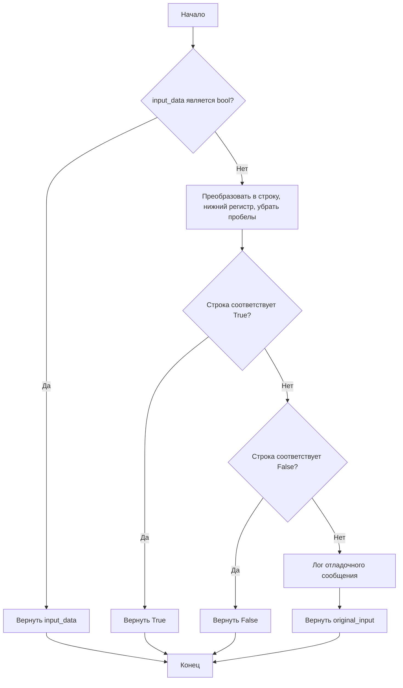
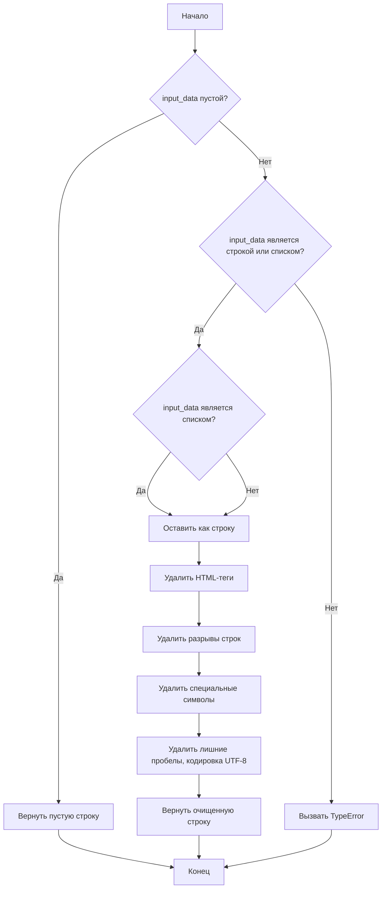
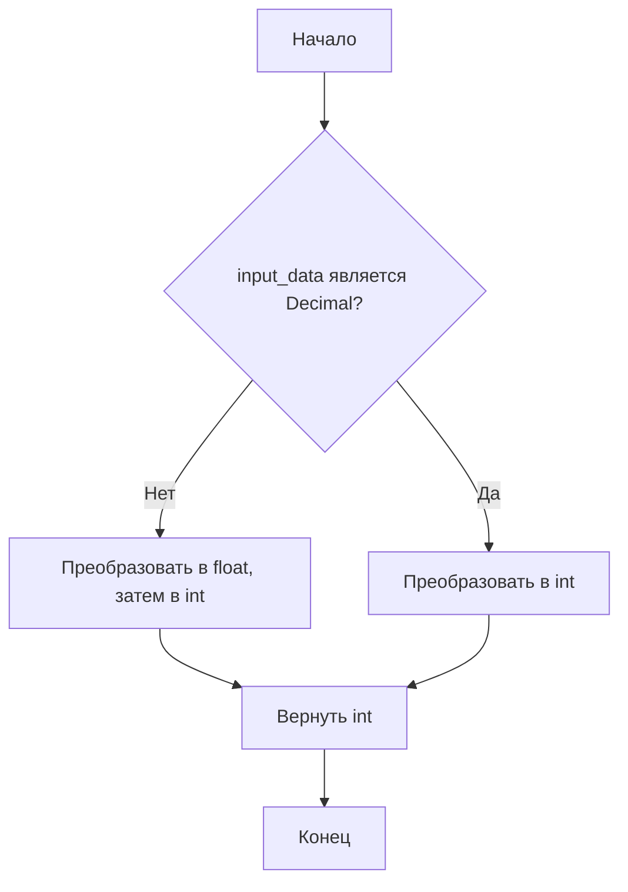
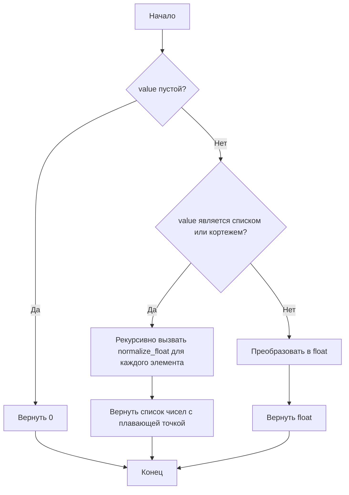
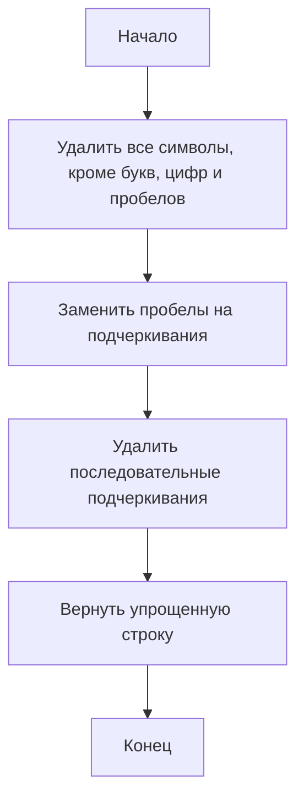
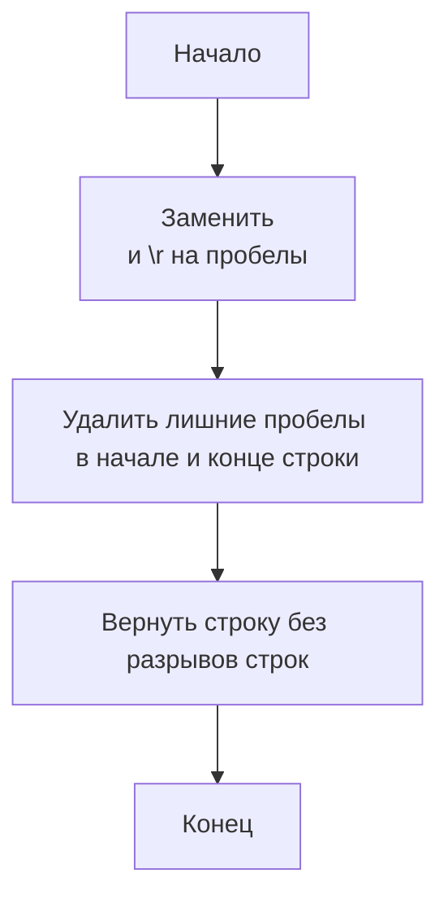
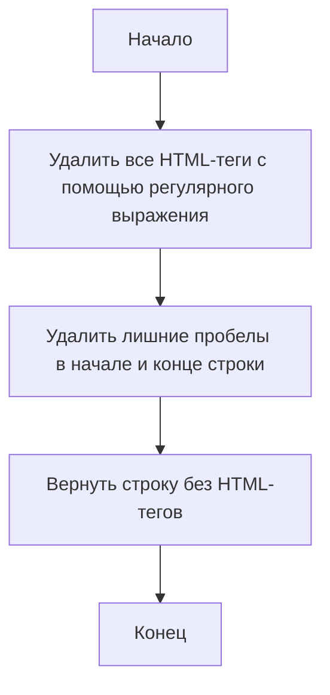
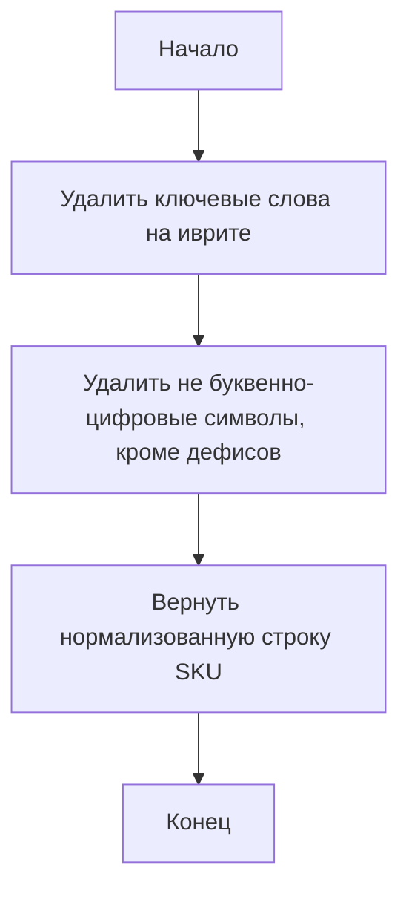

# Модуль для нормализации строк и числовых данных

## Обзор

Модуль `normalizer.py` предоставляет набор функций для нормализации различных типов данных, таких как строки, булевы значения, целые числа, числа с плавающей точкой и даты. Он также включает вспомогательные функции для очистки текста от HTML-тегов, специальных символов и разрывов строк.

## Подробней

Этот модуль предназначен для обеспечения единообразного представления данных, что особенно полезно при обработке информации из различных источников. Функции нормализации помогают приводить данные к стандартному формату, что упрощает дальнейший анализ и обработку. В проекте `hypotez` данный модуль используется для предварительной обработки данных, поступающих из различных источников, таких как веб-страницы, базы данных и файлы конфигурации.

## Функции

### `normalize_boolean`

```python
def normalize_boolean(input_data: Any) -> bool:
    """ Функция преобразует входные данные в булево значение.

    Args:
        input_data (Any): Данные любого типа, которые могут быть преобразованы в булево значение (например, строка, число, булево значение).

    Returns:
        bool: Булево представление входных данных.

    Example:
        >>> normalize_boolean('yes')
        True
    """
    ...
```

**Назначение**: Преобразует входные данные в булево значение. Функция обрабатывает различные типы входных данных, включая строки, числа и булевы значения, и возвращает соответствующее булево представление.

**Параметры**:
- `input_data` (Any): Входные данные, которые необходимо преобразовать в булево значение.

**Возвращает**:
- `bool`: Булево представление входных данных.

**Как работает функция**:

1.  Сохраняет исходное значение `input_data` в переменную `original_input`.
2.  Проверяет, является ли `input_data` булевым значением. Если да, возвращает его без изменений.
3.  Пытается преобразовать `input_data` в строку, приводит её к нижнему регистру и удаляет пробелы в начале и конце.
4.  Проверяет, соответствует ли строка одному из значений, представляющих `True` (`'true'`, `'1'`, `'yes'`, `'y'`, `'on'`, `True`, `1`). Если да, возвращает `True`.
5.  Проверяет, соответствует ли строка одному из значений, представляющих `False` (`'false'`, `'0'`, `'no'`, `'n'`, `'off'`, `False`, `0`). Если да, возвращает `False`.
6.  Если преобразование не удалось, регистрирует отладочное сообщение и возвращает исходное значение `original_input`.



**Примеры**:

```python
>>> normalize_boolean('yes')
True
>>> normalize_boolean(1)
True
>>> normalize_boolean('no')
False
>>> normalize_boolean(0)
False
>>> normalize_boolean('unknown')
'unknown'
```

### `normalize_string`

```python
def normalize_string(input_data: str | list) -> str:
    """ Функция нормализует строку или список строк.

    Args:
        input_data (str | list): Входные данные, которые могут быть строкой или списком строк.

    Returns:
        str: Очищенная и нормализованная строка в кодировке UTF-8.

    Raises:
        TypeError: Если `input_data` не является строкой или списком.

    Example:
        >>> normalize_string(['Hello', '  World!  '])
        'Hello World!'
    """
    ...
```

**Назначение**: Нормализует строку или список строк, удаляя HTML-теги, разрывы строк и специальные символы, а также приводя строку к кодировке UTF-8.

**Параметры**:
- `input_data` (str | list): Входные данные, которые могут быть строкой или списком строк.

**Возвращает**:
- `str`: Очищенная и нормализованная строка в кодировке UTF-8.

**Вызывает исключения**:
- `TypeError`: Если `input_data` не является строкой или списком.

**Как работает функция**:

1.  Проверяет, является ли `input_data` пустым. Если да, возвращает пустую строку.
2.  Сохраняет исходное значение `input_data` в переменную `original_input`.
3.  Проверяет, является ли `input_data` строкой или списком. Если нет, вызывает исключение `TypeError`.
4.  Если `input_data` является списком, объединяет элементы списка в одну строку, разделяя их пробелами.
5.  Удаляет HTML-теги из строки с помощью функции `remove_html_tags`.
6.  Удаляет разрывы строк из строки с помощью функции `remove_line_breaks`.
7.  Удаляет специальные символы из строки с помощью функции `remove_special_characters`.
8.  Удаляет лишние пробелы из строки и приводит её к кодировке UTF-8.
9.  Возвращает очищенную и нормализованную строку.



**Примеры**:

```python
>>> normalize_string(['Hello', '  World!  '])
'Hello World!'
>>> normalize_string(' Пример строки <b>с HTML</b> ')
'Пример строки с HTML'
```

### `normalize_int`

```python
def normalize_int(input_data: Union[str, int, float, Decimal]) -> int:
    """ Функция преобразует входные данные в целое число.

    Args:
        input_data (str | int | float | Decimal): Входные данные, которые могут быть числом или его строковым представлением.

    Returns:
        int: Целое представление входных данных.

    Example:
        >>> normalize_int('42')
        42
    """
    ...
```

**Назначение**: Преобразует входные данные в целое число. Функция обрабатывает различные типы входных данных, включая строки, целые числа, числа с плавающей точкой и объекты `Decimal`, и возвращает соответствующее целое представление.

**Параметры**:
- `input_data` (str | int | float | Decimal): Входные данные, которые необходимо преобразовать в целое число.

**Возвращает**:
- `int`: Целое представление входных данных.

**Как работает функция**:

1.  Сохраняет исходное значение `input_data` в переменную `original_input`.
2.  Проверяет, является ли `input_data` экземпляром класса `Decimal`. Если да, преобразует его в целое число.
3.  Пытается преобразовать `input_data` в число с плавающей точкой, а затем в целое число.
4.  Если преобразование не удалось, регистрирует сообщение об ошибке и возвращает исходное значение `original_input`.



**Примеры**:

```python
>>> normalize_int('42')
42
>>> normalize_int(42.5)
42
>>> normalize_int(Decimal('42.7'))
42
```

### `normalize_float`

```python
def normalize_float(value: Any) -> float | None:
    """ Функция преобразует входные данные в число с плавающей точкой.

    Args:
        value (Any): Входные данные для преобразования. Может быть числом, строкой или итерируемым объектом (список, кортеж).

    Returns:
        float | List[float] | None: Число с плавающей точкой, список чисел с плавающей точкой или None, если преобразование не удалось.

    Example:
        >>> normalize_float("3.14")
        3.14
        >>> normalize_float([1, '2.5', 3])
        [1.0, 2.5, 3.0]
    """
    ...
```

**Назначение**: Преобразует входные данные в число с плавающей точкой. Функция обрабатывает различные типы входных данных, включая строки, числа и итерируемые объекты (списки, кортежи), и возвращает соответствующее представление в виде числа с плавающей точкой или списка чисел с плавающей точкой.

**Параметры**:
- `value` (Any): Входные данные, которые необходимо преобразовать в число с плавающей точкой.

**Возвращает**:
- `float | List[float] | None`: Число с плавающей точкой, список чисел с плавающей точкой или `None`, если преобразование не удалось.

**Как работает функция**:

1.  Сохраняет исходное значение `value` в переменную `original_value`.
2.  Проверяет, является ли `value` пустым. Если да, возвращает 0.
3.  Проверяет, является ли `value` списком или кортежем. Если да, рекурсивно вызывает `normalize_float` для каждого элемента и возвращает список чисел с плавающей точкой.
4.  Пытается преобразовать `value` в число с плавающей точкой.
5.  Если преобразование не удалось, регистрирует предупреждение и возвращает исходное значение `original_value`.



**Примеры**:

```python
>>> normalize_float("3.14")
3.14
>>> normalize_float([1, '2.5', 3])
[1.0, 2.5, 3.0]
>>> normalize_float('abc')
'abc'
```

### `normalize_sql_date`

```python
def normalize_sql_date(input_data: str) -> str:
    """ Функция преобразует входные данные в формат даты SQL (YYYY-MM-DD).

    Args:
        input_data (str): Данные, которые могут представлять дату (например, строка, объект datetime).

    Returns:
        str: Нормализованная дата в формате SQL (YYYY-MM-DD) или исходное значение, если преобразование не удалось.

    Example:
        >>> normalize_sql_date('2024-12-06')
        '2024-12-06'
        >>> normalize_sql_date('12/06/2024')
        '2024-12-06'
    """
    ...
```

**Назначение**: Преобразует входные данные в формат даты SQL (YYYY-MM-DD). Функция обрабатывает различные типы входных данных, включая строки и объекты `datetime`, и возвращает дату в формате SQL.

**Параметры**:
- `input_data` (str): Входные данные, которые необходимо преобразовать в формат даты SQL.

**Возвращает**:
- `str`: Нормализованная дата в формате SQL (YYYY-MM-DD) или исходное значение, если преобразование не удалось.

**Как работает функция**:

1.  Сохраняет исходное значение `input_data` в переменную `original_input`.
2.  Проверяет, является ли `input_data` строкой. Если да, пытается распарсить дату из строки, используя различные форматы (`'%Y-%m-%d'`, `'%m/%d/%Y'`, `'%d/%m/%Y'`).
3.  Если `input_data` является объектом `datetime`, преобразует его в формат даты SQL.
4.  Если преобразование не удалось, регистрирует отладочное сообщение и возвращает исходное значение `original_input`.

```mermaid
graph TD
    A[Начало] --> B{input_data является строкой?};
    B -- Да --> C[Попытка распарсить дату из строки (разные форматы)];
    B -- Нет --> D{input_data является datetime?};
    D -- Да --> E[Преобразовать в формат YYYY-MM-DD];
    C --> F[Вернуть дату в формате YYYY-MM-DD];
    D -- Нет --> G[Лог отладочного сообщения];
    G --> H[Вернуть original_input];
    E --> F;
    F --> I[Конец];
    H --> I;
```

**Примеры**:

```python
>>> normalize_sql_date('2024-12-06')
'2024-12-06'
>>> normalize_sql_date('12/06/2024')
'2024-12-06'
>>> normalize_sql_date('2024/12/06')
'2024/12/06'
```

### `simplify_string`

```python
def simplify_string(input_str: str) -> str:
    """  Упрощает входную строку, оставляя только буквы, цифры и заменяя пробелы на подчеркивания.

    @param input_str: Строка для упрощения.
    @return: Упрощенная строка.
    @code
        example_str = "It\'s a test string with \'single quotes\', numbers 123 and symbols!"
        simplified_str = StringNormalizer.simplify_string(example_str)
        print(simplified_str)  # Output: Its_a_test_string_with_single_quotes_numbers_123_and_symbols
    @endcode
    """
    ...
```

**Назначение**: Упрощает входную строку, оставляя только буквы, цифры и заменяя пробелы на подчеркивания.

**Параметры**:
- `input_str` (str): Строка для упрощения.

**Возвращает**:
- `str`: Упрощенная строка.

**Как работает функция**:

1.  Удаляет все символы, кроме букв, цифр и пробелов.
2.  Заменяет пробелы на подчеркивания.
3.  Удаляет последовательные подчеркивания.
4.  Возвращает упрощенную строку.



**Примеры**:

```python
>>> simplify_string("It's a test string with 'single quotes', numbers 123 and symbols!")
"Its_a_test_string_with_single_quotes_numbers_123_and_symbols"
```

### `remove_line_breaks`

```python
def remove_line_breaks(input_str: str) -> str:
    """ Удаляет разрывы строк из входной строки.

    Args:
        input_str (str): Входная строка.

    Returns:
        str: Строка без разрывов строк.
    """
    ...
```

**Назначение**: Удаляет разрывы строк из входной строки.

**Параметры**:
- `input_str` (str): Входная строка.

**Возвращает**:
- `str`: Строка без разрывов строк.

**Как работает функция**:

1.  Заменяет символы `\n` и `\r` на пробелы.
2.  Удаляет лишние пробелы в начале и конце строки.
3.  Возвращает строку без разрывов строк.



**Примеры**:

```python
>>> remove_line_breaks("Hello\nWorld!\r")
"Hello World!"
```

### `remove_html_tags`

```python
def remove_html_tags(input_html: str) -> str:
    """ Удаляет HTML-теги из входной строки.

    Args:
        input_html (str): Входная HTML-строка.

    Returns:
        str: Строка без HTML-тегов.
    """
    ...
```

**Назначение**: Удаляет HTML-теги из входной строки.

**Параметры**:
- `input_html` (str): Входная HTML-строка.

**Возвращает**:
- `str`: Строка без HTML-тегов.

**Как работает функция**:

1.  Использует регулярное выражение для удаления всех HTML-тегов из строки.
2.  Удаляет лишние пробелы в начале и конце строки.
3.  Возвращает строку без HTML-тегов.



**Примеры**:

```python
>>> remove_html_tags("<a>Hello</a> <b>World</b>!")
"Hello World!"
```

### `remove_special_characters`

```python
def remove_special_characters(input_str: str | list, chars: list[str] = None) -> str | list:
    """ Удаляет указанные специальные символы из строки или списка строк.

    Args:
        input_str (str | list): Входная строка или список строк.
        chars (list[str], optional): Список символов для удаления. По умолчанию None.

    Returns:
        str | list: Обработанная строка или список с удаленными указанными символами.
    """
    ...
```

**Назначение**: Удаляет указанные специальные символы из строки или списка строк.

**Параметры**:
- `input_str` (str | list): Входная строка или список строк.
- `chars` (list[str], optional): Список символов для удаления. По умолчанию `None`.

**Возвращает**:
- `str | list`: Обработанная строка или список с удаленными указанными символами.

**Как работает функция**:

1.  Если `chars` не указан, использует список `['#']` в качестве списка символов для удаления по умолчанию.
2.  Формирует регулярное выражение для удаления указанных символов.
3.  Если `input_str` является списком, применяет регулярное выражение к каждому элементу списка.
4.  Если `input_str` является строкой, применяет регулярное выражение к строке.
5.  Возвращает обработанную строку или список.

```mermaid
graph TD
    A[Начало] --> B{chars указан?};
    B -- Нет --> C[chars = ['#']];
    B -- Да --> C[Использовать указанный chars];
    C --> D[Сформировать регулярное выражение];
    D --> E{input_str является списком?};
    E -- Да --> F[Применить регулярное выражение к каждому элементу списка];
    E -- Нет --> G[Применить регулярное выражение к строке];
    F --> H[Вернуть обработанный список];
    G --> H[Вернуть обработанную строку];
    H --> I[Конец];
```

**Примеры**:

```python
>>> remove_special_characters("Hello#World!", chars=['#', '!'])
"HelloWorld"
>>> remove_special_characters(['Hello#', 'World!'], chars=['#', '!'])
['Hello', 'World']
```

### `normalize_sku`

```python
def normalize_sku(input_str: str) -> str:
    """
    Нормализует SKU, удаляя определенные ключевые слова на иврите и любые не буквенно-цифровые символы,
    кроме дефисов.

    Args:
        input_str (str): Входная строка, содержащая SKU.

    Returns:
        str: Нормализованная строка SKU.

    Example:
        >>> normalize_sku("מקט: 303235-A")
        '303235-A'
        >>> normalize_sku("מק''ט: 12345-B")
        '12345-B'
        >>> normalize_sku("Some text מקט: 123-456-789 other text")
        'Some text 123-456-789 other text' # Важно: Теперь сохраняет дефисы и пробелы между текстами
    """
    ...
```

**Назначение**: Нормализует SKU, удаляя определенные ключевые слова на иврите и любые не буквенно-цифровые символы, кроме дефисов.

**Параметры**:
- `input_str` (str): Входная строка, содержащая SKU.

**Возвращает**:
- `str`: Нормализованная строка SKU.

**Как работает функция**:

1.  Удаляет ключевые слова на иврите "מקט" и "מק''ט" (независимо от регистра).
2.  Удаляет все не буквенно-цифровые символы, кроме дефисов.
3.  Возвращает нормализованную строку SKU.



**Примеры**:

```python
>>> normalize_sku("מקט: 303235-A")
'303235-A'
>>> normalize_sku("מק''ט: 12345-B")
'12345-B'
>>> normalize_sku("Some text מקט: 123-456-789 other text")
'Some text 123-456-789 other text'