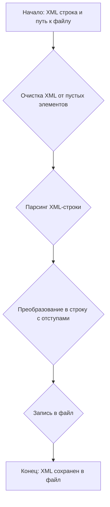

# Модуль для работы с XML
=================================================

Модуль содержит функции для очистки, форматирования и сохранения XML данных.
Основное назначение - предоставить инструменты для работы с XML, включая удаление пустых элементов и форматирование с отступами для удобства чтения.

## Обзор

Модуль `src.utils.xml` предназначен для обработки XML-данных. Он предоставляет функции для очистки XML от пустых CDATA секций и лишних пробелов, а также для сохранения XML в файл с форматированием. Это может быть полезно при работе с XML-конфигурациями или данными, которые требуют предварительной обработки перед сохранением или передачей.

## Подробнее

Модуль содержит функции `clean_empty_cdata` и `save_xml`, которые позволяют очищать XML от пустых элементов и сохранять его в файл с отступами. Функция `clean_empty_cdata` удаляет пустые элементы и лишние пробелы, а функция `save_xml` сохраняет отформатированный XML в файл.

## Функции

### `clean_empty_cdata`

```python
def clean_empty_cdata(xml_string: str) -> str:
    """ Функция очищает XML-строку от пустых CDATA секций и лишних пробелов.

    Args:
        xml_string (str): Исходный XML контент в виде строки.

    Returns:
        str: Очищенный и отформатированный XML контент.
    """
```

**Назначение**: Очистка XML-строки от пустых элементов и лишних пробелов.

**Параметры**:
- `xml_string` (str): XML контент в виде строки, который необходимо очистить.

**Возвращает**:
- `str`: Очищенный и отформатированный XML контент.

**Как работает функция**:
1. **Преобразование строки в XML-дерево**: Исходная XML-строка преобразуется в дерево элементов с использованием `ET.fromstring(xml_string)`.
2. **Рекурсивное удаление пустых элементов**: Определяется внутренняя функция `remove_empty_elements`, которая рекурсивно обходит дерево элементов. Если у элемента нет текста (или текст состоит только из пробелов), нет атрибутов и нет дочерних элементов, то он удаляется из родительского элемента.
3. **Преобразование очищенного дерева обратно в строку**: Очищенное XML-дерево преобразуется обратно в строку с использованием `ET.tostring(root, encoding="utf-8").decode("utf-8")`.
4. **Удаление лишних пробелов между тегами**: С использованием регулярного выражения `re.sub(r">\s+<", "><", cleaned_xml)` удаляются лишние пробелы между закрывающим и открывающим тегами.
5. **Возврат очищенной XML-строки**: Возвращается строка с очищенным и отформатированным XML-контентом.

```mermaid
graph TD
    A[Начало: XML строка] --> B{Преобразование в XML-дерево};
    B --> C{Удаление пустых элементов (рекурсивно)};
    C --> D{Преобразование обратно в XML строку};
    D --> E{Удаление лишних пробелов между тегами};
    E --> F[Конец: Очищенная XML строка];
```

**Примеры**:
```python
xml_data = "<root><item>Value</item><empty></empty><item attr='test'>Another</item></root>"
cleaned_xml = clean_empty_cdata(xml_data)
print(cleaned_xml)
# Вывод: <root><item>Value</item><item attr="test">Another</item></root>
```

### `save_xml`

```python
def save_xml(xml_string: str, file_path: str) -> None:
    """ Функция сохраняет очищенные XML данные из строки в файл с отступами.

    Args:
        xml_string (str): XML контент в виде строки.
        file_path (str): Путь к выходному файлу.

    Returns:
        None
    """
```

**Назначение**: Сохранение XML данных в файл с отступами.

**Параметры**:
- `xml_string` (str): XML контент в виде строки, который необходимо сохранить.
- `file_path` (str): Путь к файлу, в который будет сохранен XML контент.

**Как работает функция**:
1. **Очистка XML от пустых элементов**: Вызывается функция `clean_empty_cdata(xml_string)` для удаления пустых элементов из XML-строки.
2. **Парсинг XML-строки**: Очищенная XML-строка парсится с использованием `ET.ElementTree(ET.fromstring(cleaned_xml))` для создания XML-дерева.
3. **Преобразование в строку с отступами**: XML-дерево преобразуется в строку с отступами с использованием `minidom.parseString(rough_string).toprettyxml(indent="  ")`.
4. **Запись в файл**: Отформатированная XML-строка записывается в файл с использованием `with open(file_path, "w", encoding="utf-8") as file: file.write(pretty_xml)`.



**Примеры**:
```python
xml_data = "<root><item>Value</item><item attr='test'>Another</item></root>"
save_xml(xml_data, "output.xml")
```

## Зависимости

Модуль использует следующие стандартные библиотеки Python:

- `xml.etree.ElementTree` для парсинга и обработки XML.
- `xml.dom.minidom` для форматирования XML с отступами.
- `re` для удаления лишних пробелов.