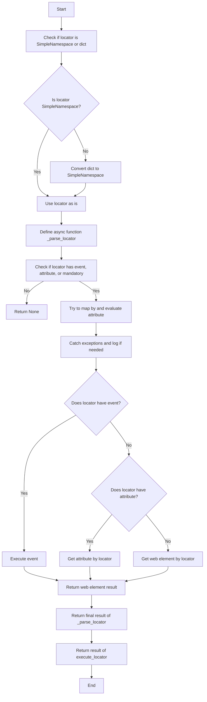
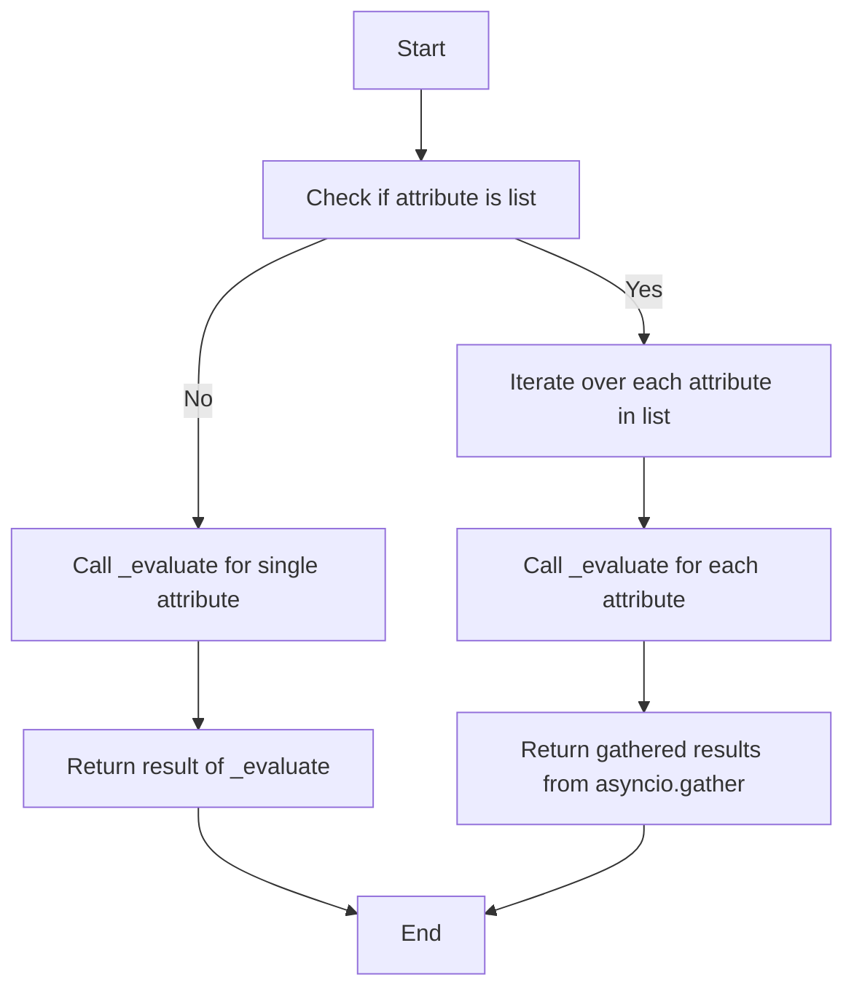
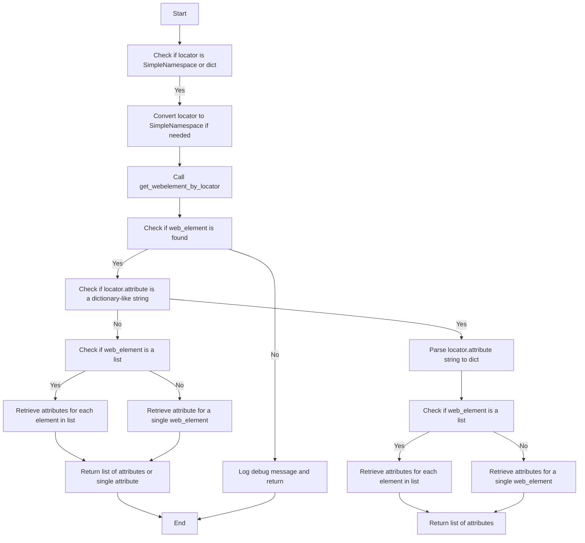

# `executor.py`

## Обзор

Модуль `executor` предназначен для выполнения действий с веб-элементами на основе предоставленных конфигураций, известных как "локаторы". Эти конфигурации (или "локаторы") представляют собой словари, содержащие информацию о том, как находить и взаимодействовать с элементами на веб-странице. Модуль предоставляет следующие функциональные возможности:

1. **Разбор и обработка локаторов**: Преобразует словари с конфигурациями в объекты `SimpleNamespace`, что обеспечивает гибкую манипуляцию данными локатора.
2. **Взаимодействие с веб-элементами**: В зависимости от предоставленных данных модуль может выполнять различные действия, такие как клики, отправка сообщений, выполнение событий и получение атрибутов веб-элементов.
3. **Обработка ошибок**: Модуль поддерживает продолжение выполнения в случае ошибки, что позволяет обрабатывать веб-страницы, которые могут содержать нестабильные элементы или требовать особого подхода.
4. **Поддержка нескольких типов локаторов**: Обрабатывает как единичные, так и множественные локаторы, обеспечивая возможность идентификации и взаимодействия с одним или несколькими веб-элементами одновременно.

Этот модуль обеспечивает гибкость и универсальность при работе с веб-элементами, позволяя автоматизировать сложные сценарии веб-взаимодействия.

## Оглавление

1.  [Классы](#классы)
    *   [`ExecuteLocator`](#executelocator)
2.  [Функции](#функции)
    *   [`execute_locator`](#execute_locator)
    *   [`evaluate_locator`](#evaluate_locator)
    *   [`get_attribute_by_locator`](#get_attribute_by_locator)
    *   [`get_webelement_by_locator`](#get_webelement_by_locator)
    *   [`get_webelement_as_screenshot`](#get_webelement_as_screenshot)
    *   [`execute_event`](#execute_event)
    *   [`send_message`](#send_message)

## Классы

### `ExecuteLocator`

**Описание**: Обработчик локаторов для веб-элементов с использованием Selenium.

**Параметры**:

*   `driver` (Optional[object], optional): Веб-драйвер Selenium. По умолчанию `None`.
*   `actions` (ActionChains): Объект ActionChains для выполнения цепочки действий.
*   `by_mapping` (dict): Словарь соответствия строк с методами поиска `By` в Selenium.
*   `mode` (str, optional): Режим работы ('debug' по умолчанию).

**Методы**:

*   `__post_init__`: Инициализирует объект `ActionChains`, если `driver` предоставлен.

## Функции

### `execute_locator`

**Описание**: Выполняет действия над веб-элементом на основе предоставленного локатора.

**Параметры**:

*   `locator` (dict | SimpleNamespace): Данные локатора (словарь или SimpleNamespace).
*   `timeout` (Optional[float], optional): Время ожидания для поиска элемента. По умолчанию `0`.
*  `timeout_for_event` (Optional[str], optional): Условие ожидания для события (`'presence_of_element_located'` или `'element_to_be_clickable'`). По умолчанию `'presence_of_element_located'`.
*   `message` (Optional[str], optional): Сообщение для отправки. По умолчанию `None`.
*   `typing_speed` (Optional[float], optional): Скорость набора текста для событий `send_keys`. По умолчанию `0`.
*   `continue_on_error` (Optional[bool], optional): Продолжать ли выполнение при ошибке. По умолчанию `True`.

**Возвращает**:

*   `str | list | dict | WebElement | bool | None`: Результат выполнения, основанный на инструкциях локатора.

**Диаграмма процесса:**



### `evaluate_locator`

**Описание**: Вычисляет и обрабатывает атрибуты локатора.

**Параметры**:

*   `attribute` (str | List[str] | dict): Атрибуты для вычисления.

**Возвращает**:

*   `Optional[str | List[str] | dict]`: Вычисленные атрибуты.

**Диаграмма процесса:**



### `get_attribute_by_locator`

**Описание**: Извлекает атрибуты из элемента или списка элементов, найденных по заданному локатору.

**Параметры**:

*   `locator` (SimpleNamespace | dict): Локатор в виде словаря или SimpleNamespace.
*   `timeout` (Optional[float], optional): Максимальное время ожидания появления элемента. По умолчанию `0`.
*   `timeout_for_event` (str, optional): Тип условия ожидания. По умолчанию `'presence_of_element_located'`.
*   `message` (Optional[str], optional): Сообщение для отправки, если применимо. По умолчанию `None`.
*   `typing_speed` (float, optional): Скорость ввода для событий отправки ключей. По умолчанию `0`.
*   `continue_on_error` (bool, optional): Продолжать ли выполнение в случае ошибки. По умолчанию `True`.

**Возвращает**:

*   `WebElement | list[WebElement] | None`: Значение(я) атрибута или словарь с атрибутами, или `None`, если элемент не найден.

**Диаграмма процесса:**



### `get_webelement_by_locator`

**Описание**: Извлекает веб-элемент или список элементов по указанному локатору.

**Параметры**:

*   `locator` (dict | SimpleNamespace): Локатор элемента в виде словаря или `SimpleNamespace`.
*   `timeout` (Optional[float], optional): Время ожидания для поиска элемента. По умолчанию `0`.
*   `timeout_for_event` (Optional[str], optional): Условие ожидания элемента. По умолчанию `'presence_of_element_located'`.

**Возвращает**:

*   `WebElement | List[WebElement] | None`: Найденный веб-элемент, список элементов или `None`, если элемент не найден.

### `get_webelement_as_screenshot`

**Описание**: Делает скриншот найденного веб-элемента.

**Параметры**:

*   `locator` (SimpleNamespace | dict): Локатор элемента.
*  `timeout` (float, optional): Максимальное время ожидания появления элемента. По умолчанию `5`.
*  `timeout_for_event` (str, optional): Тип условия ожидания. По умолчанию `'presence_of_element_located'`.
*   `message` (Optional[str], optional): Сообщение для отправки. По умолчанию `None`.
*   `typing_speed` (float, optional): Скорость ввода текста для событий отправки ключей. По умолчанию `0`.
*   `continue_on_error` (bool, optional): Продолжать ли выполнение в случае ошибки. По умолчанию `True`.
*   `webelement` (Optional[WebElement], optional): Предварительно полученный веб-элемент. По умолчанию `None`.

**Возвращает**:

*   `BinaryIO | None`: Двоичный поток скриншота или `None` в случае неудачи.

### `execute_event`

**Описание**: Выполняет события, связанные с локатором.

**Параметры**:

*   `locator` (SimpleNamespace | dict): Локатор, определяющий элемент и событие для выполнения.
*   `timeout` (float, optional): Время ожидания для нахождения элемента. По умолчанию `5`.
*   `timeout_for_event` (str, optional): Время ожидания события. По умолчанию `'presence_of_element_located'`.
*   `message` (Optional[str], optional): Сообщение для отправки с событием, если применимо. По умолчанию `None`.
*   `typing_speed` (int, optional): Скорость набора текста для событий `send_keys`. По умолчанию `0`.
*   `continue_on_error` (bool, optional): Продолжать ли выполнение в случае ошибки. По умолчанию `True`.

**Возвращает**:

*   `str | list[str] | bytes | list[bytes] | bool`: `True`, если событие выполнено успешно, `False` в противном случае.

### `send_message`

**Описание**: Отправляет сообщение веб-элементу.

**Параметры**:

*   `locator` (SimpleNamespace | dict): Информация о местоположении элемента на странице.
*   `timeout` (float, optional): Максимальное время ожидания появления элемента. По умолчанию `5`.
*   `timeout_for_event` (str, optional): Тип условия ожидания. По умолчанию `'presence_of_element_located'`.
*   `message` (str, optional): Сообщение для отправки. По умолчанию `None`.
*   `typing_speed` (float, optional): Скорость набора сообщения в секундах. По умолчанию `0`.
*   `continue_on_error` (bool, optional): Продолжать ли выполнение в случае ошибки. По умолчанию `True`.

**Возвращает**:

*   `bool`: `True`, если сообщение было успешно отправлено, `False` в противном случае.

**Пример**:

```python
>>> driver = Driver()
>>> driver.send_message(locator={"id": "messageBox"}, message="Hello World", typing_speed=0.1)
True
```
```markdown