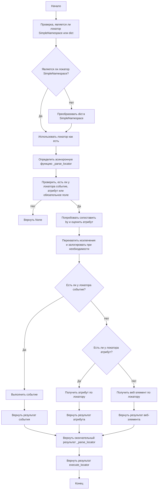
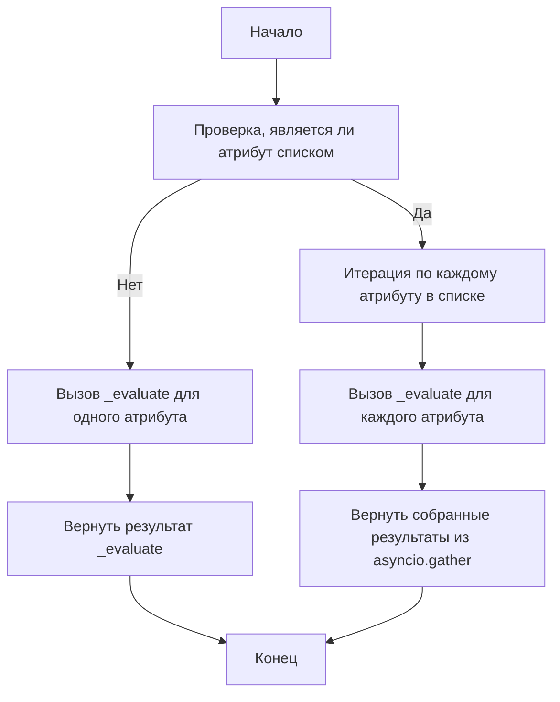
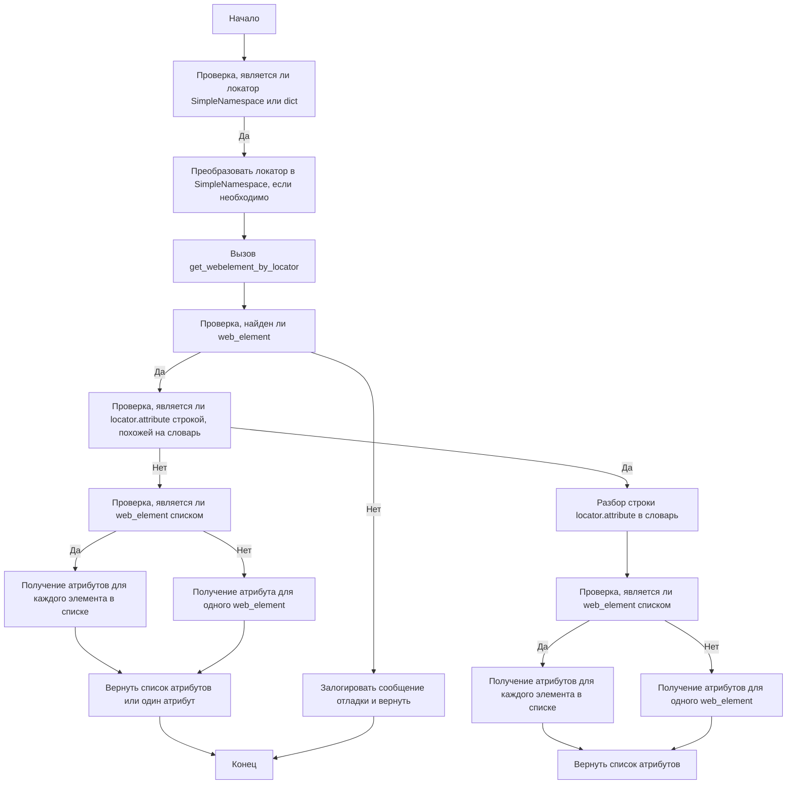

# Документация по `executor.py`

## Обзор

Модуль `executor.py` является частью пакета `src.webdriver` и предназначен для автоматизации взаимодействия с веб-элементами с использованием Selenium. Этот модуль предоставляет гибкий и универсальный фреймворк для поиска, взаимодействия и извлечения информации из веб-элементов на основе предоставленных конфигураций, известных как "локаторы".

## Оглавление

- [Обзор](#обзор)
- [Основные возможности](#основные-возможности)
- [Структура модуля](#структура-модуля)
    - [Классы](#классы)
        - [`ExecuteLocator`](#executelocator)
    - [Диаграммы потока](#диаграммы-потока)
        - [`execute_locator`](#execute_locator-1)
        - [`evaluate_locator`](#evaluate_locator-1)
        - [`get_attribute_by_locator`](#get_attribute_by_locator-1)
- [Использование](#использование)
- [Зависимости](#зависимости)
- [Обработка ошибок](#обработка-ошибок)
- [Вклад](#вклад)
- [Лицензия](#лицензия)

## Основные возможности

1.  **Парсинг и обработка локаторов**: Преобразует словари с конфигурациями в объекты `SimpleNamespace`, что позволяет гибко манипулировать данными локаторов.
2.  **Взаимодействие с веб-элементами**: Выполняет различные действия, такие как клики, отправка сообщений, выполнение событий и извлечение атрибутов из веб-элементов.
3.  **Обработка ошибок**: Поддерживает продолжение выполнения в случае ошибки, что позволяет обрабатывать веб-страницы с нестабильными элементами или требующими особого подхода.
4.  **Поддержка нескольких типов локаторов**: Обрабатывает как отдельные, так и множественные локаторы, позволяя идентифицировать и взаимодействовать с одним или несколькими веб-элементами одновременно.

## Структура модуля

### Классы

#### `ExecuteLocator`

**Описание**: Этот класс является ядром модуля, отвечающим за обработку взаимодействий с веб-элементами на основе предоставленных локаторов.

**Атрибуты**:

-   `driver` (webdriver.Chrome | webdriver.Firefox | webdriver.Safari | webdriver.Edge | None): Экземпляр Selenium WebDriver.
-   `actions` (ActionChains): Объект `ActionChains` для выполнения сложных действий.
-   `by_mapping` (dict): Словарь, сопоставляющий типы локаторов с методами `By` Selenium.
-   `mode` (str): Режим выполнения (`debug`, `dev` и т.д.).

**Методы**:

-   `__post_init__`
    
    **Описание**: Инициализирует объект `ActionChains`, если предоставлен драйвер.
    
    **Параметры**:
    
    -   `self` (ExecuteLocator): Экземпляр класса `ExecuteLocator`.
    
    **Возвращает**:
    
    -   `None`
    
-   `execute_locator`
    
    **Описание**: Выполняет действия над веб-элементом на основе предоставленного локатора.
    
    **Параметры**:
    
    -   `locator` (dict | types.SimpleNamespace):  Словарь или `SimpleNamespace` с конфигурацией локатора.
    
    **Возвращает**:
    
    -   `Any | None`: Результат выполнения действий над веб-элементом.
    
-    `evaluate_locator`
    
    **Описание**: Оценивает и обрабатывает атрибуты локатора.
    
    **Параметры**:
    
    -   `locator` (dict | types.SimpleNamespace):  Словарь или `SimpleNamespace` с конфигурацией локатора.
    
    **Возвращает**:
    
    -   `list[Any] | Any | None`: Результат оценки атрибутов локатора.
    
-   `get_attribute_by_locator`
    
    **Описание**: Извлекает атрибуты из элемента или списка элементов, найденных по заданному локатору.
    
    **Параметры**:
    
    -   `locator` (dict | types.SimpleNamespace): Словарь или `SimpleNamespace` с конфигурацией локатора.
    
    **Возвращает**:
    
    -  `list[str] | str | None`: Список атрибутов, если найден список элементов, иначе строка с атрибутом или `None`.
    
-   `get_webelement_by_locator`
    
    **Описание**: Извлекает веб-элементы на основе предоставленного локатора.
    
    **Параметры**:
    
    -   `locator` (dict | types.SimpleNamespace): Словарь или `SimpleNamespace` с конфигурацией локатора.
    
    **Возвращает**:
    
    -  `list[WebElement] | WebElement | None`: Список веб-элементов, если найден список, иначе один веб-элемент или `None`.
    
    **Вызывает исключения**:
    
    -   `ValueError`: Если указан неправильный селектор.
    
-    `get_webelement_as_screenshot`
    
    **Описание**: Делает скриншот найденного веб-элемента.
    
    **Параметры**:
    
    -  `locator` (dict | types.SimpleNamespace): Словарь или `SimpleNamespace` с конфигурацией локатора.
    -  `name` (str): Название файла, в который необходимо сохранить скриншот.
    
    **Возвращает**:
    
    - `str | None`:  Путь к файлу со скриншотом, если элемент найден, иначе `None`.

-    `execute_event`
    
    **Описание**: Выполняет события, связанные с локатором.
    
    **Параметры**:
    
    -   `locator` (dict | types.SimpleNamespace):  Словарь или `SimpleNamespace` с конфигурацией локатора.
    
    **Возвращает**:
    
    -   `Any | None`: Результат выполнения события или `None`, если событие не указано.
    
-   `send_message`
    
    **Описание**: Отправляет сообщение веб-элементу.
    
    **Параметры**:
    
    -  `locator` (dict | types.SimpleNamespace): Словарь или `SimpleNamespace` с конфигурацией локатора.
    -  `message` (str): Сообщение, которое нужно отправить веб-элементу.
    
    **Возвращает**:
    
    - `bool | None`: Возвращает `True`, если сообщение отправлено успешно, в противном случае `None`.

### Диаграммы потока

Модуль включает диаграммы потока Mermaid для иллюстрации потока выполнения ключевых методов:

-   **`execute_locator`**:



-   **`evaluate_locator`**:



-   **`get_attribute_by_locator`**:



## Использование

Для использования этого модуля создайте экземпляр класса `ExecuteLocator` с экземпляром Selenium WebDriver, а затем вызовите различные методы для взаимодействия с веб-элементами на основе предоставленных локаторов.

### Пример

```python
from selenium import webdriver
from src.webdriver.executor import ExecuteLocator

# Инициализация WebDriver
driver = webdriver.Chrome()

# Инициализация класса ExecuteLocator
executor = ExecuteLocator(driver=driver)

# Определение локатора
locator = {
    "by": "ID",
    "selector": "some_element_id",
    "event": "click()"
}

# Выполнение локатора
result = await executor.execute_locator(locator)
print(result)
```

## Зависимости

-   `selenium`: Для веб-автоматизации.
-   `asyncio`: Для асинхронных операций.
-   `re`: Для регулярных выражений.
-   `dataclasses`: Для создания классов данных.
-   `enum`: Для создания перечислений.
-   `pathlib`: Для обработки путей к файлам.
-   `types`: Для создания простых пространств имен.
-   `typing`: Для аннотаций типов.

## Обработка ошибок

Модуль включает надежную обработку ошибок, чтобы обеспечить продолжение выполнения даже в случае, если некоторые элементы не найдены или если возникли проблемы с веб-страницей. Это особенно полезно для обработки динамических или нестабильных веб-страниц.

## Вклад

Вклад в этот модуль приветствуется. Пожалуйста, убедитесь, что любые изменения хорошо документированы и включают соответствующие тесты.

## Лицензия

Этот модуль лицензирован под MIT License. Подробности смотрите в файле `LICENSE`.