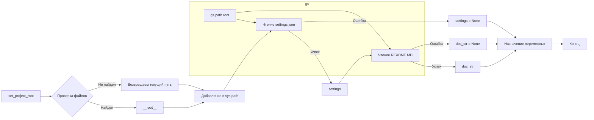

# Анализ кода из файла hypotez/src/_examples/header.py

## <input code>

```python
## \file hypotez/src/utils/_examples/header.py
# -*- coding: utf-8 -*-\
#! venv/Scripts/python.exe
#! venv/bin/python/python3.12

"""
.. module: src.utils._examples 
	:platform: Windows, Unix
	:synopsis:

"""
MODE = 'dev'

import sys
import json
from packaging.version import Version

from pathlib import Path
def set_project_root(marker_files=(\'pyproject.toml\', \'requirements.txt\', \'.git\')) -> Path:
    """
    Finds the root directory of the project starting from the current file's directory,
    searching upwards and stopping at the first directory containing any of the marker files.

    Args:
        marker_files (tuple): Filenames or directory names to identify the project root.
    
    Returns:
        Path: Path to the root directory if found, otherwise the directory where the script is located.
    """
    __root__:Path
    current_path:Path = Path(__file__).resolve().parent
    __root__ = current_path
    for parent in [current_path] + list(current_path.parents):
        if any((parent / marker).exists() for marker in marker_files):
            __root__ = parent
            break
    if __root__ not in sys.path:
        sys.path.insert(0, str(__root__))
    return __root__


# Get the root directory of the project
__root__ = set_project_root()
"""__root__ (Path): Path to the root directory of the project"""

from src import gs

settings:dict = None
try:
    with open(gs.path.root / 'src' / 'settings.json', 'r') as settings_file:
        settings = json.load(settings_file)
except (FileNotFoundError, json.JSONDecodeError):
    ...

doc_str:str = None
try:
    with open(gs.path.root / 'src' / 'README.MD', 'r') as settings_file:
        doc_str = settings_file.read()
except (FileNotFoundError, json.JSONDecodeError):
    ...


__project_name__ = settings.get("project_name", 'hypotez') if settings  else 'hypotez'
__version__: str = settings.get("version", '')  if settings  else ''
__doc__: str = doc_str if doc_str else ''
__details__: str = ''
__author__: str = settings.get("author", '')  if settings else ''
__copyright__: str = settings.get("copyrihgnt", '')  if settings else ''
__cofee__: str = settings.get("cofee", "Treat the developer to a cup of coffee for boosting enthusiasm in development: https://boosty.to/hypo69")  if settings else "Treat the developer to a cup of coffee for boosting enthusiasm in development: https://boosty.to/hypo69"
```

## <algorithm>

**Шаг 1:**  Функция `set_project_root` ищет корневой каталог проекта, начиная с текущего каталога и поднимаясь по иерархии каталогов.
    * **Пример:** Если `__file__` указывает на `/home/user/project/src/utils/_examples/header.py`, функция будет проверять `/home/user/project/src/utils/_examples`, `/home/user/project/src/utils`, `/home/user/project/src`, `/home/user/project`.
    * **Входные данные:** Кортеж `marker_files` с именами файлов или каталогов, которые определяют корневой каталог проекта.
    * **Выходные данные:** Путь до корневого каталога проекта (`Path`). Если корневой каталог не найден, возвращается путь до текущего каталога.


**Шаг 2:**  Функция `set_project_root` добавляет найденный корневой каталог в `sys.path`, чтобы импорты работали корректно.

**Шаг 3:** Получение корневого каталога проекта (`__root__`).

**Шаг 4:**  Загрузка настроек из `settings.json`.
    * **Пример:** Если файл `settings.json` находится в `/home/user/project/src/settings.json`, то код попытается его открыть.
    * **Входные данные:** Путь к `settings.json`, определенный относительно корневого каталога (`__root__`).
    * **Выходные данные:** Словарь `settings`, содержащий настройки из файла.  Возможны ошибки (FileNotFoundError, json.JSONDecodeError) при чтении или парсинге файла.

**Шаг 5:**  Загрузка документации из `README.MD`.
    * **Пример:** Если файл `README.MD` находится в `/home/user/project/src/README.MD`, то код попытается его открыть.
    * **Входные данные:** Путь к `README.MD`, определенный относительно корневого каталога (`__root__`).
    * **Выходные данные:** Строка `doc_str` с содержимым файла. Возможны ошибки (FileNotFoundError, json.JSONDecodeError) при чтении файла.

**Шаг 6:**  Назначение переменных `__project_name__`, `__version__`, `__doc__`, `__details__`, `__author__`, `__copyright__`, `__cofee__` из словаря `settings` (если найден). В противном случае, используется значение по умолчанию.


## <mermaid>



## <explanation>

**Импорты:**

* `sys`: Предоставляет доступ к системным параметрам, в том числе `sys.path`, необходимый для корректной работы импортов.
* `json`: Используется для сериализации и десериализации данных в формате JSON.
* `packaging.version`: Предоставляет классы и функции для работы с версиями пакетов, но используется только для контекста (без явного использования).
* `pathlib`: Предоставляет классы для работы с путями к файлам и каталогам.
* `src.gs`: Скорее всего, это модуль, предоставляющий полезные функции или переменные для работы с путями к файлам проекта (`gs.path.root`).  Необходим для определения путей к файлам настроек и документации. Связь с другими частями проекта через этот модуль.

**Классы:**

Код не содержит классов в явном виде.

**Функции:**

* `set_project_root(marker_files=...)`: Функция находит корневой каталог проекта.
    * **Аргументы:** `marker_files` (кортеж): Список файлов или каталогов, по наличию которых определяется корень проекта.
    * **Возвращаемое значение:** `Path`: Путь к корневому каталогу проекта.
    * **Примеры:** Если в `marker_files` указаны `pyproject.toml`, `requirements.txt` и `.git`, функция будет искать каталог, содержащий эти файлы.

**Переменные:**

* `MODE`: Строковая переменная, вероятно, для настройки режима работы (например, `dev` или `prod`).
* `__root__`: Переменная, хранящая путь к корневому каталогу проекта.
* `settings`, `doc_str`: Переменные, хранящие загруженные из файлов настройки и документ.
* `__project_name__`, `__version__`, `__doc__`, `__details__`, `__author__`, `__copyright__`, `__cofee__`: Переменные для хранения метаданных проекта, извлекаемых из файла настроек.

**Возможные ошибки и улучшения:**

* **Обработка ошибок:**  Используются `try...except` блоки для обработки `FileNotFoundError` и `json.JSONDecodeError`, но могли бы быть добавлены более подробные сообщения об ошибках, чтобы улучшить отладку.
* **Более понятные имена переменных:**  Имена переменных, такие как `__root__`,  могут быть более информативными (`project_root`).
* **Использование констант:**  `'pyproject.toml'`, `'requirements.txt'`, `'.git'` и `'settings.json'`, `'README.MD'` должны быть константами, чтобы улучшить читаемость.
* **Важность `gs.path.root`**:  Модуль `gs` и переменная `gs.path.root` являются ключевыми для определения относительных путей. Важно убедиться, что эти компоненты определены надёжно и правильно. Без этого, код может быть уязвим к ошибкам.

**Цепочка взаимосвязей:**

Файл `header.py` зависит от модуля `gs` (включая `gs.path`), который, вероятно, предоставляет функции для работы с путями к файлам проекта.  Файл `header.py` загружает настройки из `settings.json` и документ из `README.MD`, что, вероятно, используется другими модулями в проекте. Взаимодействие между ними  осуществляется через эти файлы и переменные `settings` и `doc_str`.