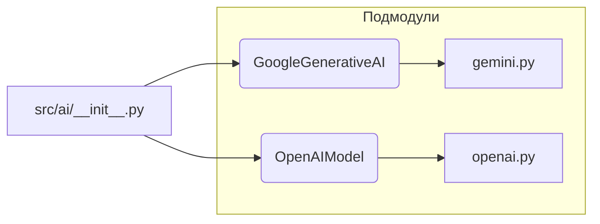

# <input code>

```python
## \file /src/ai/__init__.py
# -*- coding: utf-8 -*-\
#! venv/Scripts/python.exe
#! venv/bin/python/python3.12

"""
module: src.ai
	:platform: Windows, Unix
	:synopsis: Модуль интерфейса моделей ИИ.
	"""
MODE = 'dev'

from .gemini import GoogleGenerativeAI
from .openai import OpenAIModel
```

# <algorithm>

Алгоритм работы кода довольно прост. Файл `src/ai/__init__.py` — это модуль, который импортирует классы из подмодулей `gemini` и `openai`.  По сути, он выступает в роли импортёра, предоставляя доступ к этим классам в других частях проекта.

Пошаговая блок-схема:

1. **Импорт**: Модуль `src/ai/__init__.py` импортирует классы `GoogleGenerativeAI` и `OpenAIModel` из подмодулей `gemini` и `openai` соответственно.  Этот этап представляет собой простое указание интерпретатору Python, где искать необходимые определения классов.
2. **Инициализация**:  В этом коде нет инициализации переменных или вызовов функций, которые бы что-то делали. `MODE = 'dev'` просто задает константу, которая вероятно используется где-то в коде проекта для обозначения режима работы.

Пример:

```
# в другом модуле проекта
from src.ai import GoogleGenerativeAI

model = GoogleGenerativeAI() # Используется класс, импортированный из src/ai/__init__.py
```

# <mermaid>



**Объяснение диаграммы:**

Диаграмма показывает, что модуль `src/ai/__init__.py` импортирует классы `GoogleGenerativeAI` и `OpenAIModel`.  Эти классы, в свою очередь, определены в отдельных файлах `gemini.py` и `openai.py`, которые являются подмодулями модуля `src/ai`.  Таким образом, `src/ai/__init__.py` служит в качестве точки входа для доступа к моделям ИИ.

# <explanation>

* **Импорты**:
    * `from .gemini import GoogleGenerativeAI`: Импортирует класс `GoogleGenerativeAI` из подмодуля `gemini`. Символ `.` указывает на поиск файла `gemini.py` в текущем каталоге `src/ai`. Это указывает на то, что модуль `gemini` находится в подкаталоге `src/ai`.
    * `from .openai import OpenAIModel`: Импортирует класс `OpenAIModel` из подмодуля `openai`. Аналогично предыдущему примеру, поиск происходит в текущем каталоге.
    * `# -*- coding: utf-8 -*-`:  Указывается кодировка файла, что важно для корректного отображения символов.
    * `#! venv/Scripts/python.exe`, `#! venv/bin/python/python3.12`: Эти строки, начинающиеся с `#!`, являются "shebang lines" и используются для указания интерпретатора Python, который нужно использовать для запуска скрипта.  Они не являются критичными для корректной работы этого кода, но могут использоваться в скриптах, запускаемых из командной строки.

* **Классы**:
    * `GoogleGenerativeAI` и `OpenAIModel`: Это классы, представляющие модели ИИ, предоставляемые Google и OpenAI соответственно.  Подробности об их функциональности и методах нужно искать в файлах `gemini.py` и `openai.py`.

* **Функции**:
    * Нет явных функций в этом модуле. Это инициализирующий модуль, который лишь импортирует классы.

* **Переменные**:
    * `MODE = 'dev'`:  Переменная, вероятно, используется для определения режима работы приложения (например, `dev`, `prod`).  Это глобальная переменная, которая может быть использована в других частях проекта.

* **Возможные ошибки или области для улучшений**:

    * Отсутствует документация для класса `GoogleGenerativeAI` и `OpenAIModel` в `gemini.py` и `openai.py`. Это усложнит понимание их работы.
    * В `src/ai/__init__.py` нет обработки случаев, когда модули `gemini` или `openai` не найдены или не содержат ожидаемых классов.

* **Цепочка взаимосвязей:**  Этот модуль является частью более крупной структуры.  Он отвечает за импорт классов, которые, скорее всего, используются для взаимодействия с API Google и OpenAI в рамках более крупного приложения.


**Дополнительно:**
Рекомендуется добавить `docstrings` (строки документации) к классам `GoogleGenerativeAI` и `OpenAIModel` в файлах `gemini.py` и `openai.py` соответственно, чтобы описать их поведение.  Это поможет другим разработчикам (и будущему вам) понять, как использовать эти классы.
```