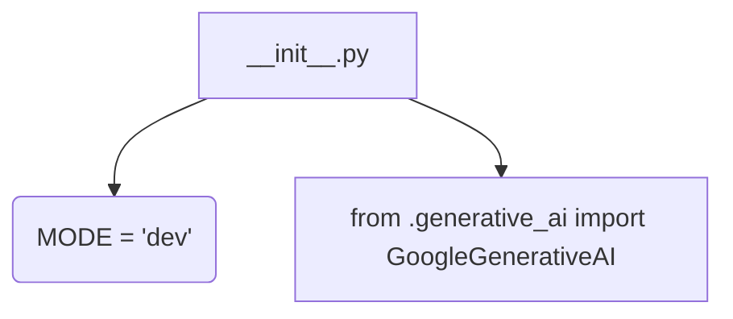
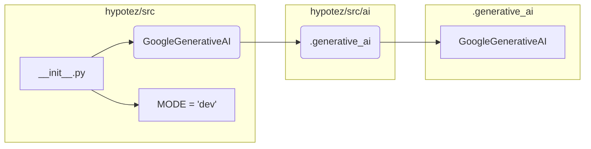

```MD
# <input code>

```python
## \file hypotez/src/ai/gemini/__init__.py
# -*- coding: utf-8 -*-
#! venv/Scripts/python.exe
#! venv/bin/python/python3.12

"""
.. module: src.ai.gemini 
	:platform: Windows, Unix
	:synopsis: Модуль модели `gemini`

"""
MODE = 'dev'


from .generative_ai import GoogleGenerativeAI
```

# <algorithm>

Алгоритм работы представленного кода прост.  Это файл инициализации модуля `gemini`.  В нем происходит импорт класса `GoogleGenerativeAI`.  Сам по себе код не выполняет никаких действий при запуске, но подготавливает пространство имён для использования в других частях проекта.  Логики обработки данных нет.



Пример: Если в другом файле проекта потребуется использовать класс `GoogleGenerativeAI`, он будет импортирован через `from hypotez.src.ai.gemini import GoogleGenerativeAI`.


# <mermaid>



# <explanation>

* **Импорты:**
    * `from .generative_ai import GoogleGenerativeAI`: Импортирует класс `GoogleGenerativeAI` из подпапки `generative_ai` текущего каталога (`hypotez/src/ai/gemini`).  Значок `.` в имени файла указывает на относительный путь.  Это важная деталь, показывающая, что `GoogleGenerativeAI` определён в другом файле в этой же структуре папок (likely `hypotez/src/ai/gemini/generative_ai.py`).  Связь с другими частями проекта - `GoogleGenerativeAI` вероятно взаимодействует с библиотекой Google AI для генерации текста.


* **Переменные:**
    * `MODE = 'dev'`:  Переменная, вероятно, используется для определения режима работы (например, `dev`, `prod`).  Это конфигурационная переменная, которая не имеет непосредственной связи с импортируемым классом.


* **Классы:**
    * `GoogleGenerativeAI`:  Этот класс, определённый в файле `generative_ai.py` (подразумевается), вероятно, предоставляет функции для взаимодействия с API Google для генерации текста.  Подключение к API и использование его ресурсов произойдёт не в `__init__.py`, а в другом месте, где этот класс будет создан и использован.

* **Функции:**
   Нет функций в данном файле.


* **Возможные ошибки или улучшения:**

    * Отсутствует документация для класса `GoogleGenerativeAI` и его методов.  Это затрудняет использование этого класса.
    * Файл `__init__.py` должен иметь ясное назначение (не только импортировать классы).  Имея только импорты, он не выполняет никаких действий и, по сути, бесполезен.  В идеале, в нём должны быть функции, которые инициализируют модуль или предоставляют доступ к основным функциям класса `GoogleGenerativeAI`.
    * Лучше использовать абсолютные пути при импорте для большей устойчивости кода.  Для понимания проекта необходимо посмотреть на код в файле `generative_ai.py`.
    * Вероятно, требуется добавить обработку исключений для ситуаций, когда доступ к API Google невозможен.


**Цепочка взаимосвязей:**

Этот файл инициализирует импорты для использования класса `GoogleGenerativeAI`.  Этот класс взаимодействует с Google AI API для генерации текста.  Другой код в проекте, импортирующий `GoogleGenerativeAI` из этого файла, использует функции класса `GoogleGenerativeAI` для своих задач.
```