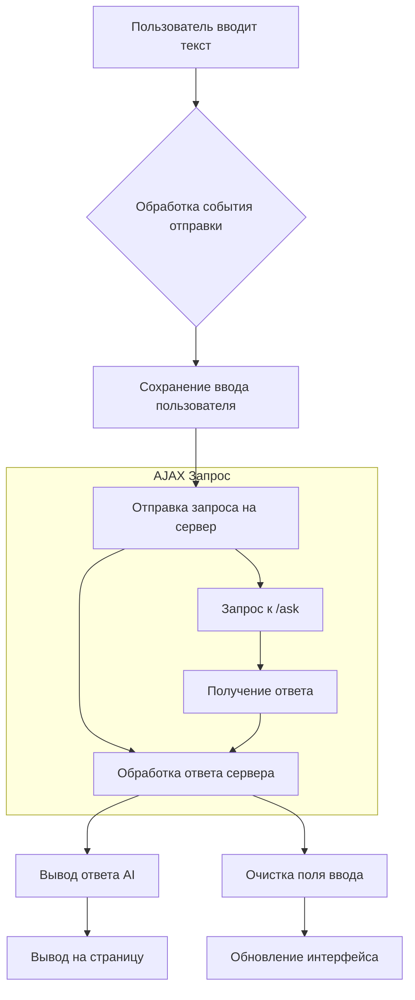

```MD
# Анализ кода файла chat.html

**1. <input code>**

```html
## \file hypotez/src/ai/gemini/html_chat/templates/chat.html
# -*- coding: utf-8 -*-\
#! venv/Scripts/python.exe

""" module: src.ai.gemini.html_chat.templates """
MODE = 'debug'
<!DOCTYPE html>
<html lang="en">
<head>
    <meta charset="UTF-8">
    <meta name="viewport" content="width=device-width, initial-scale=1.0">
    <title>Kazarinov Chat</title>
    <!-- Bootstrap CSS -->
    <link rel="stylesheet" href="https://cdn.jsdelivr.net/npm/bootstrap@4.0.0/dist/css/bootstrap.min.css" integrity="sha384-Gn5384xqQ1aoWXA+058RXPxPg6fy4IWvTNh0E263XmFcJlSAwiGgFAW/dAiS6JXm" crossorigin="anonymous">
    <script src="https://code.jquery.com/jquery-3.5.1.min.js"></script>
    <!-- Дополнительные стили -->
    <link rel="stylesheet" href="{{ url_for('static', path='css/styles.css') }}">
</head>
<body>
    <div class="container mt-5">
        <h1 class="text-center">Kazarinov AI Chat</h1>
        <div class="chat-box border rounded p-3 mb-3" style="height: 400px; overflow-y: scroll;">
            <div id="chat-log">
                <!-- Здесь будут отображаться сообщения -->
            </div>
        </div>
        <form id="chat-form">
            <div class="input-group">
                <input type="text" id="user-input" class="form-control" placeholder="Введите сообщение...">
                <div class="input-group-append">
                    <button class="btn btn-primary" type="submit">Отправить</button>
                </div>
            </div>
        </form>
    </div>


    <script>
        $(document).ready(function() {
            $('#chat-form').submit(function(event) {
                event.preventDefault();

                let userInput = $('#user-input').val();
                $('#chat-log').append('<p><strong>Вы:</strong> ' + userInput + '</p>');

                $.ajax({
                    url: '/ask',
                    method: 'POST',
                    data: { user_input: userInput },
                    success: function(response) {
                        $('#chat-log').append('<p><strong>AI:</strong> ' + response.response + '</p>');
                        $('#user-input').val('');  // Очистка поля ввода
                    }
                });
            });
        });
    </script>
</body>
</html>
```

**2. <algorithm>**



**3. <mermaid>**

```mermaid
graph LR
    A[chat.html] --> B(jQuery);
    B --> C{Обработка событий};
    C --> D(AJAX);
    D --> E[/ask (POST)];
    E --> F(Сервер);
    F --> G{Обработка запроса};
    G --> H(Отправка ответа);
    H --> I[chat.html];
    I --> J(Вывод ответа);
```

**4. <explanation>**

* **Импорты**:
    * Нет явных импортов Python-модулей.  Этот файл - шаблон HTML, использующий JavaScript и jQuery для взаимодействия с сервером Flask.
    *  `{{ url_for('static', path='css/styles.css') }}` —  директива Jinja2,  подключающая статические файлы CSS, например, `styles.css`.  `url_for` — функция Flask для построения URL.  Связь: Flask отвечает за обработку запросов, связанных с файлами `static`, и Jinja2 использует информацию из Flask.
* **Классы**:
    * Нет определённых классов Python.  Код использует JavaScript для создания динамического содержимого страницы.
* **Функции**:
    * Нет функций Python.  В JS есть анонимная функция, обрабатывающая событие отправки формы `#chat-form`.  Она получает ввод пользователя и отправляет запрос AJAX на сервер. Функция success в `$.ajax` получает ответ и обновляет страницу.
* **Переменные**:
    * `userInput` (JS): Хранит введённое пользователем сообщение.  Тип - строка.
    * `response` (JS): Хранит ответ от сервера, в котором предполагается поле `response`.  Тип - объект JavaScript.
    * `MODE` (Python): Константа, используемая, вероятно, в другом коде Flask для определения режима работы приложения.
* **Возможные ошибки или улучшения**:
    * Необходимо правильно обработать возможные ошибки в запросе AJAX (`error`-обработчик). Сейчас при проблеме с сервером пользователю не будет показано сообщение об ошибке.
    * Обработка разных статусов HTTP от сервера (200, 404 и т.д.).
    * Возможно, лучше использовать более структурированный способ вывода диалогов, чем просто `append` в `#chat-log`.
    * Отсутствие валидации ввода пользователя. Необходимо добавить проверку на пустой ввод и другие некорректные данные.
    * Нет обработки ошибок в JavaScript, что может привести к проблемам, если сервер возвращает не JSON.
    * Неясно, как работает обработчик `'/ask'`.  Это предположительно маршрут Flask, который получает ввод пользователя и отправляет запрос в AI-модель. Необходимо проанализировать код Flask.

**Взаимосвязь с другими частями проекта:**
    *  `src.ai.gemini.html_chat` — вероятно,  пакет, отвечающий за чат-интерфейс.
    * `'/ask'`-маршрут (Flask)  обрабатывает POST-запросы с пользовательским вводом, взаимодействует с Gemini-моделью (или другим AI-API) и возвращает ответ.
    *  `static/css/styles.css` содержит стили, определяющие внешний вид чат-интерфейса.
    *  `venv/Scripts/python.exe` — интерпретатор Python, используемый Flask для работы сервера.
    *  jQuery используется для динамического обновления интерфейса.


Этот HTML-шаблон, совместно с кодом сервера Flask, формирует веб-приложение для чата с AI-моделью Gemini.  Подробный анализ требует ознакомления с кодом Flask, отвечающим за обработку `'/ask'`-маршрута.