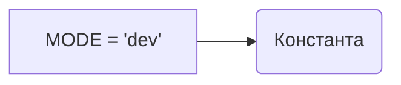

# <input code>

```python
## \file hypotez/src/ai/helicone/__init__.py
# -*- coding: utf-8 -*-\
#! venv/Scripts/python.exe
#! venv/bin/python/python3.12

"""
.. module: src.ai.helicone 
	:platform: Windows, Unix
	:synopsis:

"""
MODE = 'dev'
```

# <algorithm>

Этот код представляет собой инициализационный модуль для пакета `helicone` внутри проекта `hypotez`. Алгоритм работы тривиален: он просто определяет переменную `MODE` и присваивает ей строковое значение `'dev'`.  Никаких вычислений или сложных операций нет.

**Пример:**

Код просто устанавливает значение константы.


# <mermaid>



# <explanation>

- **Импорты:** В этом файле нет импортов. Модуль `helicone` не зависит от других модулей в этом коде. Это чисто инициализационный модуль.

- **Классы:** Нет объявленных классов.

- **Функции:** Нет объявленных функций.

- **Переменные:**
    - `MODE`: Строковая переменная, которая, скорее всего, используется для определения режима работы приложения (`dev`, `prod`, `test` и т.п.). В данном случае присвоено значение 'dev'.  Эта переменная может быть использована в других частях кодовой базы для выбора разных настроек или поведения приложения.


- **Возможные ошибки или области для улучшений:**

    - Нет явного указания, как `MODE` будет использоваться.  Желательно иметь комментарии, которые объясняют назначение переменной и как ее значение влияет на поведение кода.
    - В идеале,  можно было бы добавить проверку типов для `MODE`, чтобы гарантировать, что она всегда содержит ожидаемое значение.


- **Взаимосвязь с другими частями проекта:**

    Переменная `MODE` может быть использована в других модулях проекта `hypotez`, например, в конфигурационных файлах или модулях, отвечающих за подключение к внешним сервисам (например, к API Helicone).  Значение `MODE` позволит использовать разные конфигурации в зависимости от фазы разработки (разработка, тестирование, релиз).  Без дополнительного кода, пока невозможно точно сказать как и где это используется, но это - типичное применение подобных констант.  Необходимо просмотреть остальной код проекта, чтобы понять, как используется `MODE`.