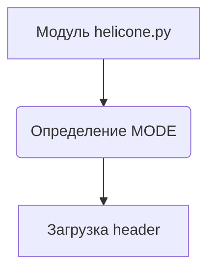
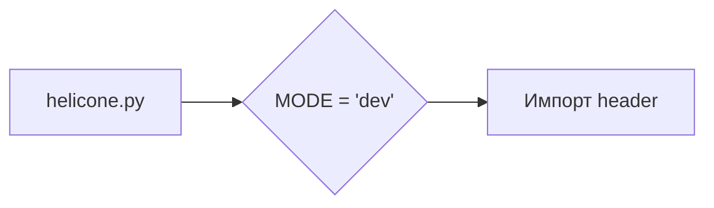

# <input code>

```python
## \file hypotez/src/ai/helicone/helicone.py
# -*- coding: utf-8 -*-\n#! venv/Scripts/python.exe\n#! venv/bin/python/python3.12\n
"""
.. module: src.ai.helicone 
	:platform: Windows, Unix
	:synopsis:

"""
MODE = 'dev'

"""
	:platform: Windows, Unix
	:synopsis:

"""

"""
	:platform: Windows, Unix
	:synopsis:

"""


"""
  :platform: Windows, Unix

"""
"""
  :platform: Windows, Unix
  :platform: Windows, Unix
  :synopsis:
"""MODE = 'dev'
  
""" module: src.ai.helicone """


""" HERE SHOULD BE A DESCRIPTION OF THE MODULE OPERATION ! 
quick start:   https://docs.helicone.ai/getting-started/quick-start
"""

import header
```

# <algorithm>

Этот код представляет собой файл Python, вероятно, часть более крупного проекта.  Алгоритм работы в данном случае неясен, так как нет реализованных функций или классов.  Файл содержит:

1. **Комментарии:**  Множество комментариев, описывающих предполагаемую функциональность модуля `src.ai.helicone`. Комментарии не содержат конкретного алгоритма.
2. **Константа `MODE`:** Определяет режим работы (`'dev'` в данном случае).

Поскольку нет функций или классов, блок-схема будет простой:




Пример:  Код просто инициализирует переменную `MODE` и импортирует модуль `header`. Данных, передаваемых между функциями, нет.


# <mermaid>



# <explanation>

**Импорты:**

* `import header`:  Импортирует другой модуль под именем `header`.  Без кода `header.py` сложно понять его назначение.  Вероятно, он содержит функции или классы, необходимые для работы `helicone.py`.   Связь с другими частями проекта – через `header.py`.


**Классы:**

* Нет определённых классов.


**Функции:**

* Нет определённых функций.


**Переменные:**

* `MODE`: Строковая переменная, хранящая значение `'dev'`.


**Возможные ошибки или области для улучшений:**

* **Отсутствует функциональность:**  В файле пусто, за исключением комментариев и переменной `MODE`. Нужно добавить код функций и классов, которые должны реализовать логику модуля.
* **Недостаточная документация:**  Не хватает ясной документации о работе модуля.  Комментарии слишком общие и не предоставляют деталей.  Нужна подробная документация, объясняющая, что этот модуль делает, для чего он нужен и как его использовать.
* **Не указано назначение `header`:** Необходимо знать, что делает `header`, чтобы понять, как это влияет на работу `helicone.py`.
* **Отсутствие обработки ошибок:**  Нет проверки ошибок или обработки исключительных ситуаций при работе с `header`.

**Взаимосвязи с другими частями проекта:**

* Модуль `helicone.py` зависит от `header.py`.

**Общий вывод:**

Данный код представляет собой лишь заготовку модуля.  Необходимо добавить в него функциональность, а также документацию, чтобы сделать его полезным и понятным.  Для анализа взаимосвязей с другими частями проекта требуется изучить `header` и другие связанные файлы.