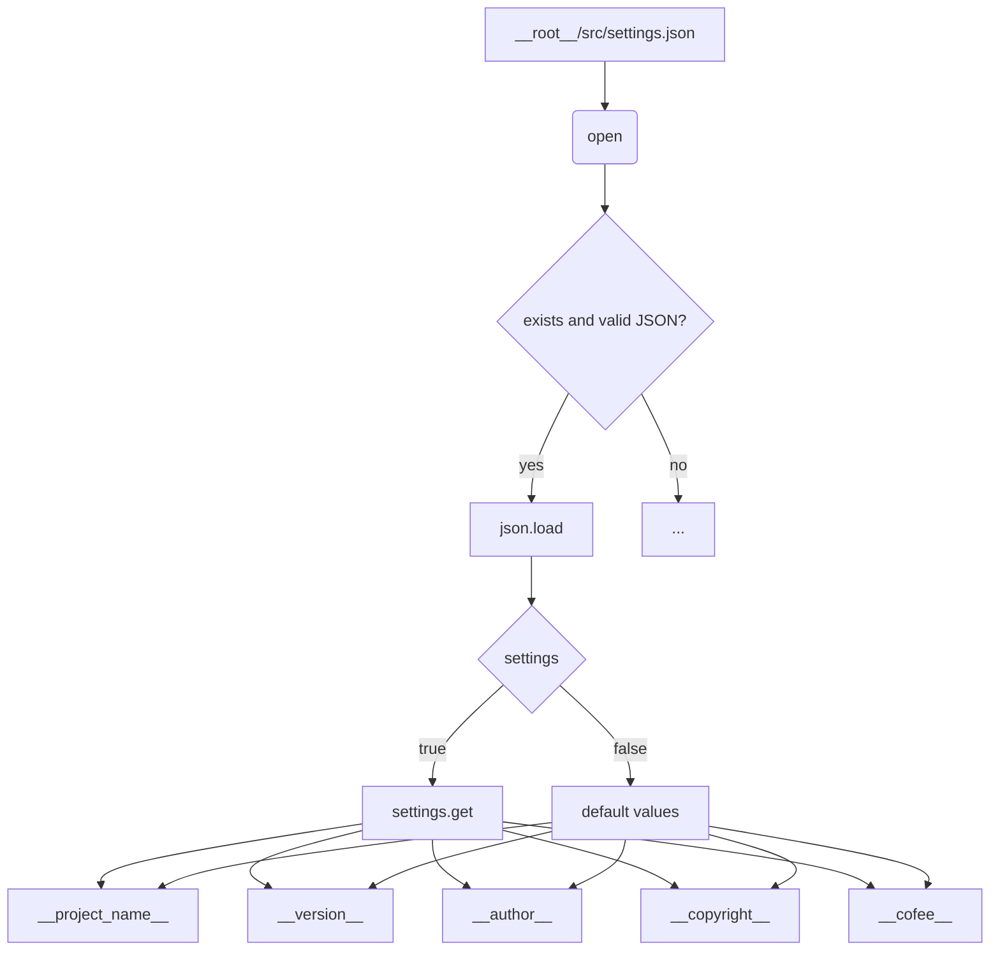

# <input code>

```python
## \file hypotez/src/ai/helicone/version.py
# -*- coding: utf-8 -*-\n#! venv/Scripts/python.exe
#! venv/bin/python/python3.12
"""
.. module: src.ai.helicone 
	:platform: Windows, Unix
	:synopsis:

"""
MODE = 'dev'

"""
	:platform: Windows, Unix
	:synopsis:

"""


"""
	:platform: Windows, Unix
	:synopsis:

"""


"""
  :platform: Windows, Unix

"""
"""
  :platform: Windows, Unix
  :platform: Windows, Unix
  :synopsis:
"""MODE = 'dev'
  
""" module: src.ai.helicone """


import json

settings:dict = None

try:
    with open(__root__ / 'src' /  'settings.json', 'r') as settings_file:
        settings = json.load(settings_file)
except (FileNotFoundError, json.JSONDecodeError):
    ...

__project_name__ = settings.get("project_name", 'hypotez') if settings  else 'hypotez'
__version__: str = settings.get("version", '')  if settings  else ''
__doc__: str = ''
__details__: str = ''
__author__: str = settings.get("author", '')  if settings  else ''
__copyright__: str = settings.get("copyrihgnt", '')  if settings  else ''
__cofee__: str = settings.get("cofee", "Treat the developer to a cup of coffee for boosting enthusiasm in development: https://boosty.to/hypo69")  if settings else "Treat the developer to a cup of coffee for boosting enthusiasm in development: https://boosty.to/hypo69"
```

# <algorithm>

1. **Инициализация:** Переменная `settings` инициализируется как `None`.
2. **Чтение настроек:** Программа пытается открыть файл `settings.json` в директории `src`.
3. **Обработка файла:** Если файл существует и содержит корректный JSON, то его содержимое загружается в переменную `settings`. В противном случае, выполняется блок `...` (предположительно, пропускается ошибка).
4. **Получение значений:** Из словаря `settings` извлекаются значения для переменных `__project_name__`, `__version__`, `__author__`, `__copyright__`, `__cofee__` с использованием метода `get()`. Если ключ не найден, используется значение по умолчанию.
5. **Возврат значений:** Переменные `__project_name__`, `__version__`, `__author__`, `__copyright__`, `__cofee__` содержат полученные значения.


**Пример:**

Если в `settings.json` содержится:

```json
{
  "project_name": "MyProject",
  "version": "1.0.0",
  "author": "John Doe"
}
```

то `__project_name__` получит значение "MyProject", `__version__` – "1.0.0", а `__author__` – "John Doe". Если `settings.json` не найден или некорректен, значения по умолчанию.

# <mermaid>



# <explanation>

**Импорты:**

- `import json`: Импортирует модуль `json` для работы с файлами JSON.  Он необходим для парсинга содержимого `settings.json`.


**Классы:**

- Нет явных классов в данном фрагменте кода.


**Функции:**

- Нет явных функций в данном фрагменте кода.

**Переменные:**

- `settings: dict = None`: Переменная, хранящая словарь с настройками из файла.  Инициализируется как `None` для обозначения отсутствия загрузки.
- `__root__`:  Специальная переменная (возможно, определенная в другом модуле или конфигурации), которая представляем корневую директорию проекта.
- `__project_name__`, `__version__`, `__author__`, `__copyright__`, `__cofee__`:  Переменные, хранящие значения, получаемые из `settings.json`. Имеют типы `str`. Используются для хранения метаданных о проекте, например, название проекта, версия, автор и т.д.


**Возможные ошибки и улучшения:**

- **Обработка ошибок:** Блок `try...except` хорошо обрабатывает `FileNotFoundError` и `json.JSONDecodeError`, но может быть полезно добавить более конкретные проверки на валидность данных в файле `settings.json`.
- **Типизация:**  Использование типов данных (`dict`, `str`) для переменных `settings` и других улучшит читаемость и позволит статическому анализатору обнаружить потенциальные ошибки.
- **`__root__`:**  Необходимо обеспечить корректное определение `__root__` в контексте проекта.
- **Дополнения:** Добавить возможность валидации значений, приходящих из `settings.json`, чтобы предотвратить неожиданное поведение программы.


**Взаимосвязи с другими частями проекта:**

- Фрагмент кода получает данные из файла `settings.json`, что предполагает его существование и корректность.  `settings.json` должен быть создан и заполнен, возможно, в процессе сборки проекта или через конфигурационный скрипт.  Взаимодействие происходит через чтение файла.
-  Вероятно, другие модули проекта используют значения, определённые в `__version__`, `__project_name__` и т.д., для различных целей, например, для информирования о текущей версии.