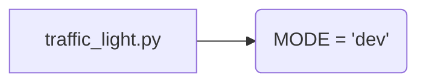

# <input code>

```python
## \file hypotez/src/ai/myai/traffic_light.py
# -*- coding: utf-8 -*-
#! venv/Scripts/python.exe
#! venv/bin/python/python3.12

"""
.. module: src.ai.myai 
	:platform: Windows, Unix
	:synopsis:

"""
MODE = 'dev'

"""
	:platform: Windows, Unix
	:synopsis:

"""


"""
	:platform: Windows, Unix
	:synopsis:

"""


"""
  :platform: Windows, Unix

"""
"""
  :platform: Windows, Unix
  :platform: Windows, Unix
  :synopsis:
"""MODE = 'dev'
  
""" module: src.ai.myai """


""" HERE SHOULD BE A DESCRIPTION OF THE MODULE OPERATION ! 
https://habr.com/ru/articles/849414/
"""
```

# <algorithm>

К сожалению, предоставленный код не содержит алгоритма. Он представляет собой пустой файл с комментариями и константой `MODE`.  Без определения функций и классов, блок-схема не может быть построена.  Алгоритм работы будет зависеть от последующего кода, который опишет, как будет использоваться `MODE` и какой функционал реализует модуль.


# <mermaid>



**Объяснение диаграммы:**

Единственное, что можно отобразить - это переменная `MODE`, которая инициализирована значением 'dev'.  Отсутствуют классы или функции, поэтому визуализация ограничена.


# <explanation>

**Импорты:**

Код не содержит импортов.  Это пустой файл, содержащий только переменную `MODE` и комментарии.  Следовательно, нет связей с другими модулями из `src`.


**Классы:**

Отсутствуют классы.


**Функции:**

Отсутствуют функции.


**Переменные:**

- `MODE`: Строковая переменная, присвоено значение 'dev'.  Значение не используется, но может служить константой для настройки режима работы (например, 'dev', 'prod') в последующем коде.


**Возможные ошибки или области для улучшений:**

- Отсутствие документации: файл содержит много пустых комментариев, но не объясняет, зачем он существует или что делает.  Необходимо добавить описание функциональности модуля.
- Отсутствие логики:  код пустой.  Необходимо реализовать функции и классы, которые будут описывать и выполнять определенный функционал, связанный с регулированием светофора (в соответствии со ссылкой на habr.com).
- Непонятная структура:  переменная MODE повторяется, это дублирование.

**Цепочка взаимосвязей с другими частями проекта:**

Без определения функций и классов в этом файле, сложно определить взаимосвязь с другими частями проекта.  В дальнейшем, если будут определены функции для управления светофором, можно будет говорить о связи с классом `TrafficLight` или другими компонентами.