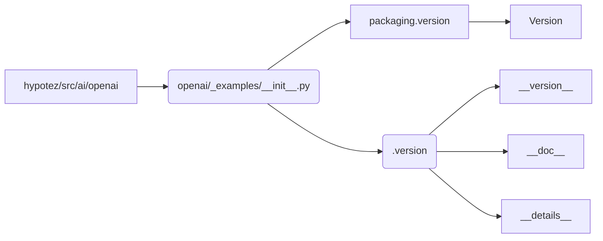

1. **<input code>**

```python
## \file hypotez/src/ai/openai/_examples/__init__.py
# -*- coding: utf-8 -*-
#! venv/Scripts/python.exe
#! venv/bin/python/python3.12

"""
.. module: src.ai.openai._examples 
	:platform: Windows, Unix
	:synopsis:

"""
MODE = 'dev'

"""
	:platform: Windows, Unix
	:synopsis:

"""


"""
	:platform: Windows, Unix
	:synopsis:

"""


"""
  :platform: Windows, Unix

"""
"""
  :platform: Windows, Unix
  :platform: Windows, Unix
  :synopsis:
"""MODE = 'dev'
  
""" module: src.ai.openai._examples """


from packaging.version import Version
from .version import __version__, __doc__, __details__
```

2. **<algorithm>**

Этот файл `__init__.py` является инициализатором пакета `_examples` внутри модуля `openai` в подпакете `ai` проекта `hypotez`.  Он не содержит  никаких  алгоритмов в традиционном понимании.  Файл определяет константу `MODE` и импортирует информацию о версии из файла `version.py`.  Процесс работы сводится к импорту и инициализации.  Нет явного цикла или обработки данных.

3. **<mermaid>**



4. **<explanation>**

* **Импорты**:
    * `from packaging.version import Version`: Импортирует класс `Version` из пакета `packaging`.  Этот пакет используется для работы с версиями пакетов. Импорт необходим для работы с версиями, которые часто встречаются в программных компонентах.
    * `from .version import __version__, __doc__, __details__`: Импортирует переменные `__version__`, `__doc__`, `__details__` из файла `version.py` в текущей директории `_examples`.  Это стандартный способ импорта констант, содержащих информацию о версии. `__init__.py` служит точкой входа для доступа к информации о версии.

* **Классы**: Нет определенных классов.


* **Функции**: Нет функций.

* **Переменные**:
    * `MODE = 'dev'`:  Переменная глобального уровня, вероятно, используется для определения режима работы (например, для разработки или производства).  Значение 'dev' указывает на режим разработки.

* **Возможные ошибки или области для улучшений**:
    * Отсутствие кода: Файл пустой, кроме импорта и константы.  Предполагается, что основная логика/функциональность находится в других файлах пакета `_examples`, а этот файл лишь служит для доступа к ним.
    * Ненужные строки документации: Несколько строк документации повторяют друг друга. Можно оптимизировать строки документации.
    * Неочевидная роль файла: Непонятно, что делает `_examples` в `openai`.  Возможно, необходимы комментарии или дополнительная документация для ясности роли этого файла в проекте.

* **Взаимосвязи с другими частями проекта**:
    Файл `__init__.py` служит для инициализации пакета `_examples` и импорта необходимых компонентов.  Для понимания полной функциональности необходимо изучить содержимое файла `.version`, который определяет `__version__`, `__doc__`, `__details__`.  Вероятно, эти переменные используются для различных целей, таких как определение версии, документации, или метаданных, связанных с модулем. Также, предположительно, существуют другие файлы/модули в папке `_examples`, которые используются или вызываются из данного файла.