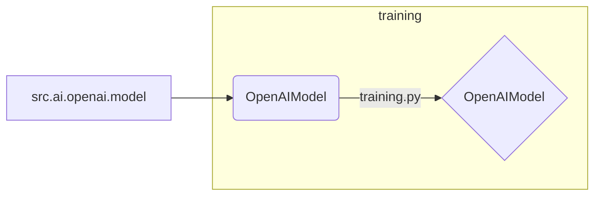

# <input code>

```python
## \file hypotez/src/ai/openai/model/__init__.py
# -*- coding: utf-8 -*-
#! venv/Scripts/python.exe
#! venv/bin/python/python3.12

"""
.. module: src.ai.openai.model 
	:platform: Windows, Unix
	:synopsis:

"""
MODE = 'dev'


from .training import OpenAIModel
```

# <algorithm>

В данном коде определена инициализирующая часть модуля `src.ai.openai.model`.  Пошаговая блок-схема:

1. **Инициализация:** Модуль устанавливает константу `MODE` со значением 'dev'.  Это, вероятно, флаг режима работы (например, "development").


2. **Импорт:** Модуль импортирует класс `OpenAIModel` из подмодуля `training` внутри текущего модуля (`src.ai.openai.model`).  Это указывает на то, что основная логика модели находится в файле `training.py`.


Примеры отсутствуют, так как в коде нет вызовов функций и объектов.  Данные не перемещаются между функциями или классами на этом этапе.


# <mermaid>



**Описание диаграммы:**

* Модуль `src.ai.openai.model` импортирует класс `OpenAIModel` из подмодуля `training`.
* `training.py` содержит определение класса `OpenAIModel`.


# <explanation>

**Импорты:**

* `from .training import OpenAIModel`: Импортирует класс `OpenAIModel` из подмодуля `training` текущего пакета (`src.ai.openai.model`).  Это указывает на то, что класс, который предоставляет основные функции для работы с моделями OpenAI, находится в отдельном файле `training.py` внутри пакета `src.ai.openai.model`.  Файл `training.py`  должен содержать определение класса `OpenAIModel`, который, вероятно, реализует методы для обучения, использования и работы с моделями OpenAI.

**Классы:**

* `OpenAIModel`:  Этот класс (определение которого, скорее всего, находится в `training.py`), вероятно, представляет собой модель OpenAI. Недостаточно информации для полного описания.


**Функции:**

В этом файле нет определений функций.

**Переменные:**

* `MODE = 'dev'`:  Переменная, вероятно, используется для выбора режима работы (например, dev, prod).


**Возможные ошибки или улучшения:**

* Отсутствует документация для класса `OpenAIModel`. Добавление docstrings к классу и его методам значительно повысит читабельность и понимание кода.
*  Нет проверки корректности импортов. Необходимо убедиться, что путь к подмодулю `training` корректен.
* Нет примеров использования класса `OpenAIModel`. Без примеров трудно понять, как этот класс должен использоваться.


**Цепочка взаимосвязей:**

Этот модуль (`src.ai.openai.model`) импортирует класс `OpenAIModel` из подмодуля `training`.  Это указывает на то, что  `training.py` содержит детали реализации модели, а `src.ai.openai.model` скорее всего, предоставляет интерфейс к ней.  Далее,  как `src.ai.openai.model` взаимодействует с остальной частью проекта зависит от контекста,  которого не видно из представленного фрагмента кода.  Вероятно, этот класс будет использоваться другими частями проекта, например, для создания и использования моделей OpenAI в других задачах.