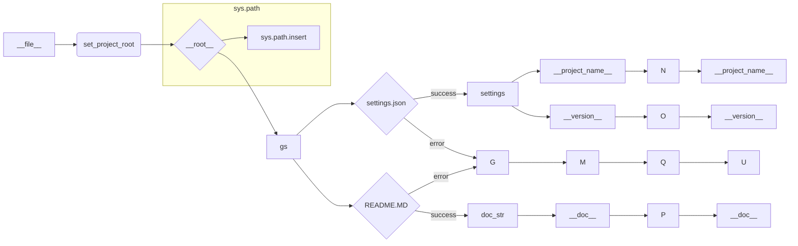

# Анализ кода hypotez/src/logger/header.py

## <input code>

```python
## \file hypotez/src/logger/header.py
# -*- coding: utf-8 -*-\
#! venv/Scripts/python.exe
#! venv/bin/python/python3.12

"""
module: src.logger 
	:platform: Windows, Unix
	:synopsis: Модуль определяющий корневой путь к проекту. Все импорты строятся относительно этого пути.
    :TODO: В дальнейшем перенести в системную переменную"""
MODE = 'dev'

import sys
import json
from packaging.version import Version

from pathlib import Path
def set_project_root(marker_files=('pyproject.toml', 'requirements.txt', '.git')) -> Path:
    """
    Finds the root directory of the project starting from the current file's directory,
    searching upwards and stopping at the first directory containing any of the marker files.

    Args:
        marker_files (tuple): Filenames or directory names to identify the project root.
    
    Returns:
        Path: Path to the root directory if found, otherwise the directory where the script is located.
    """
    __root__:Path
    current_path:Path = Path(__file__).resolve().parent
    __root__ = current_path
    for parent in [current_path] + list(current_path.parents):
        if any((parent / marker).exists() for marker in marker_files):
            __root__ = parent
            break
    if __root__ not in sys.path:
        sys.path.insert(0, str(__root__))
    return __root__


# Get the root directory of the project
__root__ = set_project_root()
"""__root__ (Path): Path to the root directory of the project"""

from src import gs

settings:dict = None
try:
    with open(gs.path.root / 'src' /  'settings.json', 'r') as settings_file:
        settings = json.load(settings_file)
except (FileNotFoundError, json.JSONDecodeError):
    ...

doc_str:str = None
try:
    with open(gs.path.root / 'src' /  'README.MD', 'r') as settings_file:
        doc_str = settings_file.read()
except (FileNotFoundError, json.JSONDecodeError):
    ...


__project_name__ = settings.get("project_name", 'hypotez') if settings  else 'hypotez'
__version__: str = settings.get("version", '')  if settings  else ''
__doc__: str = doc_str if doc_str else ''
__details__: str = ''
__author__: str = settings.get("author", '')  if settings  else ''
__copyright__: str = settings.get("copyrihgnt", '')  if settings  else ''
__cofee__: str = settings.get("cofee", "Treat the developer to a cup of coffee for boosting enthusiasm in development: https://boosty.to/hypo69")  if settings else "Treat the developer to a cup of coffee for boosting enthusiasm in development: https://boosty.to/hypo69"
```

## <algorithm>

**Шаг 1:**  Функция `set_project_root` ищет корневой каталог проекта.

*   Начинается с текущего каталога (`__file__`).
*   Ищет вверх по дереву каталогов.
*   Проверяет существование файлов (маркеров): `pyproject.toml`, `requirements.txt`, `.git`.
*   Если такой каталог найден, то `__root__` устанавливается на него.
*   Добавляет корневой каталог в `sys.path` для правильной работы импортов.
*   Возвращает `Path` до корневого каталога.

**Шаг 2:** Переменная `__root__` получает корневой путь, полученный от `set_project_root`.

**Шаг 3:** Импортируется модуль `gs` из `src`.

**Шаг 4:** Попытка загрузить `settings.json` из корневого каталога проекта (`gs.path.root`).  Используется `try-except` для обработки исключений.

*   Если `settings.json` найден и корректен, `settings` получает содержимое файла.
*   Если файл не найден или ошибка декодирования JSON, переменная `settings` остается `None`.

**Шаг 5:** Попытка загрузить `README.MD` из корневого каталога проекта. Логика аналогична предыдущему шагу.

**Шаг 6:** Присваивание значений переменным `__project_name__`, `__version__`, `__doc__`, `__details__`, `__author__`, `__copyright__`, `__cofee__` на основе данных в `settings` или значений по умолчанию, если `settings` не загрузились или в них нет необходимых ключей.


## <mermaid>



## <explanation>

**Импорты:**

*   `sys`: Для доступа к системным переменным, в частности, `sys.path`.
*   `json`: Для работы с файлами JSON.
*   `packaging.version`: Для работы с версиями пакетов.
*   `pathlib`: Для работы с путями файлов.
*   `gs`:  предполагается, что это модуль из `src`, отвечающий за работу с путями и ресурсами проекта. (`gs.path.root` - важнейшая переменная, хранящая корневой каталог).


**Классы:**

В коде нет явных классов.


**Функции:**

*   `set_project_root(marker_files)`: Находит корневой каталог проекта, начиная с текущего файла и ища вышестоящие каталоги, содержащие указанные файлы-маркеры. 
    *   Аргументы: `marker_files` (кортеж строк - имена файлов для поиска).
    *   Возвращаемое значение: `Path` - путь к корневому каталогу проекта.
    *   Пример: `set_project_root(('pyproject.toml',))` ищет каталог, содержащий `pyproject.toml`.


**Переменные:**

*   `MODE`: Строковая константа, указывающая режим работы (например, 'dev' или 'prod').
*   `__root__`: `Path` - хранит путь к корневому каталогу проекта.
*   `settings`: Словарь, загруженный из `settings.json` (если он существует и корректен), содержит настройки проекта.
*   `doc_str`: Строка, содержащая содержимое `README.MD` (если он существует).
*   `__project_name__`, `__version__`, `__doc__`, `__details__`, `__author__`, `__copyright__`, `__cofee__`: Переменные, содержащие данные из файла настроек.

**Возможные ошибки/улучшения:**

*   Отсутствие обработки `TypeError` если `settings` не словарь.
*   Можно добавить логирование для отладки поиска корневого каталога и загрузки настроек.
*   Можно использовать `try-except` блоки для обработки ошибок в `set_project_root` на случай отсутствия указанных файлов-маркеров или других проблем.
*   Использование `Path` для всех путей повышает надежность и предотвращает ошибки.
*   Документация `__root__` должна быть более подробной, особенно о том, как `__root__` вычисляет корневой путь.


**Взаимосвязи с другими частями проекта:**

Модуль `gs` (из `src`) необходим для работы с путями. Файлы `settings.json` и `README.MD` используются для настройки проекта.  Все импорты строятся относительно корневого каталога, определенного в `header.py`.  В коде прослеживается, что этот модуль используется для инициализации глобальных переменных, важных для остальных частей проекта.