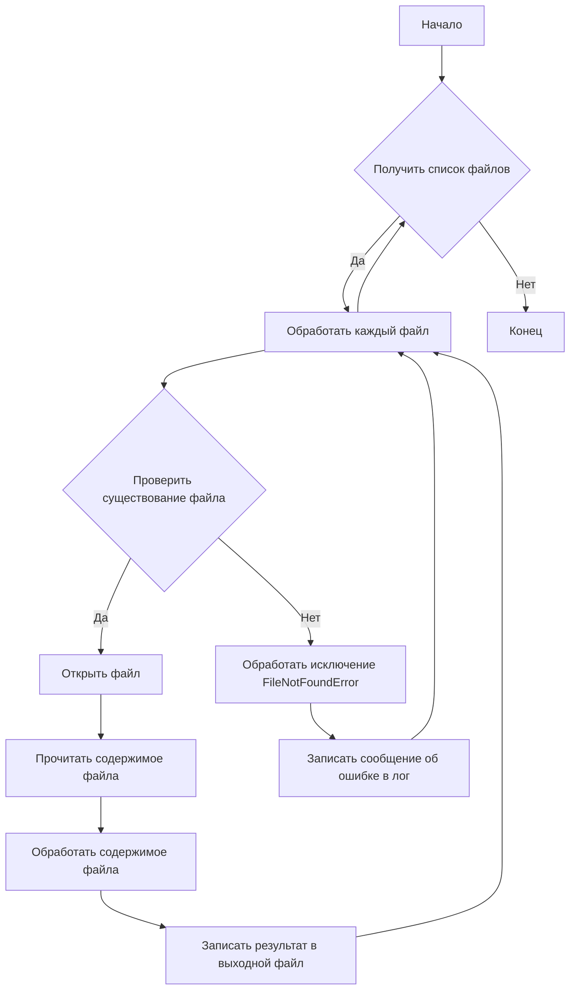

```MD
# <algorithm>

**Блок-схема алгоритма:**



**Пример данных:**

Входные данные: список файлов `['file1.txt', 'file2.txt', 'nonexistent.txt']`.

**Пошаговое описание:**

1. **Начало:** Алгоритм начинается.
2. **Получить список файлов:**  Из входных данных берется список файлов, которые нужно обработать.
3. **Обработать каждый файл:** Цикл проходит по каждому файлу в списке.
4. **Проверить существование файла:** Для каждого файла проверяется, существует ли он на диске.
5. **Открыть файл:** Если файл существует, он открывается в режиме чтения.
6. **Прочитать содержимое файла:** Содержимое файла считывается.
7. **Обработать содержимое файла:**  Считанное содержимое файла обрабатывается (например, анализируется, преобразуется и т.д.).
8. **Записать результат в выходной файл:** Результат обработки записывается в соответствующий выходной файл.
9. **Обработать исключение FileNotFoundError:** Если файл не найден, генерируется исключение `FileNotFoundError`.  В блоке обработки исключения записывается сообщение об ошибке в лог (например, в файл `error.log`).
10. **Записать сообщение об ошибке в лог:** В лог записывается информация об ошибке.
11. **Конец:** Алгоритм завершается.


# <mermaid>


**Описание диаграммы:**

* `HTML Документация` – входной документ в HTML формате.
* `Обработка кода` –  общий блок обработки, включающий чтение файлов, анализ кода и генерацию документации.
* `Чтение файлов` – процесс считывания файлов кода.
* `Анализ кода` –  логика анализа кода.
* `Генерация документации` – процесс создания документации в формате Markdown.
* `Формирование Markdown` – преобразование документации в Markdown формат.
* `Вывод` – результат в виде файла Markdown.

# <explanation>

**1. Импорты (отсутствуют):**  Код не содержит импортов.

**2. Классы (отсутствуют):**  Код описывает структуру документации, а не реализует код.

**3. Функции (отсутствуют):**  Код не содержит функций, это шаблон документации.

**4. Переменные (отсутствуют):**  Код не содержит переменных, это шаблон документации.

**5. Возможные ошибки/улучшения:**

* Отсутствует реализация. Код — это пример документации, а не выполняемый код.  Для реальной работы нужно добавить код, обрабатывающий файлы кода и генерирующий Markdown-документацию.
* Не указана обработка исключений для других возможных ошибок (например, ошибок чтения файла, ошибок парсинга).
* Не хватает описания конкретных алгоритмов обработки.


**Цепочка взаимосвязей с другими частями проекта:**

Этот код — *шаблон* документации, который должен использоваться для написания документации к другим частям проекта, где есть классы и функции.  Он не зависит напрямую от других частей проекта, но является инструментом для их описания.