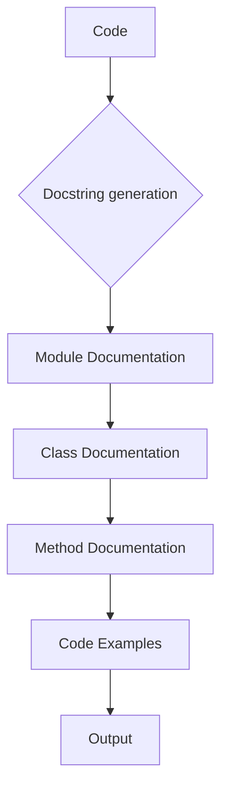

# <input code>

```python
"prompt": "You must document code in the following style. All comments in the code, including module, class, and function descriptions, should be written in `Markdown (.md)` format. For each module, class, and function, follow this template:\n\n1. **Module**:\n    - The module description should be written at the top, indicating its purpose.\n    - Provide examples of using the module, if possible. Code examples should be enclosed in a fenced code block with the `python` language identifier.\n    - Specify the platforms and synopsis of the module.\n    - Use headers to describe attributes and methods of the module where necessary.\n\nExample of module documentation:\n```markdown\n# Module: Programming Assistant\n\nThis module contains the `CodeAssistant` class, which is used to interact with various AI models, such as Google Gemini and OpenAI, for code processing tasks.\n\n## Example Usage\n\nExample of using the `CodeAssistant` class:\n\n```python\nassistant = CodeAssistant(role=\'code_checker\', lang=\'ru\', model=[\'gemini\'])\nassistant.process_files()\n```\n```\n\n2. **Classes**:\n    - Each class should be described according to its purpose. Include the class description, its attributes, and methods.\n    - In the class section, list all methods, their purpose, and examples of usage.\n    - For each method, include descriptions of its parameters and return values, as well as examples.\n\nExample of class documentation:\n```markdown\n# Class: CodeAssistant\n\nThe `CodeAssistant` class is used to interact with various AI models such as Google Gemini and provides methods for analyzing and generating documentation for code.\n\n## Attributes\n- `role`: The role of the assistant (e.g., \'code_checker\').\n- `lang`: The language the assistant will use (e.g., \'ru\').\n- `model`: List of AI models used (e.g., `[\'gemini\']`).\n\n## Methods\n### `process_files`\n\nMethod for processing code files.\n\n## Example Usage\n\n```python\nassistant = CodeAssistant(role=\'code_checker\', lang=\'ru\', model=[\'gemini\'])\nassistant.process_files()\n```\n```\n\n3. **Functions and Methods**:\n    - Document each function or method by specifying parameters and return values.\n    - For each function, provide a description of its purpose and usage examples in fenced code blocks with the `python` language identifier.\n\nExample of method documentation:\n```markdown\n# Method: process_files\n\nThis method is used to analyze and process code files.\n\n## Parameters\n- `files`: A list of files to process.\n- `options`: Additional parameters for configuring the processing.\n\n## Return Value\n- Returns the processing result as a list of analyzed data.\n\n## Example Usage\n\n```python\nassistant = CodeAssistant(role=\'code_checker\', lang=\'ru\', model=[\'gemini\'])\nresult = assistant.process_files(files=[\'file1.py\', \'file2.py\'], options={})\n```\n```\n\n4. **Code Comments**:\n    - All comments in the code should be written in Markdown format and should explain what the specific part of the code does.\n    - Leave comments in blocks, not in lines. Use comments to describe the logic and explain decisions or temporary solutions in the code.\n    - Example:\n    ```markdown\n    # Here, the exception is being handled to continue execution if the file is not found\n    try:\n        process_file(file)\n    except FileNotFoundError as ex:\n        handle_exception(ex)\n    ```\n5. **Exceptions**:\n    - Document exceptions for classes, methods, and functions.\n    - Specify which exceptions can be raised and under what circumstances.\n\nExample of exception documentation:\n```markdown\n# Exception: File Not Found\n\nThis exception is raised when a file is not found during processing.\n\n## Parameters\n- `file`: The path of the file that was not found.\n\n## Example Usage\n\n```python\ntry:\n    open(file)\nexcept FileNotFoundError as ex:\n    raise FileNotFoundError("File not found") from ex\n```\n```\n\nFollow these instructions for documenting your code. All comments should be clear, informative, and compliant with the Markdown standard."\n```
```



```
# <algorithm>

This code snippet does not contain any executable code. It's a detailed description of how to document code using Markdown.  It provides a template for documenting modules, classes, functions, methods, and exceptions. There's no actual algorithm to follow as the prompt is a documentation guideline, not code instructions.


# <mermaid>

The provided Mermaid code `graph TD` is a basic flow chart showing the relationships between the stages of code documentation.
-  `Code` is the input
- `Docstring generation` is the phase of creating the docstrings
-  `Module Documentation`, `Class Documentation`, `Method Documentation`, and `Code Examples` are the sequential stages for generating the documentation structure
-  `Output` is the formatted documentation in Markdown format.

There are no external dependencies in this code snippet,  it only defines a structure for internal code documentation process.


# <explanation>

The provided text is a set of instructions for creating documentation for Python code in Markdown format.  It's not executable code; instead, it acts as a specification or a style guide.

- **No imports**: There are no imports as it's a set of guidelines, not Python code.
- **No classes or functions**:  The text describes *how to* document classes and functions, not the classes or functions themselves.
- **No variables**: There are no variables in this text as it's not Python code.
- **No errors/improvements**:  It's impossible to identify errors or suggest improvements because the prompt is not a code block for analysis but instructions for writing code documentation.


The prompt's purpose is to standardize and improve the quality of code documentation within a project, which is beneficial for maintainability, understandability, and collaborative work.  The intended use is for developers to follow the instructions provided to create Markdown documentation for their Python code.