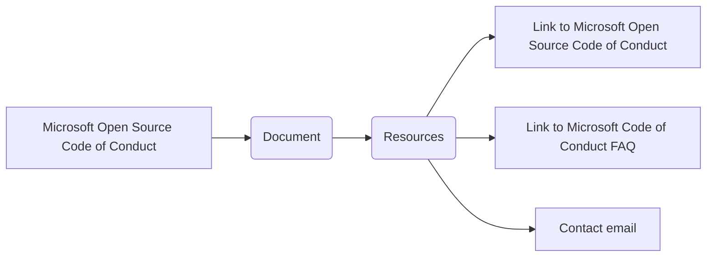

# <input code>

```
# Microsoft Open Source Code of Conduct

This project has adopted the [Microsoft Open Source Code of Conduct](https://opensource.microsoft.com/codeofconduct/).

Resources:

- [Microsoft Open Source Code of Conduct](https://opensource.microsoft.com/codeofconduct/)
- [Microsoft Code of Conduct FAQ](https://opensource.microsoft.com/codeofconduct/faq/)
- Contact [opencode@microsoft.com](mailto:opencode@microsoft.com) with questions or concerns
```

# <algorithm>

Этот код не содержит алгоритма в привычном понимании. Он представляет собой просто текст, описывающий принятый кодекс поведения для проекта, ссылаясь на внешний ресурс (Microsoft Open Source Code of Conduct).  Отсутствие действий, циклов, условных операторов делает построение блок-схемы невозможным.  Данные не передаются между функциями или классами, поскольку нет ни функций, ни классов.

# <mermaid>



# <explanation>

Этот код представляет собой просто текст, описывающий принятый проектным сообществом кодекс поведения. Он не содержит никакого программного кода.

* **Импорты**: Нет импортов, так как это не программный код.
* **Классы**: Нет классов, так как это не программный код.
* **Функции**: Нет функций, так как это не программный код.
* **Переменные**: Нет переменных, так как это не программный код.

**Цепочка взаимосвязей с другими частями проекта:**  Эта часть проекта не содержит кода, но является документом, который устанавливает стандарт поведения для проекта.  Он связан с другими частями проекта тем, что его соблюдение ожидается от всех участников проекта.

**Возможные ошибки или области для улучшений**:  Нет ошибок, так как это не программный код, а просто текст.  Однако, для лучшей организации, можно было бы добавить ссылки на конкретные разделы кодекса поведения, которые особенно важны для участников данного проекта.

**В заключение**:  Код представляет собой статический текст, устанавливающий правила, а не алгоритм, выполняющий действия.  Он не содержит внутренних взаимосвязей с другими частями проекта, кроме указания на внешнюю ссылку на Microsoft Open Source Code of Conduct.