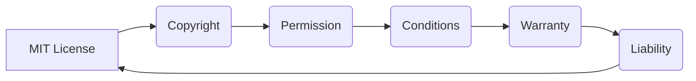

# Анализ кода

## <input code>

```
MIT License

Copyright (c) Microsoft Corporation.

Permission is hereby granted, free of charge, to any person obtaining a copy
of this software and associated documentation files (the "Software"), to deal
in the Software without restriction, including without limitation the rights
to use, copy, modify, merge, publish, distribute, sublicense, and/or sell
copies of the Software, and to permit persons to whom the Software is
furnished to do so, subject to the following conditions:

The above copyright notice and this permission notice shall be included in all
copies or substantial portions of the Software.

THE SOFTWARE IS PROVIDED "AS IS", WITHOUT WARRANTY OF ANY KIND, EXPRESS OR
IMPLIED, INCLUDING BUT NOT LIMITED TO THE WARRANTIES OF MERCHANTABILITY,
FITNESS FOR A PARTICULAR PURPOSE AND NONINFRINGEMENT. IN NO EVENT SHALL THE
AUTHORS OR COPYRIGHT HOLDERS BE LIABLE FOR ANY CLAIM, DAMAGES OR OTHER
LIABILITY, WHETHER IN AN ACTION OF CONTRACT, TORT OR OTHERWISE, ARISING FROM,
OUT OF OR IN CONNECTION WITH THE SOFTWARE OR THE USE OR OTHER DEALINGS IN THE
SOFTWARE
```

## <algorithm>

Данный код представляет собой лицензионное соглашение MIT.  Алгоритм работы - это просто текст, описывающий условия использования.  Нет пошаговых действий или вычислений.  Данные в данном случае - это текст лицензии.

## <mermaid>



## <explanation>

Этот код не содержит функций, классов или переменных в традиционном понимании. Это текстовое лицензионное соглашение, которое определяет условия использования программного обеспечения.

**Импорты:** Нет импортов, так как код - это сам лицензионный текст.

**Классы:** Нет классов.

**Функции:** Нет функций.

**Переменные:** Нет переменных.

**Возможные ошибки или области для улучшений:** Нет ошибок и не требуется никаких улучшений, так как это просто текст соглашения.

**Цепочка взаимосвязей с другими частями проекта:**  Лицензионное соглашение MIT применяется к конкретному проекту (в данном случае `hypotez/src/ai/tiny_troupe/TinyTroupe`), делая его частью всей структуры проекта.  Это соглашение определяет правила использования кода, находящегося в рамках проекта.