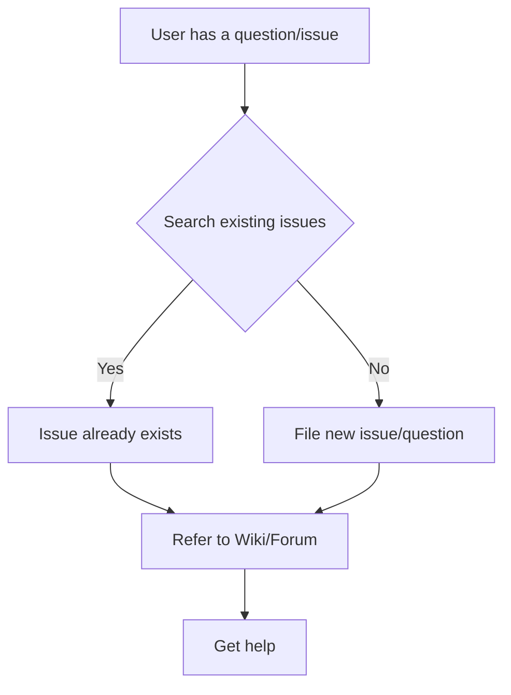
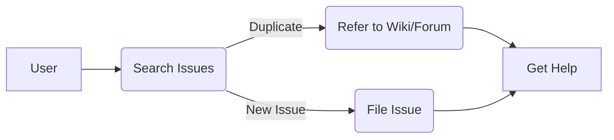

# <input code>

```
# Support

## How to file issues and get help  

This project uses GitHub Issues to track bugs and feature requests. Please search the existing 
issues before filing new issues to avoid duplicates.  For new issues, file your bug or 
feature request as a new Issue.

For help and questions about using this project, please consult our Wiki or post on our
Discussion forum, both right here on GitHub.

## Microsoft Support Policy  

Support for TinyTroupe is limited to the resources listed above.
```

# <algorithm>



**Описание алгоритма:**

1. **Пользователь сталкивается с вопросом или проблемой (A).**
2. **Поиск существующих проблем (B).** Если проблема уже описана (B - Yes), пользователь направляется к ресурсам Wiki/Forum (C). В противном случае (B - No), он создает новую проблему/вопрос (D).
3. **Независимо от результата поиска, пользователь направляется к ресурсам Wiki/Forum для поиска решения (E).**
4. **Если найден ответ, пользователь получает помощь (F).**


# <mermaid>



**Описание диаграммы:**

Диаграмма представляет собой простую схему взаимодействия пользователя с проектом.  Пользователь (A) ищет ответы в существующих багах/проблемах (B). Если найден дубликат (B -> C), пользователь перенаправляется к Wiki/Forum, в противном случае создает новую багу/проблему (B -> D). В обоих случаях пользователь может получить помощь (C/D -> E).


# <explanation>

**Импорты:**

В данном коде нет импортов, так как это текстовый документ, описывающий процесс поддержки проекта.

**Классы:**

Нет классов, так как это документ, а не программный код.

**Функции:**

Нет функций.

**Переменные:**

Нет переменных.

**Возможные ошибки или области для улучшений:**

- Отсутствие конкретного описания процесса.  Указание этапов (например, как создать issue на GitHub) улучшит практичность документа.


**Взаимосвязи с другими частями проекта:**

Документ `SUPPORT.md`  является частью документации проекта. Он описывает процесс взаимодействия с сообществом и разработчиками для решения проблем и получения помощи.  Эта документация тесно связана с проектом `TinyTroupe` и  репозиторием GitHub, где хранятся вопросы и баги.