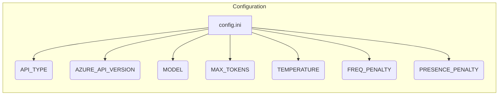

# <input code>

```ini
[OpenAI]
#
# OpenAI or Azure OpenAI Service
#
# Default options: openai, azure
API_TYPE=openai

# Check Azure's documentation for updates here:
# https://learn.microsoft.com/en-us/azure/ai-services/openai/chatgpt-quickstart?tabs=command-line&pivots=programming-language-python
AZURE_API_VERSION=2023-05-15

#
# Model parameters
#
MODEL=gpt-4o
MAX_TOKENS=4000
TEMPERATURE=0.3
FREQ_PENALTY=0.0
PRESENCE_PENALTY=0.0
TIMEOUT=60
MAX_ATTEMPTS=5
WAITING_TIME=1
EXPONENTIAL_BACKOFF_FACTOR=5

EMBEDDING_MODEL=text-embedding-3-small 

CACHE_API_CALLS=False
CACHE_FILE_NAME=openai_api_cache.pickle

MAX_CONTENT_DISPLAY_LENGTH=1024

[Simulation]
RAI_HARMFUL_CONTENT_PREVENTION=True
RAI_COPYRIGHT_INFRINGEMENT_PREVENTION=True


[Logging]
LOGLEVEL=ERROR
# ERROR
# WARNING
# INFO
# DEBUG
```

# <algorithm>

(Нет алгоритма, так как код представляет собой конфигурационный файл.)


# <mermaid>



# <explanation>

Этот файл `config.ini` - конфигурационный файл, используемый, вероятно, приложением, взаимодействующим с API OpenAI (или Azure OpenAI). Он определяет параметры для работы с этим API.

**Импорты:**

Нет импортируемых модулей в файле. Это конфигурационный файл, который задаёт значения параметров, не требуя импорта каких-либо библиотек или модулей.

**Классы:**

Нет классов. Файл конфигурации не содержит определения классов или объектов.


**Функции:**

Нет функций. Файл конфигурации не содержит определения функций.

**Переменные:**

Файл содержит переменные, которые будут использоваться приложением для инициализации взаимодействия с API OpenAI.  Эти переменные представлены в виде пар "ключ-значение", например:

* `API_TYPE = openai`: Указывает, что используется API OpenAI.
* `MODEL = gpt-4o`:  Указывает используемую модель.
* `MAX_TOKENS = 4000`: Максимальное количество токенов для ответа.
* ...и так далее.


**Возможные ошибки или области для улучшений:**

* **Нет проверки значений:** Файл не выполняет валидацию введённых значений (например, убеждаясь, что `MAX_TOKENS` — положительное число). Это может привести к ошибкам при запуске программы, если значения некорректны.  Необходимо добавить проверку значений.
* **Комментарии:**  Комментарии в файле являются информативными, но не обеспечивают самодокументацию по параметрам (описать, например, что делает `TEMPERATURE`). Добавление более подробных комментариев улучшит понимание целей этих настроек.
* **Возможное использование в нескольких приложениях:** Если конфигурация предназначена для использования в разных частях приложения или различных модулях, стоит подумать о создании более гибкой системы, например, используя несколько файлов конфигурации или конфигурационный модуль.


**Цепочка взаимосвязей с другими частями проекта:**

Файл `config.ini` является источником данных для программы (вероятно, написанной на Python), которая будет взаимодействовать с OpenAI API. Приложение, скорее всего, содержит логику:

1. Чтение настроек из `config.ini`.
2. Инициализацию подключения к API OpenAI с использованием прочитанных значений.
3. Выполнение запросов к API OpenAI с заданными параметрами.
4. Обработка ответов от API.

В целом, этот файл определяет параметры, необходимые для работы приложения с OpenAI, и является ключевым элементом в архитектуре программы.