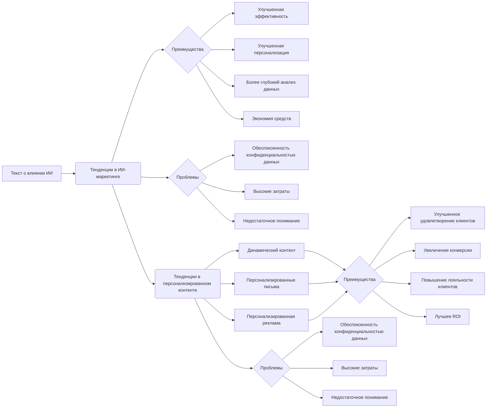

# Анализ кода: "Тенденции в цифровом маркетинге"

## <input code>

```
# Impact of AI on Digital Marketing Strategies
# ... (Большой кусок текста - описание влияния ИИ на маркетинг)

# Importance of Personalized Content
# ... (Большой кусок текста - описание важности персонализированного контента)

# Tables and Lists
# ... (Таблицы и списки о преимуществах и проблемах ИИ и персонализированного контента)
```

## <algorithm>

К сожалению, предоставленный код - это текст, а не код в традиционном понимании.  Поэтому построить блок-схему алгоритма не представляется возможным.  Это текстовое описание, анализирующее и описывающее тренды в цифровом маркетинге, а не алгоритм в смысле последовательности действий, выполняемых программой.

## <mermaid>



**Описание диаграммы:**  Диаграмма представляет собой простой граф, показывающий связи между различными аспектами обсуждаемой темы.  Нет зависимостей в традиционном смысле, т.к. это просто текстовое описание.

## <explanation>

**Импорты:** Нет импортов, так как это текстовый документ, а не код программы.

**Классы:** Нет классов, так как это текстовое описание трендов, а не программный код.

**Функции:** Нет функций.

**Переменные:** Нет переменных.

**Возможные ошибки или области для улучшений:**  Текст хорошо структурирован, но может быть дополнен более конкретными примерами, цифрами и ссылками на исследования для повышения достоверности и убедительности.  Также возможно добавить более детализированное рассмотрение конкретных технологий и инструментов, используемых в описанных тенденциях.

**Цепочка взаимосвязей:**  Текст анализирует тенденции в цифровом маркетинге, а не непосредственно связывается с кодом или другим кодом проекта, нет связи с другими частями проекта.


**Заключение:** Предоставленный текст представляет собой аналитическое описание трендов в цифровом маркетинге, а не код программы.  Он не содержит данных, которые могли бы быть использованы для анализа в традиционном понимании разработки программ.