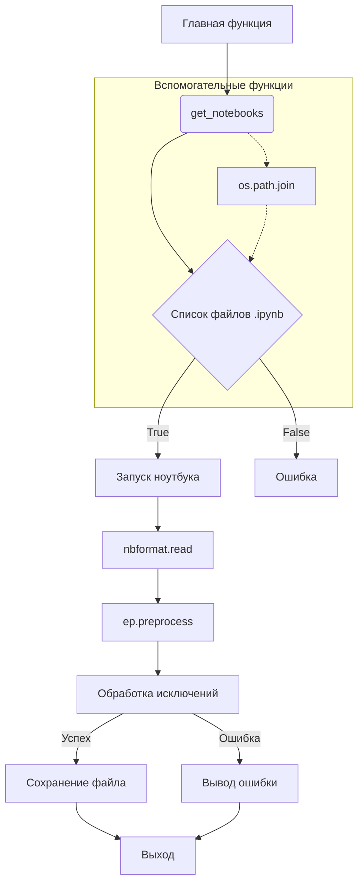

# <input code>

```python
import os
import nbformat
from nbconvert.preprocessors import ExecutePreprocessor
import pytest

import sys
sys.path.insert(0, '../../tinytroupe/') # ensures that the package is imported from the parent directory, not the Python installation
sys.path.insert(0, '../../') # ensures that the package is imported from the parent directory, not the Python installation
sys.path.insert(0, '..') # ensures that the package is imported from the parent directory, not the Python installation

# Set the folder containing the notebooks
NOTEBOOK_FOLDER = "../examples/"  # Update this path

# Set a timeout for long-running notebooks
TIMEOUT = 600

KERNEL_NAME = "python3" #"py310"


def get_notebooks(folder):
    """Retrieve all Jupyter notebook files from the specified folder."""
    return [
        os.path.join(folder, f)
        for f in os.listdir(folder)
        if f.endswith(".ipynb") and not ".executed." in f and not ".local." in f
    ]


@pytest.mark.parametrize("notebook_path", get_notebooks(NOTEBOOK_FOLDER))
def test_notebook_execution(notebook_path):
    """Execute a Jupyter notebook and assert that no exceptions occur."""
    with open(notebook_path, "r", encoding="utf-8") as nb_file:
        notebook = nbformat.read(nb_file, as_version=4)
        print(f"Executing notebook: {notebook_path} with kernel: {KERNEL_NAME}")
        ep = ExecutePreprocessor(timeout=TIMEOUT, kernel_name=KERNEL_NAME)

        try:
            ep.preprocess(notebook, {'metadata': {'path': NOTEBOOK_FOLDER}})
            print(f"Notebook {notebook_path} executed successfully.")

        except Exception as e:
            pytest.fail(f"Notebook {notebook_path} raised an exception: {e}")
        
        finally:
            # save a copy of the executed notebook
            output_path = notebook_path.replace(".ipynb", ".executed.local.ipynb")
            with open(output_path, "w", encoding="utf-8") as out_file:
                nbformat.write(notebook, out_file)
            
            print(f"Executed notebook saved as: {output_path}")
```

# <algorithm>

**Шаг 1**: Импортирование необходимых библиотек (os, nbformat, ExecutePreprocessor, pytest, sys).  
    * Пример: `import os` импортирует модуль `os` для работы с файловой системой.
**Шаг 2**: Установка пути к папке с пакетом TinyTroupe, чтобы Python мог найти его.
    * Пример: `sys.path.insert(0, '../../tinytroupe/')` добавляет родительский каталог к пути поиска модулей.
**Шаг 3**: Определение папки с Jupyter Notebook'ами (`NOTEBOOK_FOLDER`).
    * Пример: `NOTEBOOK_FOLDER = "../examples/"` указывает на папку `examples` в каталоге над текущим.
**Шаг 4**: Определение таймаута для выполнения ноутбуков (`TIMEOUT`).
    * Пример: `TIMEOUT = 600` устанавливает таймаут в 600 секунд.
**Шаг 5**: Определение имени ядра (`KERNEL_NAME`).
    * Пример: `KERNEL_NAME = "python3"` устанавливает ядро для выполнения.
**Шаг 6**: Функция `get_notebooks(folder)` возвращает список путей к ноутбукам в указанной папке, исключая те, которые уже были обработаны.
    * Пример: `get_notebooks("../examples/")` вернет список путей к файлам `.ipynb`, не содержащих `executed`.
**Шаг 7**: Тестовая функция `test_notebook_execution(notebook_path)`:
   * Читает Jupyter Notebook из файла.
   * Выводит сообщение об исполняемом ноутбуке.
   * Создаёт экземпляр ExecutePreprocessor для выполнения ноутбука с заданным таймаутом и именем ядра.
   * Выполняет ноутбук с помощью `ep.preprocess()`. Обрабатывает исключения во время выполнения.
   * Сохраняет исполненый ноутбук в новую папку.
   * Выводит сообщение о успешном выполнении или ошибке.
    * Пример: `test_notebook_execution("my_notebook.ipynb")` выполнит ноутбук `my_notebook.ipynb`.

Данные передаются между функциями в виде аргументов и возвращаемых значений (списки путей к ноутбукам, объекты `nbformat`).


# <mermaid>



# <explanation>

**Импорты:**
- `os`: Для работы с операционной системой (например, чтение списка файлов в папке).
- `nbformat`: Для чтения и записи Jupyter Notebook файлов в формате nbformat.
- `ExecutePreprocessor`: Из пакета `nbconvert`, используется для выполнения ядра Jupyter в ноутбуках.
- `pytest`: Для написания тестов.
- `sys`: Для управления путями поиска модулей (очень важно для работы с пакетами).

**Классы:**
- Нет явных пользовательских классов.  Используется класс `ExecutePreprocessor` из пакета `nbconvert`.

**Функции:**
- `get_notebooks(folder)`: Возвращает список путей к Jupyter Notebook файлам в заданной папке,  фильтруя файлы, которые были уже обработаны.  Она возвращает список строк.
- `test_notebook_execution(notebook_path)`:  Основная тестовая функция, которая выполняет Jupyter Notebook и проверяет отсутствие ошибок.  Принимает путь к ноутбуку в качестве аргумента и не возвращает явного значения, но влияет на выполнение теста.

**Переменные:**
- `NOTEBOOK_FOLDER`: Строка, представляющая путь к папке с Jupyter Notebook файлами.
- `TIMEOUT`: Целое число, устанавливающее таймаут выполнения ноутбука в секундах.
- `KERNEL_NAME`: Строка, представляющая имя ядра для выполнения ноутбука.


**Возможные ошибки или области для улучшений:**
- Отсутствие обработки ошибок в `get_notebooks`. Нужно добавить проверку на существование папки.
-  Отсутствие описания, что происходит с exception's, которые выкидываются в процессе исполнения ноутбука.

**Цепочка взаимосвязей:**
Код интегрируется в процесс тестирования (`pytest`), в котором выполняется запуск ноутбуков.  `ExecutePreprocessor` выполняет код ноутбука. Конечный результат (успех или ошибка) влияет на прохождение теста `pytest`.  Код зависит от пакета `nbconvert` (который, в свою очередь, зависит от `nbformat` и других библиотек).