```MD
# <input code>

```python
import pytest

import sys
sys.path.append('../../tinytroupe/')
sys.path.append('../../')
sys.path.append('..')

from testing_utils import *

from tinytroupe.experimentation import ABRandomizer

def test_randomize():
    randomizer = ABRandomizer()
    # run multiple times to make sure the randomization is properly tested
    for i in range(20):
        a, b = randomizer.randomize(i, "option1", "option2")

        if randomizer.choices[i] == (0, 1):
            assert (a, b) == ("option1", "option2")
        elif randomizer.choices[i] == (1, 0):
            assert (a, b) == ("option2", "option1")
        else:
            raise Exception(f"No randomization found for item {i}")

def test_derandomize():
    randomizer = ABRandomizer()

    # run multiple times to make sure the randomization is properly tested
    for i in range(20):
        a, b = randomizer.randomize(i, "option1", "option2")
        c, d = randomizer.derandomize(i, a, b)

        assert (c, d) == ("option1", "option2")

def test_derandomize_name():
    randomizer = ABRandomizer()

    for i in range(20):
        a, b = randomizer.randomize(i, "A", "B")
        real_name = randomizer.derandomize_name(i, a)

        if randomizer.choices[i] == (0, 1):
            assert real_name == "control"
        elif randomizer.choices[i] == (1, 0):
            assert real_name == "treatment"
        else:
            raise Exception(f"No randomization found for item {i}")


def test_passtrough_name():
    randomizer = ABRandomizer(passtrough_name=["option3"])
    a, b = randomizer.randomize(0, "option1", "option2")
    real_name = randomizer.derandomize_name(0, "option3")

    assert real_name == "option3"

def test_intervention_1():
    pass # TODO
```

# <algorithm>

**Шаг 1:** Импорты

- `pytest`: для тестирования.
- `sys`: для манипулирования путём.
- `testing_utils`: вероятно, модуль для вспомогательных функций тестирования (не показано).
- `ABRandomizer`: класс для рандомизации.

**Шаг 2:** Тестирование `randomize`

- Создаётся экземпляр `ABRandomizer`.
- Цикл по 20 итерациям.
- Для каждой итерации вызывается `randomize` с `i`, "option1" и "option2".
- Проверяется результат с помощью `assert`.

**Шаг 3:** Тестирование `derandomize`

- Создаётся экземпляр `ABRandomizer`.
- Цикл по 20 итерациям.
- Для каждой итерации вызывается `randomize` и `derandomize`.
- Проверяется корректность результата.

**Шаг 4:** Тестирование `derandomize_name`

- Создаётся экземпляр `ABRandomizer`.
- Цикл по 20 итерациям.
- Для каждой итерации вызывается `randomize` и `derandomize_name`.
- Проверяется соответствие с ожидаемым результатом.

**Шаг 5:** Тестирование `passtrough_name`

- Создаётся экземпляр `ABRandomizer` с опцией `passtrough_name`.
- Вызывается `randomize` и `derandomize_name`.
- Проверка результата.

**Пример данных:**

Входные данные: `i`, "option1", "option2"
Результат `randomize`: случайная пара ("option1", "option2") или ("option2", "option1")
Входные данные `derandomize`: `i`, "option1" или "option2", возвращённые значения `randomize`
Результат `derandomize`: ("option1", "option2")
Входные данные `derandomize_name`: `i`, имя, возвращённые значения `randomize`
Результат `derandomize_name`: "control" или "treatment"

```mermaid
graph TD
    subgraph "Модуль тестирования"
        A[test_randomize] --> B(ABRandomizer);
        B --> C{randomize};
        C --> D[Проверка результатов];
        B --> E{randomize}
        E --> F[Проверка результатов];
    end
    subgraph "Модуль тестирования 2"
        G[test_derandomize] --> H(ABRandomizer);
        H --> I{randomize};
        I --> J{derandomize};
        J --> K[Проверка результатов];
    end
    subgraph "Модуль тестирования 3"
        L[test_derandomize_name] --> M(ABRandomizer);
        M --> N{randomize};
        N --> O{derandomize_name};
        O --> P[Проверка результатов];
    end
    subgraph "Модуль тестирования 4"
        Q[test_passtrough_name] --> R(ABRandomizer);
        R --> S{randomize};
        S --> T{derandomize_name};
        T --> U[Проверка результатов];
    end
    subgraph "ABRandomizer"
        B -- randomize(i, a, b) --> C;
        H -- derandomize(i, a, b) --> I;
        M -- derandomize_name(i, a) --> N;
        R -- randomize(i, a, b) --> S;
    end
    style B fill:#f9f,stroke:#333,stroke-width:2px;
    style H fill:#ccf,stroke:#333,stroke-width:2px;
    style M fill:#ccf,stroke:#333,stroke-width:2px;
    style R fill:#ccf,stroke:#333,stroke-width:2px;

```


# <mermaid>



# <explanation>

**Импорты:**

- `pytest`:  Библиотека для написания тестов.  Связь с `src` - через установленный проект (и импорт).
- `sys`: Библиотека для взаимодействия с системными функциями. Используется для добавления каталогов в `sys.path`, чтобы импортировать модули из других папок проекта.
- `testing_utils`:  Вероятно, модуль, содержащий вспомогательные функции для тестирования (не показано в коде).
- `ABRandomizer`:  Класс из модуля `experimentation` в пакете `tinytroupe`, предназначенный для рандомизации.

**Классы:**

- `ABRandomizer`:  Этот класс отвечает за рандомизацию и обратную рандомизацию элементов в A/B-тестировании.  В коде присутствуют методы `randomize`, `derandomize`, и `derandomize_name`. Внутри класса вероятно хранятся данные о текущей рандомизации, что подразумевает внутренние атрибуты (например, `choices`) для хранения результатов рандомизации.

**Функции:**

- `test_randomize`: Тестирует метод `randomize` класса `ABRandomizer`.  Проверяет, что рандомизация выполняется корректно, генерируя 20 пар `a`, `b` и сравнивая их с ожидаемыми значениями.
- `test_derandomize`: Тестирует метод `derandomize` класса `ABRandomizer`.  Проверяет, что обратная рандомизация вернёт исходные значения.
- `test_derandomize_name`:  Тестирует метод `derandomize_name`. Проверяет корректность определения групп (control/treatment) на основе рандомизации.
- `test_passtrough_name`: Тестирует обработку специальных значений. Использует `passtrough_name` для проверки, что определённые значения не изменяются при обратной рандомизации.
- `test_intervention_1`: Функция-заглушка для будущего тестирования.

**Переменные:**

- `randomizer`:  Экземпляр класса `ABRandomizer`.
- `a`, `b`, `c`, `d`: Используются для хранения результатов рандомизации.

**Возможные ошибки/улучшения:**

- **Отсутствие docstrings:** Функции и классы не имеют документирующих строк (`docstrings`), что затрудняет понимание их назначения и использования. Добавление `docstrings` повысило бы читаемость и поддержку кода.
- **Неясность `testing_utils`:** Непонятно, какие функции содержит данный модуль, и как он взаимодействует с кодом.
- **Проверка `choices`:** Необходимо убедиться, что `choices` инициализируются корректно в конструкторе `ABRandomizer` и не вызывают `IndexError` в случаях, когда доступ к элементу с индексом `i` недопустим.


**Взаимосвязи с другими частями проекта:**

- `ABRandomizer` напрямую связан с модулями тестирования, использующими его для генерации и проверки результатов рандомизации.  Связь осуществляется через вызов методов класса.
- `testing_utils` играет роль вспомогательного модуля для тестирования. По всей видимости, `tinytroupe.experimentation` является частью более крупного проекта, включающего `ABRandomizer`.

**Важно:** Чтобы точно определить цепочку взаимосвязей, нужно знать всю структуру проекта.