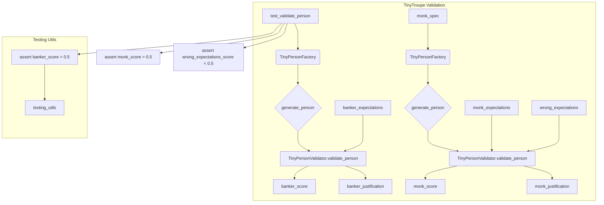

# <input code>

```python
import pytest
import os

import sys
sys.path.append('../../tinytroupe/')
sys.path.append('../../')
sys.path.append('..')


from tinytroupe.examples import create_oscar_the_architect
from tinytroupe.control import Simulation
import tinytroupe.control as control
from tinytroupe.factory import TinyPersonFactory
from tinytroupe.validation import TinyPersonValidator

from testing_utils import *

def test_validate_person(setup):

    ##########################
    # Banker
    ##########################
    banker_spec =\\\
    """
    A vice-president of one of the largest brazillian banks. Has a degree in engineering and an MBA in finance. 
    Is facing a lot of pressure from the board of directors to fight off the competition from the fintechs.    
    """
    banker_factory = TinyPersonFactory(banker_spec)
    banker = banker_factory.generate_person()
    banker_expectations =\\\
    """
    He/she is:
    - Wealthy
    - Very intelligent and ambitious
    - Has a lot of connections
    - Is in his 40s or 50s

    Tastes:
    - Likes to travel to other countries
    - Either read books, collect art or play golf
    - Enjoy only the best, most expensive, wines and food
    - Dislikes communists, unions and the like

    Other notable traits:
    - Has some stress issues, and might be a bit of a workaholic
    - Deep knowledge of finance, economics and financial technology
    - Is a bit of a snob
    - Might pretend to be a hard-core woke, but in reality that's just a facade to climb the corporate ladder  
    """
    banker_score, banker_justification = TinyPersonValidator.validate_person(banker, expectations=banker_expectations, include_agent_spec=False, max_content_length=None)
    print("Banker score: ", banker_score)
    print("Banker justification: ", banker_justification)

    assert banker_score > 0.5, f"Validation score is too low: {banker_score:.2f}"


    ##########################
    # Busy Knowledge Worker   
    ########################## 
    monk_spec =\\\
    """
    A poor buddhist monk living alone and isolated in a remote montain.
    """
    monk_spec_factory = TinyPersonFactory(monk_spec)
    monk = monk_spec_factory.generate_person()
    monk_expectations =\\\
    """
    Some characteristics of this person:
    - Is very poor, and in fact do not seek money
    - Has no formal education, but is very wise
    - Is very calm and patient
    - Is very humble and does not seek attention
    - Honesty is a core value    
    """

    monk_score, monk_justification = TinyPersonValidator.validate_person(monk, expectations=monk_expectations, include_agent_spec=False, max_content_length=None)
    print("Monk score: ", monk_score)
    print("Monk justification: ", monk_justification)
          

    assert monk_score > 0.5, f"Validation score is too low: {monk_score:.2f}"

    # Now, let's check the score for the busy knowledge worker with the wrong expectations! It has to be low!
    wrong_expectations_score, wrong_expectations_justification = TinyPersonValidator.validate_person(monk, expectations=banker_expectations, include_agent_spec=False, max_content_length=None)

    assert wrong_expectations_score < 0.5, f"Validation score is too high: {wrong_expectations_score:.2f}"
    print("Wrong expectations score: ", wrong_expectations_score)
    print("Wrong expectations justification: ", wrong_expectations_justification)
```

# <algorithm>

**Шаг 1:**  Импортирование необходимых библиотек.  `pytest`, `os` для тестов и управления файлами.  `sys` для манипуляции с `sys.path` для поиска модулей.  `tinytroupe` предоставляет классы для создания и валидации персон. `testing_utils` для вспомогательных функций (не определенных в данном фрагменте).


**Шаг 2:** Тест `test_validate_person`:
   - Создает описание человека (банклер):  `banker_spec`.
   - Создает фабрику (`TinyPersonFactory`) для генерации человека по его описанию.
   - Создает человека (`banker`).
   - Создает ожидаемые характеристики (`banker_expectations`).
   - Использует `TinyPersonValidator.validate_person` для сравнения с ожиданиями.
   - Выводит оценку и обоснование.
   - Проверяет, что оценка выше 0.5.

**Шаг 3:** Тест для буддийского монаха (busy knowledge worker):
   - Аналогично шагу 2, но для монаха (monk_spec, monk_expectations).
   - Выводит оценку и обоснование.
   - Проверяет, что оценка выше 0.5.

**Шаг 4:** Тест с неправильными ожиданиями:
   - Использует `banker_expectations` для монаха.
   - Выводит оценку и обоснование.
   - Проверяет, что оценка ниже 0.5.

**Данные:** Передаются от одного метода к другому в виде аргументов (`banker`, `banker_expectations`, `monk`, `monk_expectations`) и возвращаются `banker_score` и т.д.

# <mermaid>



# <explanation>

**Импорты:**

- `pytest`: Библиотека для написания юнит-тестов.
- `os`: Модуль для взаимодействия с операционной системой (менее важно в данном случае).
- `sys`: Модуль для работы с системой, используется для модификации `sys.path` что бы найти модули `tinytroupe` в нужном каталоге.
- `tinytroupe.examples`, `tinytroupe.control`, `tinytroupe.factory`, `tinytroupe.validation`: Модули из пакета `tinytroupe` отвечающие за создание и проверку персон.
- `testing_utils`:  Вспомогательный модуль для тестов (не определен в предоставленном фрагменте кода) содержащий полезные функции для тестов.


**Классы:**

- `TinyPersonFactory`: Создает экземпляры персон, основанных на описании. `generate_person` метод принимает спецификацию (`spec`) и создает персону.
- `TinyPersonValidator`: Класс для валидации персон. `validate_person` метод сравнивает созданную персону с ожидаемыми характеристиками, возвращая оценку соответствия и обоснование.


**Функции:**

- `test_validate_person`: Функция тестирования, которая создает, валидирует и проверяет корректность валидации персон. Принимает `setup` - аргумент, вероятнее всего, для подготовки окружения перед выполнением теста, в `testing_utils`.

**Переменные:**

- `banker_spec`, `banker_expectations`, `monk_spec`, `monk_expectations`: Строковые переменные содержащие описания ожидаемых характеристик людей.
- `banker`, `monk`: Экземпляры персон, созданные с помощью `TinyPersonFactory`.
- `banker_score`, `banker_justification`, `monk_score`, `monk_justification`: Результаты валидации персон.
- `wrong_expectations_score`, `wrong_expectations_justification`: Результаты валидации персоны с неверными ожиданиями.

**Возможные ошибки/улучшения:**

- Не указан `setup` параметр, возможно, он имеет значение, и должен быть определён, чтобы выполнить тесты корректно.
- Фрагмент кода показывает только часть тестирования, валидации персон, и не указывает, как происходит генерация описания личности.
- Отсутствует логика валидации в `TinyPersonValidator.validate_person`: не описан алгоритм сравнения фактических и ожидаемых атрибутов.

**Взаимосвязи:**

Функция `test_validate_person` использует `TinyPersonFactory` и `TinyPersonValidator` для создания и проверки персон.  Неявно предполагается, что `testing_utils` содержит функции для подготовки тестовой среды (`setup`) и других вспомогательных функций, которые помогают с тестированием.