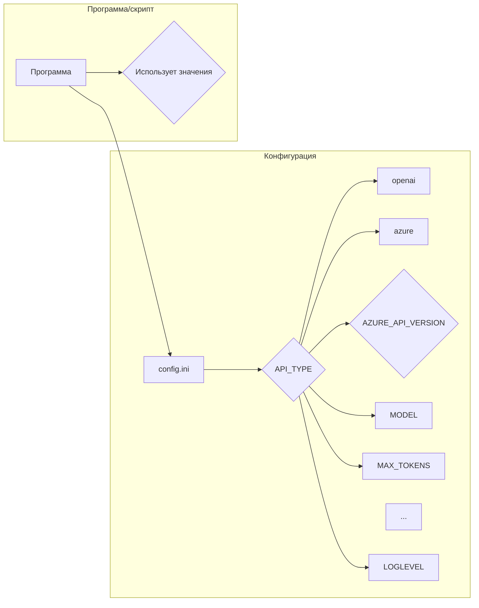

# <input code>

```ini
#
# OpenAI or Azure OpenAI Service
#

# Default options: openai, azure
API_TYPE=openai

# Check Azure's documentation for updates here:
# https://learn.microsoft.com/en-us/azure/ai-services/openai/chatgpt-quickstart?tabs=command-line&pivots=programming-language-python
AZURE_API_VERSION=2023-05-15


#
# Model parameters
#

MODEL=gpt-4o
MAX_TOKENS=4000
TEMPERATURE=0.3
FREQ_PENALTY=0.0
PRESENCE_PENALTY=0.0
TIMEOUT=60
MAX_ATTEMPTS=5
WAITING_TIME=1
EXPONENTIAL_BACKOFF_FACTOR=5

EMBEDDING_MODEL=text-embedding-3-small 

CACHE_API_CALLS=False
CACHE_FILE_NAME=openai_api_cache.pickle

MAX_CONTENT_DISPLAY_LENGTH=1024

[Simulation]
RAI_HARMFUL_CONTENT_PREVENTION=True
RAI_COPYRIGHT_INFRINGEMENT_PREVENTION=True


[Logging]
LOGLEVEL=ERROR
# ERROR
# WARNING
# INFO
# DEBUG
```

# <algorithm>

Этот код представляет собой конфигурационный файл (в формате INI), который определяет параметры для взаимодействия с API OpenAI или Azure OpenAI. Алгоритм работы – это непосредственное чтение и интерпретация значений, заданных в секциях файла.  Нет циклов и ветвлений в смысле алгоритма, но есть выбор из предустановленных значений (например, API_TYPE=openai).

**Блок-схема (непосредственно в тексте):**

Файл `config.ini` содержит настройки, связанные с использованием API OpenAI.  Каждая секция (например, "[OpenAI]", "[Simulation]") группирует связанные параметры.  Программа/скрипт, использующий этот файл, будет считывать значения параметров.  Нет никаких вычислений или логических операций над данными, просто чтение.


# <mermaid>




# <explanation>

Этот файл `config.ini` содержит конфигурацию для взаимодействия с API OpenAI или Azure OpenAI.  Он используется для настройки параметров, которые будут использоваться в коде Python, управляющем взаимодействием с этим API.

**Импорты:**  В этом коде нет импортируемых модулей. Это чистый конфигурационный файл, не требующий импортов.

**Классы:**  Нет классов, только настройки параметров.

**Функции:** Нет функций, только конфигурационные параметры.

**Переменные:**  Все значения представляют собой строки (строковые константы) или логические значения (True/False), которые используются как параметры для работы с API OpenAI. Например:
* `API_TYPE`: Определяет тип API (openai или azure).
* `MODEL`: Модель OpenAI для использования.
* `MAX_TOKENS`: Максимальное количество токенов для запроса.
* `CACHE_API_CALLS`: Флаг для кэширования вызовов API.
* `LOGLEVEL`: Уровень ведения логов.

**Возможные ошибки/улучшения:**

* **Типизация:**  Использование строго типизированных данных (например, целочисленных для `MAX_TOKENS`)  было бы предпочтительнее, особенно если конфигурация будет использоваться в критичных приложениях.
* **Валидация:** Добавление валидации на корректность значений. Например, проверка допустимых значений для `API_TYPE`, `MODEL`, `LOGLEVEL`. Это предотвратит ошибки при попытке использования неверных параметров.
* **Комментарии:**  Комментарии, особенно для необъявленных параметров (например, `EXPONENTIAL_BACKOFF_FACTOR`),  должны объяснять их назначение.
* **Секции:** Использование секций ([OpenAI], [Simulation], [Logging]) улучшает структурированность конфигурации.
* **Разделение на файлы:** Если конфигурация будет очень большой, следует разбить ее на отдельные файлы для лучшей читаемости и организации.

**Цепочка взаимосвязей:**

Конфигурационный файл `config.ini`  является внешним источником данных для последующего кода на Python, который будет использовать API OpenAI для выполнения задач.  Этот код, в свою очередь, может быть частью более крупного проекта, включающего модели обработки языка.