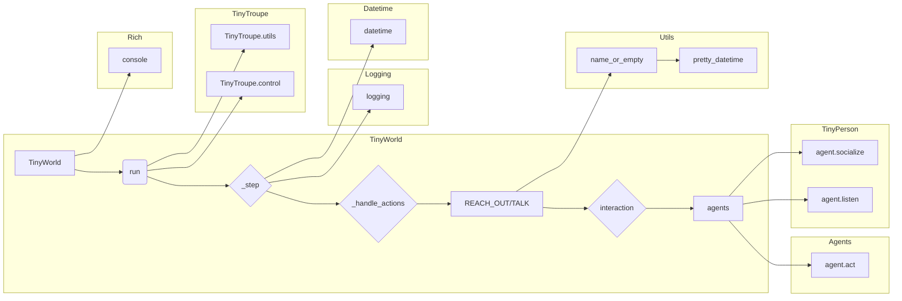

```MD
# <input code>

```python
"""
Environments provide a structured way to define the world in which the
agents interact with each other as well as external entities (e.g., search engines).
"""

import logging
logger = logging.getLogger("tinytroupe")
import copy
from datetime import datetime, timedelta

from tinytroupe.agent import *
from tinytroupe.utils import name_or_empty, pretty_datetime
import tinytroupe.control as control
from tinytroupe.control import transactional

from rich.console import Console

from typing import Any, TypeVar, Union
AgentOrWorld = Union["TinyPerson", "TinyWorld"]

class TinyWorld:
    """
    Base class for environments.
    """

    # A dict of all environments created so far.
    all_environments = {} # name -> environment

    # Whether to display environments communications or not, for all environments. 
    communication_display = True

    def __init__(self, name: str="A TinyWorld", agents=[], 
                 initial_datetime=datetime.datetime.now(),
                 broadcast_if_no_target=True):
        """
        Initializes an environment.

        Args:
            name (str): The name of the environment.
            agents (list): A list of agents to add to the environment.
            initial_datetime (datetime): The initial datetime of the environment, or None (i.e., explicit time is optional). 
                Defaults to the current datetime in the real world.
            broadcast_if_no_target (bool): If True, broadcast actions if the target of an action is not found.
        """

        # ... (rest of the code)
```

# <algorithm>

**Шаг 1: Инициализация TinyWorld**

*   Принимаются имя окружения, список агентов, начальная дата и флаг broadcast_if_no_target.
*   Создается экземпляр TinyWorld, устанавливаются его атрибуты.
*   Добавляется окружение в список всех окружений `all_environments`.
*   Добавляются агенты в окружение.

**Шаг 2: Выполнение шага симуляции (_step)**

*   Увеличивается текущее время `current_datetime` на заданный интервал `timedelta_per_step`.
*   Каждый агент в `self.agents` выполняет действие `act` и возвращает список действий `actions`.
*   Действия обрабатываются функцией `_handle_actions`.

**Шаг 3: Обработка действий агентов (_handle_actions)**

*   Проверяются типы действий (REACH_OUT, TALK).
*   В зависимости от типа действия вызывается соответствующий обработчик (например, `_handle_reach_out`).
*   Обработчики взаимодействуют с другими агентами, передавая сообщения и обновляя их доступность.

**Шаг 4: Выполнение симуляции (run)**

*   Вызывается `_step` для заданного количества шагов `steps`.
*   Возвращается список действий, принятых агентами за все шаги (при `return_actions`).

**Шаг 5: Пропуск шагов (skip)**

*   Увеличивается текущее время `current_datetime` на заданный интервал `timedelta_per_step` без выполнения действий агентов.


**Пример**

Пусть `TinyWorld` с именем "MyWorld" имеет двух агентов: `AgentA` и `AgentB`.  При вызове `run(2, timedelta(minutes=1))` будет выполнено два шага, каждый продолжительностью 1 минута.  `AgentA` и `AgentB` могут совершить действия в каждом шаге.

# <mermaid>



# <explanation>

**Импорты:**

*   `import logging`: Импортирует модуль `logging` для ведения журналов.
*   `import copy`: Импортирует модуль `copy` для создания копий объектов.
*   `from datetime import datetime, timedelta`: Импортирует классы `datetime` и `timedelta` для работы со временем.
*   `from tinytroupe.agent import *`: Импортирует все классы из модуля `tinytroupe.agent` (предполагается, что он содержит классы агентов, таких как `TinyPerson`).
*   `from tinytroupe.utils import name_or_empty, pretty_datetime`: Импортирует полезные функции из `tinytroupe.utils` для обработки имен агентов и форматирования дат.
*   `import tinytroupe.control as control`: Импортирует модуль `tinytroupe.control` и переименовывает его как `control` для краткого доступа.
*   `from tinytroupe.control import transactional`: Импортирует декоратор `transactional` из модуля `tinytroupe.control` для управления транзакциями (предполагается, что `tinytroupe.control` содержит функции для обработки транзакций).
*   `from rich.console import Console`: Импортирует `Console` для красивой визуализации вывода.
*   `from typing import Any, TypeVar, Union`: Импортирует типы данных `Any`, `TypeVar` и `Union` для более явного определения типов.
*   `AgentOrWorld = Union["TinyPerson", "TinyWorld"]`: Определяет тип `AgentOrWorld`, который может быть либо `TinyPerson` (агент), либо `TinyWorld` (среда).

**Классы:**

*   `TinyWorld`: Базовый класс для сред. Содержит методы для управления агентами, выполнения шагов симуляции, и взаимодействия с ними.

**Функции:**

*   `__init__`: Конструктор класса `TinyWorld`. Инициализирует атрибуты, добавляет окружение в `all_environments`, добавляет агентов.
*   `_step`: Выполняет один шаг симуляции. Вызывает `act` у каждого агента и обрабатывает полученные действия.
*   `run`: Выполняет симуляцию заданное количество шагов. Содержит логику для отображения информации о шаге.
*   `skip`: Пропускает заданное количество шагов, но без выполнения действий агентами.
*   `add_agent`, `remove_agent`, `remove_all_agents`: методы для управления агентами в окружении.
*   `get_agent_by_name`: Возвращает агента по имени.
*   `_handle_actions`: Метод для обработки действий агентов. Разделяет логику обработки разных типов действий.
*   `_handle_reach_out`: Обрабатывает действие `REACH_OUT`.
*   `_handle_talk`: Обрабатывает действие `TALK`.
*   `broadcast`, `broadcast_thought`, `broadcast_internal_goal`, `broadcast_context_change`: Методы для распространения сообщений, мыслей и целей между агентами.
*   `make_everyone_accessible`: Делает всех агентов доступными друг другу.
*   `_display_communication`: Отображает информацию о текущей коммуникации в консоли и сохраняет ее в буфере для последующего использования.
*   `pop_and_display_latest_communications`: Возвращает и отображает накопленные коммуникации.
*   `clear_communications_buffer`: Очищает буфер коммуникаций.
*   `encode_complete_state`, `decode_complete_state`: Методы для кодирования и декодирования состояния окружения, важны для сохранения и загрузки состояния симуляции.
*   `add_environment`, `set_simulation_for_free_environments`, `get_environment_by_name`, `clear_environments`: Статические методы для управления списком всех окружений.


**Переменные:**

*   `all_environments`: Словарь, хранящий все созданные окружения (ключ - имя окружения, значение - сам объект).
*   `communication_display`: Флаг, определяющий, отображать ли коммуникации агентов.
*   `agents`: Список агентов в окружении.
*   `name_to_agent`: Словарь для быстрого поиска агентов по имени.
*   `current_datetime`: Текущая дата и время в симуляции.
*   `broadcast_if_no_target`: Флаг, определяющий, нужно ли пересылать действия, если целевой агент не найден.

**Возможные ошибки/улучшения:**

*   Отсутствие проверки на корректность типов данных, передаваемых в функции.
*   Нехватка документации для некоторых методов и переменных.
*   Можно добавить поддержку других типов действий агентов.
*   Можно реализовать более гибкую систему обработки ошибок и исключений, а также вывод отладочных сообщений.
*   Можно оптимизировать методы `get_agent_by_name` и `is_in_relation_with` для более быстрого поиска в больших средах.


**Взаимосвязи с другими частями проекта:**

Код взаимодействует с другими частями проекта через импорты: `tinytroupe.agent`, `tinytroupe.utils`, `tinytroupe.control`, и предполагает наличие класса `TinyPerson` (агент) в `tinytroupe.agent`.  Эти зависимости обеспечивают взаимодействие с другими модулями, например, для управления агентами, работы с датой и временем, и выполнением транзакций.