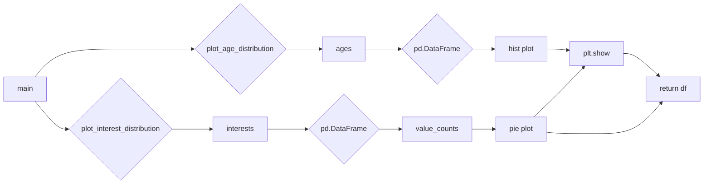

# <input code>

```python
"""
Provides mechanisms for creating understanding the characteristics of agent populations, such as
the their age distribution, typical interests, and so on.

Guideline for plotting the methods: all plot methods should also return a Pandas dataframe with the data used for 
plotting.
"""
import pandas as pd
import matplotlib.pyplot as plt
from typing import List
from tinytroupe.agent import TinyPerson

def plot_age_distribution(agents:List[TinyPerson], title:str="Age Distribution", show:bool=True):
    """
    Plots the age distribution of the given agents.

    Args:
        agents (List[TinyPerson]): The agents whose age distribution is to be plotted.
        title (str, optional): The title of the plot. Defaults to "Age Distribution".
        show (bool, optional): Whether to show the plot. Defaults to True.
    
    Returns:
        pd.DataFrame: The data used for plotting.
    """
    ages = [agent.get("age") for agent in agents]

    # corresponding dataframe
    df = pd.DataFrame(ages, columns=["Age"])
    df["Age"].plot.hist(bins=20, title=title)
    if show:
        plt.show()

    return df
    

def plot_interest_distribution(agents:List[TinyPerson], title:str="Interest Distribution", show:bool=True):
    """
    Plots the interest distribution of the given agents.

    Args:
        agents (List[TinyPerson]): The agents whose interest distribution is to be plotted.
        title (str, optional): The title of the plot. Defaults to "Interest Distribution".
        show (bool, optional): Whether to show the plot. Defaults to True.
    
    Returns:
        pd.DataFrame: The data used for plotting.
    """
    interests = [agent.get("interests") for agent in agents]

    # corresponding dataframe
    df = pd.DataFrame(interests, columns=["Interests"])

    # let's plot a pie chart
    df["Interests"].value_counts().plot.pie(title=title)
    if show:
        plt.show()

    return df
```

# <algorithm>

**Алгоритм для `plot_age_distribution`:**

1. Принимает список агентов (`agents`) и необязательные параметры `title` и `show`.
2. Создаёт новый список `ages`, содержащий значения возраста из каждого агента.
3. Создаёт `Pandas DataFrame` (`df`) с колонкой "Age", содержащей список возрастов.
4. Строит гистограмму распределения возрастов (`df["Age"].plot.hist`).
5. Если `show=True`, отображает график с помощью `plt.show()`.
6. Возвращает DataFrame `df` с данными для построения графика.

**Пример:**

Предположим `agents` содержит агентов с возрастом 20, 25, 20, 30.
1. `ages` будет содержать `[20, 25, 20, 30]`.
2. `df` будет DataFrame с одной колонкой "Age" и четырьмя строками со значениями из `ages`.
3. Гистограмма покажет распределение возрастов (20 встречается 2 раза, 25 - 1 раз, 30 - 1 раз).
4. Если `show=True`, график будет отображен.
5. Функция вернёт DataFrame `df` содержащий данные для построения графика.


**Алгоритм для `plot_interest_distribution`:**

1. Принимает список агентов (`agents`) и необязательные параметры `title` и `show`.
2. Создаёт новый список `interests`, содержащий списки интересов каждого агента.
3. Создаёт `Pandas DataFrame` (`df`) с колонкой "Interests", содержащей списки интересов.
4. Строит круговую диаграмму распределения интересов по частоте (`df["Interests"].value_counts().plot.pie`).
5. Если `show=True`, отображает график с помощью `plt.show()`.
6. Возвращает DataFrame `df` с данными для построения графика.

**Пример:**

Предположим `agents` содержит агентов с интересами `['спорт', 'музыка', 'спорт']`.
1. `interests` будет содержать `[['спорт'], ['музыка'], ['спорт']]`.
2. `df` будет DataFrame с одной колонкой "Interests" и тремя строками со значениями из `interests`.
3. Круговая диаграмма покажет распределение интересов (спорт встречается 2 раза, музыка - 1 раз).
4. Если `show=True`, график будет отображен.
5. Функция вернёт DataFrame `df` содержащий данные для построения графика.


# <mermaid>



**Описание диаграммы:**

Функции `plot_age_distribution` и `plot_interest_distribution` вызываются из основной части кода (обозначено как `main`).  Они используют `pandas` для создания DataFrame и `matplotlib` для построения графиков (гистограммы и круговой диаграммы соответственно).  `TinyPerson`  это класс из `tinytroupe.agent`, из которого берутся данные о возрасте и интересах.

# <explanation>

**Импорты:**

- `import pandas as pd`: Импортирует библиотеку Pandas для работы с DataFrame.
- `import matplotlib.pyplot as plt`: Импортирует библиотеку Matplotlib для визуализации данных.
- `from typing import List`: Импортирует тип данных `List` для типизации аргументов.
- `from tinytroupe.agent import TinyPerson`: Импортирует класс `TinyPerson` из модуля `agent` в пакете `tinytroupe`. Это указывает на то, что код взаимодействует с агентами из другой части проекта (предполагаемо, `src.tinytroupe.agent`).

**Классы:**

Код не определяет новые классы, но использует класс `TinyPerson` из пакета `tinytroupe.agent`.  Это предполагает, что `TinyPerson` определён в другом модуле в этом же проекте, хранит данные об агентах (возраст, интересы) и предоставляет метод `get("age")` и `get("interests")` для доступа к этим данным.

**Функции:**

- `plot_age_distribution(agents:List[TinyPerson], title:str="Age Distribution", show:bool=True)`: Строит гистограмму распределения возраста агентов. Принимает список агентов и параметры для заголовка графика и показа графика. Возвращает DataFrame с данными возраста.
- `plot_interest_distribution(agents:List[TinyPerson], title:str="Interest Distribution", show:bool=True)`: Строит круговую диаграмму распределения интересов агентов. Принимает список агентов и параметры для заголовка графика и показа графика. Возвращает DataFrame с данными о распределении интересов.


**Переменные:**

- `ages`, `interests`: Списки, содержащие данные о возрастах и интересах агентов соответственно.
- `df`: DataFrame, используемый для хранения и отображения данных о распределении возраста или интересов.
- `title`, `show`: Строковые и логические переменные, используемые для настройки заголовка графика и отображения.

**Возможные ошибки и улучшения:**

- **Обработка ошибок:** Если `agent.get("age")` или `agent.get("interests")` вернут ошибку (например, ключ не найден), код может упасть. Необходимо добавить проверку на наличие ключей или обработку исключений `KeyError` для повышения устойчивости.

- **Тип данных:** Если `interests` могут содержать разные типы данных (например, строки или числа), то `df` нужно построить таким образом, чтобы можно было обработать данные различного типа.
- **Разрешение конфликтов имён:** При работе с другими модулями важно убедиться, что имена переменных не дублируются.


**Взаимосвязи с другими частями проекта:**

Функции `plot_age_distribution` и `plot_interest_distribution` тесно связаны с классом `TinyPerson` в модуле `tinytroupe.agent`. Они получают данные об агентах из этого класса, что подразумевает существование кода, где данные о `TinyPerson` формируются и хранятся.  Также, эти функции используют пакеты `pandas` и `matplotlib`, которые являются внешними библиотеками для работы с данными и их визуализации.