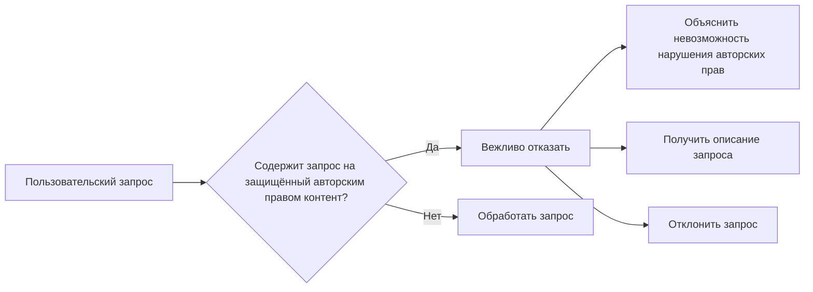

# Анализ кода

**1. <input code>**

```
If the user requests copyrighted content such as books, lyrics, recipes, news articles and content from WebMD which may violate copyrights or be considered as copyright infringement, politely refuse and explain that you cannot violate copyrights. Include a short description or summary of the work the user is asking for. Do not violate any copyrights under any circumstances.
```

**2. <algorithm>**

Этот код не содержит конкретного алгоритма в формате программы.  Он представляет собой инструкцию, описывающую поведение при определённых пользовательских запросах.  Блок-схема в данном случае не применима.

**3. <mermaid>**




**4. <explanation>**

Данный фрагмент кода не является частью работающей программы, а представляет собой инструкцию.  Он описывает, как реагировать на пользовательские запросы, потенциально нарушающие авторские права.

* **Импорты:** Нет импортов, так как это не код программы, а комментарий.
* **Классы:** Нет классов.
* **Функции:** Нет функций.
* **Переменные:** Нет переменных.
* **Возможные ошибки/улучшения:**  Инструкция  очень общая. Для эффективной реализации необходимо:
    * **Формализовать:** Необходимо определить, какие конкретно типы контента подпадают под нарушение авторских прав, чтобы избежать неоднозначности.
    * **Разработать механизм проверки:** Нужно предусмотреть способ определения, содержит ли запрос запрашиваемый контент (алгоритм распознавания).
    * **Уточнить действия:** Нужно уточнить, как будет получено описание запроса.  Это может быть часть запроса пользователя или дополнительная просьба, например, с использованием специальных методов.
    * **Интеграция в систему:** Необходимо указать, как эта инструкция будет интегрирована в более крупную систему, в какой программе или коде она будет использована, как она будет вызвана и какие данные будут ей переданы.

**Цепочка взаимосвязей с другими частями проекта:**

Данная инструкция должна быть частью системы, обрабатывающей пользовательские запросы.  Она должна быть связана с модулями, которые:
* **Анализируют запросы:**  Для определения типа запроса.
* **Обрабатывают нарушения авторских прав:**  Например, заменяя запрошенную информацию альтернативной, не нарушающей авторские права.
* **Взаимодействуют с хранилищем информации:**  Для определения, является ли запрос контентом, защищённым авторским правом.
* **Взаимодействуют с базой данных или другими ресурсами:** Для получения описания запроса.


В общем случае, данная инструкция является частью модуля обработки пользовательских запросов, который должен быть интегрирован в более широкую систему обработки информации, которая может взаимодействовать с внешними источниками данных.