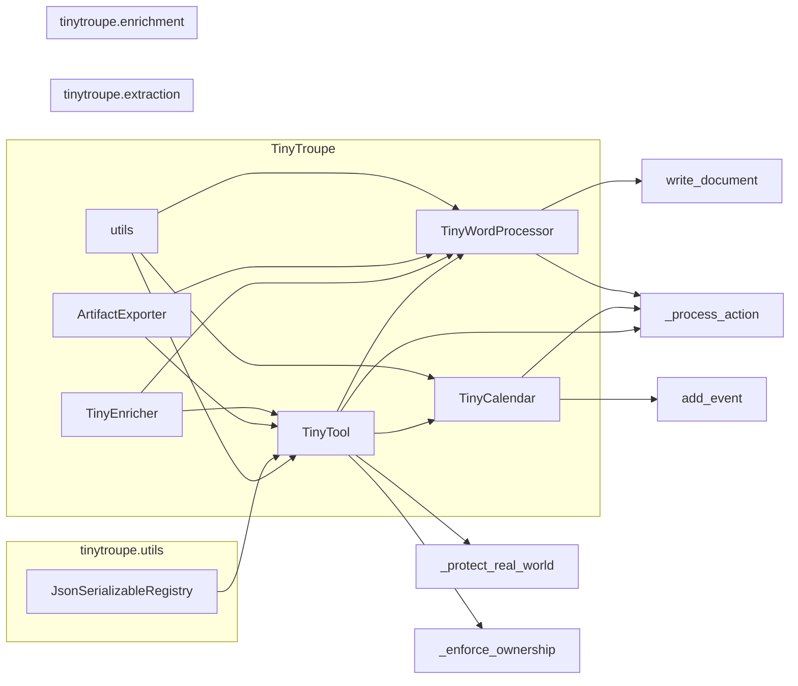

# Анализ кода из tinytroupe/tools.py

## <input code>

```python
"""
Tools allow agents to accomplish specialized tasks.
"""
import textwrap
import json
import copy

import logging
logger = logging.getLogger("tinytroupe")

import tinytroupe.utils as utils
from tinytroupe.extraction import ArtifactExporter
from tinytroupe.enrichment import TinyEnricher
from tinytroupe.utils import JsonSerializableRegistry

# ... (остальной код)
```

## <algorithm>

(Блок-схема здесь не применимо, так как код описывает классы и методы, а не алгоритм в строгом смысле.  Для описания алгоритма нужно было бы задать конкретный сценарий использования.)

## <mermaid>



## <explanation>

**Импорты:**

- `textwrap`, `json`, `copy`, `logging`: Стандартные библиотеки Python, необходимые для работы с текстом, обработкой JSON, копированием объектов и ведения журналов.
- `tinytroupe.utils`: Модуль утилит, вероятно, содержащий вспомогательные функции, используемые в других модулях `tinytroupe`.  Связь с `src` определяется проектной структурой.
- `tinytroupe.extraction.ArtifactExporter`: Класс для экспорта результатов.  Связь с `src` определяется проектной структурой, например, `src/tinytroupe/extraction.py`.
- `tinytroupe.enrichment.TinyEnricher`: Класс для обогащения результатов.  Связь с `src` определяется проектной структурой.
- `tinytroupe.utils.JsonSerializableRegistry`: Базовый класс для сериализуемых объектов JSON, вероятно, предоставляющий функции для работы с JSON.  Связь с `src` определяется проектной структурой.

**Классы:**

- `TinyTool`: Абстрактный базовый класс для инструментов. Он определяет общие методы для работы с инструментами, такие как обработка действий (`_process_action`), проверка реального мира (`_protect_real_world`), проверка владения (`_enforce_ownership`).  Это класс-родитель для `TinyCalendar` и `TinyWordProcessor`.

- `TinyCalendar`: Конкретный инструмент для работы с календарем. Имеет атрибут `calendar` для хранения событий.  Реализует методы `add_event` (добавление события), `find_events` (поиск события) и `_process_action` (обработка действий, связанных с календарем).  Связан с `TinyTool` через наследование.

- `TinyWordProcessor`: Конкретный инструмент для обработки текстов (похоже, word processor). Имеет метод `write_document` для написания документов.   Реализует методы `_process_action` (обработка действий, связанных с процессором текста), `actions_definitions_prompt` и `actions_constraints_prompt`. Связан с `TinyTool` через наследование.


**Функции:**

- `_process_action`: Абстрактный метод, требующий реализации в дочерних классах. Обрабатывает конкретное действие инструмента.
- `_protect_real_world`: Выводит предупреждение, если инструмент имеет побочные эффекты в реальном мире.
- `_enforce_ownership`: Проверяет, имеет ли агент право использовать инструмент.
- `set_owner`: Устанавливает владельца инструмента.
- `actions_definitions_prompt`, `actions_constraints_prompt`: Возвращают подсказки для определения и ограничений действий.

**Переменные:**

- `self.name`, `self.description`, `self.owner`, `self.real_world_side_effects`: Характеристики инструмента.
- `self.exporter`, `self.enricher`: Ссылки на объекты экспортера и обогатителя.
- `self.calendar`: Словарь для хранения событий в календаре.
- `valid_keys`: Список допустимых ключей в JSON.

**Возможные ошибки/улучшения:**

- `NotImplementedError`: Необходимо реализовать `_process_action` и `actions_definitions_prompt`, `actions_constraints_prompt` в дочерних классах.
- Обработка ошибок JSON: В `TinyWordProcessor` имеется обработка `JSONDecodeError`, но можно добавить более расширенную валидацию входов (например, проверка наличия необходимых полей в JSON).
- `check_valid_fields`:  В `tinytroupe.utils` возможно, есть функция для проверки входов, но она не описана в предоставленном фрагменте.


**Цепочка взаимосвязей:**

`TinyTool` выступает в качестве абстрактного класса для `TinyCalendar` и `TinyWordProcessor`. Эти классы используют функции и классы из `tinytroupe.utils`, `tinytroupe.extraction`, `tinytroupe.enrichment`.  Взаимодействие инструментов, вероятно, реализуется через передачу данных между методами и классами. Например, `TinyWordProcessor` использует `TinyEnricher` для обогащения текста.