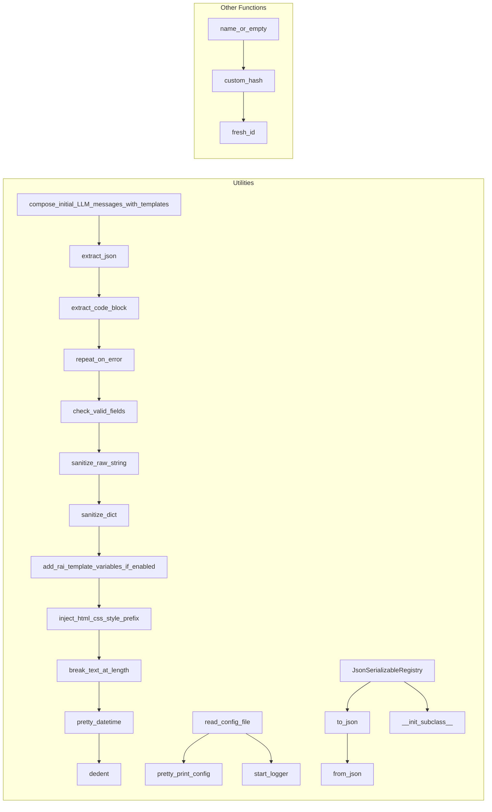

# <input code>

```python
"""
General utilities and convenience functions.
"""
import re
import json
import os
import sys
import hashlib
import textwrap
import logging
import chevron
import copy
from typing import Collection
from datetime import datetime
from pathlib import Path
import configparser
from typing import Any, TypeVar, Union
AgentOrWorld = Union["TinyPerson", "TinyWorld"]

# logger
logger = logging.getLogger("tinytroupe")


################################################################################
# Model input utilities
################################################################################
def compose_initial_LLM_messages_with_templates(system_template_name:str, user_template_name:str=None, rendering_configs:dict={}) -> list:
    """
    Composes the initial messages for the LLM model call, under the assumption that it always involves 
    a system (overall task description) and an optional user message (specific task description). 
    These messages are composed using the specified templates and rendering configurations.
    """

    system_prompt_template_path = os.path.join(os.path.dirname(__file__), f'prompts/{system_template_name}')
    user_prompt_template_path = os.path.join(os.path.dirname(__file__), f'prompts/{user_template_name}')

    messages = []

    messages.append({"role": "system", 
                         "content": chevron.render(
                             open(system_prompt_template_path).read(), 
                             rendering_configs)})
    
    # optionally add a user message
    if user_template_name is not None:
        messages.append({"role": "user", 
                            "content": chevron.render(
                                    open(user_prompt_template_path).read(), 
                                    rendering_configs)})
    return messages


################################################################################
# Model output utilities
################################################################################
def extract_json(text: str) -> dict:
    """
    Extracts a JSON object from a string, ignoring: any text before the first 
    opening curly brace; and any Markdown opening (```json) or closing(```) tags.
    """
    try:
        # remove any text before the first opening curly or square braces, using regex. Leave the braces.
        text = re.sub(r'^.*?({|\\[)', r'\1', text, flags=re.DOTALL)

        # remove any trailing text after the LAST closing curly or square braces, using regex. Leave the braces.
        text  =  re.sub(r'(\}|\])(?!.*(\\]|\\})).*$', r'\1', text, flags=re.DOTALL)
        
        # remove invalid escape sequences, which show up sometimes
        # replace \\' with just '
        text =  re.sub("\\\\'", "\'", text) #re.sub(r'\\\\\'', r"\'", text)

        # return the parsed JSON object
        return json.loads(text)
    
    except Exception:
        return {}


def extract_code_block(text: str) -> str:
    """
    Extracts a code block from a string, ignoring any text before the first 
    opening triple backticks and any text after the closing triple backticks.
    """
    try:
        # remove any text before the first opening triple backticks, using regex. Leave the backticks.
        text = re.sub(r'^.*?(```)', r'\1', text, flags=re.DOTALL)

        # remove any trailing text after the LAST closing triple backticks, using regex. Leave the backticks.
        text  =  re.sub(r'(```)(?!.*```).*$', r'\1', text, flags=re.DOTALL)
        
        return text
    
    except Exception:
        return ""


################################################################################
# Model control utilities
################################################################################    
def repeat_on_error(retries:int, exceptions:list):
    """
    Decorator that repeats the specified function call if an exception among those specified occurs, 
    up to the specified number of retries. If that number of retries is exceeded, the
    exception is raised. If no exception occurs, the function returns normally.

    Args:
        retries (int): The number of retries to attempt.
        exceptions (list): The list of exception classes to catch.
    """
    def decorator(func):
        def wrapper(*args, **kwargs):
            for i in range(retries):
                try:
                    return func(*args, **kwargs)
                except tuple(exceptions) as e:
                    logger.debug(f"Exception occurred: {e}")
                    if i == retries - 1:
                        raise e
                    else:
                        logger.debug(f"Retrying ({i+1}/{retries})...")
                        continue
        return wrapper
    return decorator
   


# ... (rest of the code)
```



```markdown
# <explanation>

**Импорты:**

Модули `re`, `json`, `os`, `sys`, `hashlib`, `textwrap`, `logging`, `chevron`, `copy`, `typing`, `datetime`, `pathlib`, `configparser` импортируются для использования их функций в коде.  Важно отметить, что `Union`, `Collection`, `Any`, `TypeVar`, которые тоже используются в `typing`, являются частями модуля `typing` и используются для более безопасной типизации функций, объектов, и параметров.  `AgentOrWorld` - определяет союз типов, вероятно, для использования в функции `name_or_empty`, где `TinyPerson` и `TinyWorld` - это классы из других модулей (скорее всего, в `tinytroupe`).

**Классы:**

* **`JsonSerializableRegistry`**: Это миксин-класс, добавляющий функциональность сериализации и десериализации объектов в JSON формат.  Ключевые методы: `to_json` (сериализация) и `from_json` (десериализация).  Класс использует механизм `__init_subclass__` для динамического добавления классов к `class_mapping`, а также для наследования атрибутов `serializable_attributes` и `suppress_attributes_from_serialization` от родительских классов.

**Функции:**

* **`compose_initial_LLM_messages_with_templates`**: Создаёт начальные сообщения для LLM (Large Language Model), используя шаблоны (`system_template_name`, `user_template_name`) и конфигурацию `rendering_configs`.  Возвращает список словарей, каждый из которых представляет собой сообщение с ролью ("system" или "user") и текстом сообщения. Функция использует `chevron` для рендеринга шаблонов.

* **`extract_json`**: Извлекает JSON из строки, игнорируя текст перед первой открывающей фигурной скобкой или квадратной скобкой, а также Markdown теги ````json````. Возвращает словарь, если JSON  валиден, пустой словарь в противном случае. Регулярные выражения (`re.sub`) критически важны для корректного извлечения, игнорируя невалидные части.

* **`extract_code_block`**:  Аналогична `extract_json`, но извлекает код, заключённый в тройные кавычки (```).

* **`repeat_on_error`**:  Декоратор, который повторно выполняет функцию заданное число раз (`retries`), если возникает один из перечисленных типов исключений (`exceptions`).

* **`check_valid_fields`**: Проверяет, что словарь `obj` содержит только ожидаемые ключи из списка `valid_fields`. Если нет, выводит ошибку `ValueError`.

* **`sanitize_raw_string`**: Сантизирует строку, удаляя невалидные символы (UTF-8) и ограничивая её длину `sys.maxsize`.

* **`sanitize_dict`**: Сантизирует словарь, сначала конвертируя его в строку, а затем обратно в словарь, используя `sanitize_raw_string` для обработки.  Признак потенциального бага - предполагается, что  JSON-строка всегда корректна и имеет глубокую вложенность.

* **`add_rai_template_variables_if_enabled`**: Добавляет переменные шаблона RAI в `template_variables`, если это включено в конфигурации (`config.ini`). Эти переменные содержат тексты из файлов `.md` (предотвращение вредоносного контента и нарушения авторских прав).

* **`inject_html_css_style_prefix`**:  Вставляет префикс в атрибуты `style` в HTML коде.

* **`break_text_at_length`**: Обрезает текст или JSON до указанной длины, добавляя "...".

* **`pretty_datetime`**: Форматирует дату и время в читаемом виде.

* **`dedent`**: Удаляет отступы из строки.

* **`read_config_file`**: Читает конфигурационный файл `config.ini` из текущего каталога и родительского, если в текущем нет файла. Возвращает `configparser.ConfigParser` объект.  Использует кеширование, чтобы не читать файл дважды. Возможна ошибка, если файл `config.ini` не найден или невалиден.

* **`pretty_print_config`**: Выводит конфигурацию в удобочитаемом формате.

* **`start_logger`**: Настраивает логгер на вывод в консоль с указанным уровнем логгирования (из `config.ini`).

* **`name_or_empty`**: Возвращает имя объекта `named_entity`, или пустую строку, если объект `None`.

* **`custom_hash`**: Возвращает хеш (SHA256) объекта, преобразованного в строку.

* **`fresh_id`**: Генератор уникальных идентификаторов.


**Переменные:**

* `_config`: Кэширует объект `configparser.ConfigParser` для `read_config_file`.

* `logger`: Логгер `logging`.

**Возможные ошибки/улучшения:**

* **Обработка ошибок при чтении JSON:**  Обработка возможных исключений в `extract_json` и `extract_code_block` улучшит стабильность кода. Нужно определить конкретные типы исключений, которые могут быть брошены.

* **Документация для классов/методов:**  Добавление комментариев с описанием входных и выходных параметров для всех методов `JsonSerializableRegistry` улучшит читаемость и понимание кода.

* **Улучшение `sanitize_dict`:** Проверка вложенности словарей на практике более сложна. Лучше использовать проверку для глубокой вложенности словарей.

* **Обработка пустого `config.ini`:** Добавьте проверку на пустой `configparser.ConfigParser` в `read_config_file` для избежания неожиданных ошибок.

* **Обработка `user_template_name = None` в `compose_initial_LLM_messages_with_templates`:** Необходимо обработать ситуацию, когда `user_template_name = None`, чтобы избежать ошибок при отсутствии соответствующего файла.

* **`AgentOrWorld`:** Убедитесь, что типы `TinyPerson` и `TinyWorld` импортированы и правильно определены.

* **Циклические импорты:**  Реализовано избегание циклических импортов в `add_rai_template_variables_if_enabled`.

**Взаимосвязи с другими частями проекта:**

Функции и классы из данного модуля, скорее всего, используются в других модулях проекта, например, в компонентах обработки данных LLM, вызовов API или представления данных.  `TinyPerson`, `TinyWorld` должны быть определены в других частях проекта и взаимодействовать с текущими функциями.  Конфигурация в `config.ini` используется другими частями приложения.