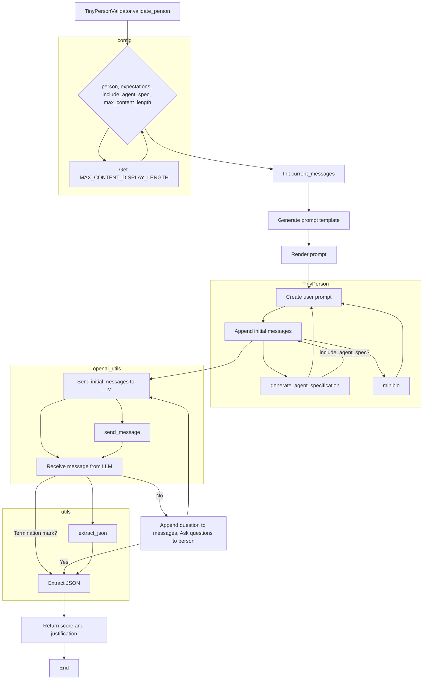

# <input code>

```python
import os
import json
import chevron
import logging

from tinytroupe import openai_utils
from tinytroupe.agent import TinyPerson
from tinytroupe import config
import tinytroupe.utils as utils

default_max_content_display_length = config["OpenAI"].getint("MAX_CONTENT_DISPLAY_LENGTH", 1024)


class TinyPersonValidator:

    @staticmethod
    def validate_person(person, expectations=None, include_agent_spec=True, max_content_length=default_max_content_display_length):
        """
        Validate a TinyPerson instance using OpenAI's LLM.

        This method sends a series of questions to the TinyPerson instance to validate its responses using OpenAI's LLM.
        The method returns a float value representing the confidence score of the validation process.
        If the validation process fails, the method returns None.

        Args:
            person (TinyPerson): The TinyPerson instance to be validated.
            expectations (str, optional): The expectations to be used in the validation process. Defaults to None.
            include_agent_spec (bool, optional): Whether to include the agent specification in the prompt. Defaults to True.
            max_content_length (int, optional): The maximum length of the content to be displayed when rendering the conversation.

        Returns:
            float: The confidence score of the validation process (0.0 to 1.0), or None if the validation process fails.
            str: The justification for the validation score, or None if the validation process fails.
        """
        # Initiating the current messages
        current_messages = []
        
        # Generating the prompt to check the person
        check_person_prompt_template_path = os.path.join(os.path.dirname(__file__), 'prompts/check_person.mustache')
        with open(check_person_prompt_template_path, 'r') as f:
            check_agent_prompt_template = f.read()
        
        system_prompt = chevron.render(check_agent_prompt_template, {"expectations": expectations})

        # use dedent
        import textwrap
        user_prompt = textwrap.dedent(
        """
        Now, based on the following characteristics of the person being interviewed, and following the rules given previously, 
        create your questions and interview the person. Good luck!

        """)

        if include_agent_spec:
            user_prompt += f"\n\n{person.generate_agent_specification()}"
        else:
            user_prompt += f"\n\nMini-biography of the person being interviewed: {person.minibio()}"


        logger = logging.getLogger("tinytroupe")

        logger.info(f"Starting validation of the person: {person.name}")

        # Sending the initial messages to the LLM
        current_messages.append({"role": "system", "content": system_prompt})
        current_messages.append({"role": "user", "content": user_prompt})

        message = openai_utils.client().send_message(current_messages)

        # What string to look for to terminate the conversation
        termination_mark = "```json"

        while message is not None and not (termination_mark in message["content"]):
            # Appending the questions to the current messages
            questions = message["content"]
            current_messages.append({"role": message["role"], "content": questions})
            logger.info(f"Question validation:\n{questions}")

            # Asking the questions to the person
            person.listen_and_act(questions, max_content_length=max_content_length)
            responses = person.pop_actions_and_get_contents_for("TALK", False)
            logger.info(f"Person reply:\n{responses}")

            # Appending the responses to the current conversation and checking the next message
            current_messages.append({"role": "user", "content": responses})
            message = openai_utils.client().send_message(current_messages)

        if message is not None:
            json_content = utils.extract_json(message['content'])
            # read score and justification
            score = float(json_content["score"])
            justification = json_content["justification"]
            logger.info(f"Validation score: {score:.2f}; Justification: {justification}")
            
            return score, justification
        
        else:
            return None, None
```

# <algorithm>

**Шаг 1:** Инициализируются пустой список `current_messages` для хранения диалога с LLM и переменная `max_content_length`.
**Шаг 2:** Формируется запрос `system_prompt` к LLM, используя шаблон `check_agent_prompt_template` и, при необходимости, ожидания (`expectations`).
**Шаг 3:** Создается пользовательский запрос `user_prompt`, который включает в себя мини-биографию персонажа `person`.
**Шаг 4:** Записываются сообщения `system_prompt` и `user_prompt` в список `current_messages`.
**Шаг 5:**  Отправляются сообщения `current_messages` к LLM.
**Шаг 6:** Цикл продолжается до тех пор, пока получен ответ от LLM не содержит маркер окончания `termination_mark` ("```json").
    * Внутри цикла:
        * Извлекается вопрос из ответа LLM, добавляется к `current_messages`
        * Объект `person` отвечает на вопрос.
        * Ответ `person` добавляется к `current_messages`
        * Получается следующий ответ от LLM, и цикл повторяется
**Шаг 7:** После цикла, если ответ от LLM содержит `termination_mark`:
    * Извлекается JSON с оценкой и обоснованием.
    * Возвращаются оценка и обоснование.
**Шаг 8:** Иначе возвращает `None` и `None`.

**Пример:**

Предположим, `person` - это объект с именем "Alice" и мини-биографией "Она - программист".
`expectations` = "Проверьте коммуникативные навыки".
Тогда `user_prompt` будет содержать "Now...Alice, she is a programmer" и вопросы от LLM.

# <mermaid>



# <explanation>

**Импорты:**

* `os`, `json`, `chevron`, `logging`: Стандартные библиотеки Python для работы с файлами, JSON, шаблонами, логированием.
* `openai_utils`: Модуль, вероятно, из проекта, предоставляющий интерфейс к OpenAI API.
* `TinyPerson`: Класс из модуля `tinytroupe.agent`, представляющий персонажа.
* `config`: Модуль, вероятно, из проекта, содержащий конфигурационные данные (в данном случае, настройки для OpenAI).
* `tinytroupe.utils`: Модуль, вероятно, из проекта, предоставляющий вспомогательные функции.

**Классы:**

* `TinyPersonValidator`: Класс, отвечающий за валидацию экземпляров класса `TinyPerson` с помощью LLM. `@staticmethod` указывает, что метод `validate_person` является статическим методом, то есть его не нужно вызывать через экземпляр класса.

**Функции:**

* `validate_person`:  Валидирует `TinyPerson` на основе ответов LLM. Принимает `person`, `expectations` (для настройки валидации), `include_agent_spec` (флаг включения спецификации агента) и `max_content_length`. Возвращает кортеж (`score`, `justification`) или `None`.

**Переменные:**

* `default_max_content_display_length`: Максимальная длина контента для отображения. Получается из конфигурации.
* `current_messages`: Список, хранящий сообщения для LLM.
* `check_person_prompt_template_path`: Путь к файлу с шаблоном запроса к LLM.
* `check_agent_prompt_template`: Содержимое шаблона запроса.
* `system_prompt`: Запрос к LLM, сформированный с использованием `chevron` на основе шаблона.
* `user_prompt`: Запрос, содержащий контекст для LLM.
* `logger`: Объект для ведения журнала.
* `termination_mark`: Маркер для остановки цикла.
* `json_content`, `score`, `justification`: Переменные для хранения данных, полученных от LLM.


**Возможные ошибки/улучшения:**

* **Обработка исключений:**  Добавление `try...except` блоков для обработки потенциальных ошибок при работе с файлами, JSON, API OpenAI.
* **Улучшение логирования:**  Более подробное логирование, включая информацию о статусе LLM-запроса.
* **Обработка ошибок `TinyPerson`:** Проверка на корректность объекта `person` и обработка возможных исключений во время взаимодействия с ним.
* **Оптимизация цикла:** Если общение с LLM занимает много времени, можно рассмотреть методы асинхронной обработки.
* **Управление состоянием `person`:**  Возможно, нужно сохранять состояние `person` между итерациями цикла, чтобы избегать повторного получения информации.


**Взаимосвязи с другими частями проекта:**

Метод `validate_person` использует классы `TinyPerson` и `openai_utils` из других модулей проекта, а также вспомогательные функции из `tinytroupe.utils`.  Функция `person.listen_and_act` предполагает, что `TinyPerson` имеет методы для взаимодействия с внешним миром. Все это показывает, что данный код является частью более крупного проекта, связанного с обработкой и валидацией персонажей.