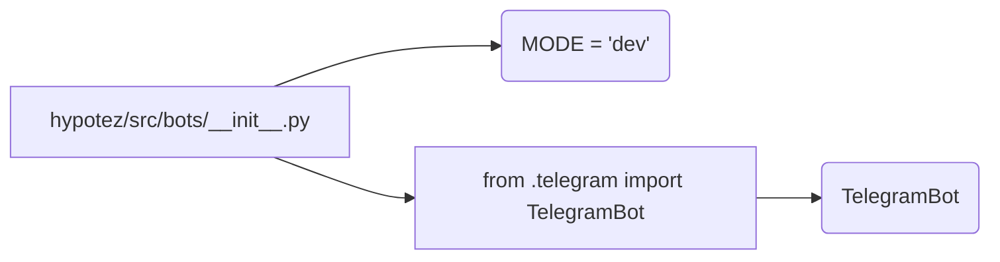

# <input code>

```python
## \file hypotez/src/bots/__init__.py
# -*- coding: utf-8 -*-
#! venv/Scripts/python.exe
#! venv/bin/python/python3.12

"""
.. module: src.bots 
	:platform: Windows, Unix
	:synopsis:

"""
MODE = 'dev'


from .telegram import TelegramBot
```

# <algorithm>

Этот код является файлом инициализации модуля `bots` внутри проекта `hypotez`.  Он определяет константу `MODE` с значением 'dev' и импортирует класс `TelegramBot` из подмодуля `telegram`.  Блок-схема будет простой, поскольку в файле нет логики обработки данных или вызовов функций.

1. **Инициализация:** Модуль `bots` инициализируется.
2. **Константа `MODE`:** Переменной `MODE` присваивается строковое значение 'dev'.
3. **Импорт `TelegramBot`:** Модуль `bots` импортирует класс `TelegramBot` из подмодуля `telegram`.

Пример использования (вне данного файла):

```python
from hypotez.src.bots import TelegramBot
# Далее можно создавать экземпляры TelegramBot и использовать их методы
bot = TelegramBot()
```

Данные не передаются между функциями или классами внутри этого файла.


# <mermaid>



В данном случае, `TelegramBot` является классом, определённым в модуле `hypotez/src/telegram.py`.


# <explanation>

* **Импорты:**
    * `from .telegram import TelegramBot`: Этот импорт подключает класс `TelegramBot` из подмодуля `telegram`, который, скорее всего, находится в директории `hypotez/src/bots/telegram.py`.  Символ `.` указывает на поиск файла `telegram.py` внутри текущего пакета (`bots`). Это стандартный подход для импорта модулей внутри пакета Python.

* **Классы:**
    * `TelegramBot`:  Этот класс не определён в данном файле.  Он импортируется из файла `hypotez/src/bots/telegram.py` и, предположительно, содержит код для работы с ботом Telegram.

* **Функции:**  Нет функций.

* **Переменные:**
    * `MODE`:  Это константа, хранящая строковое значение, вероятно, определяющее режим работы бота (например, 'dev', 'prod').


**Возможные ошибки или улучшения:**

* Отсутствие документации для `TelegramBot` — это хороший случай для добавления docstrings к классу `TelegramBot` в `hypotez/src/bots/telegram.py`.  Это позволит другим разработчикам понять его назначение и как им пользоваться.

**Цепочка взаимосвязей:**

Этот файл является частью модуля `bots`, который, вероятно, взаимодействует с другими частями проекта, такими как модули обработки данных, конфигурации и т.д., через класс `TelegramBot`. Например, чтобы отправить сообщение, класс `TelegramBot` должен получить данные от других частей проекта.


В целом, код инициализирует модуль и импортирует необходимый класс для дальнейшей работы с ботом Telegram.   В `telegram.py` нужно будет больше кода, чтобы `TelegramBot` был функциональным.