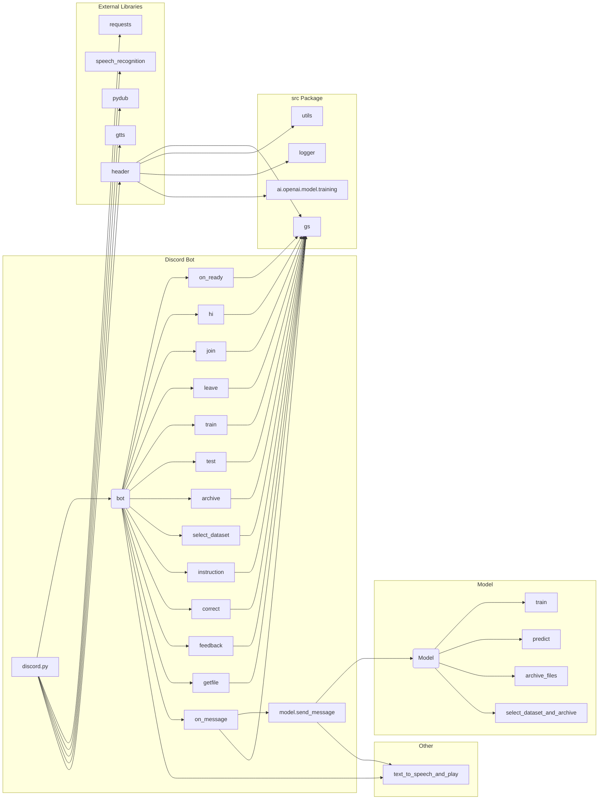

# <input code>

```python
## \file hypotez/src/bots/discord/discord_bot_trainger.py
# -*- coding: utf-8 -*-\
#! venv/Scripts/python.exe
#! venv/bin/python/python3.12

"""
.. module: src.bots.discord 
	:platform: Windows, Unix
	:synopsis:

"""
MODE = 'dev'


"""
	:platform: Windows, Unix
	:synopsis:

"""


"""
	:platform: Windows, Unix
	:synopsis:

"""


"""
  :platform: Windows, Unix

"""
"""
  :platform: Windows, Unix
  :platform: Windows, Unix
  :synopsis:
"""MODE = 'dev'
  
""" module: src.bots.discord """


import discord
from discord.ext import commands
from pathlib import Path
import tempfile
import asyncio
import header
from src import gs
from src.ai.openai.model.training import Model
from src.utils import j_loads, j_loads_ns, j_dumps
from src.logger import logger
import speech_recognition as sr  # Библиотека для распознавания речи
import requests  # Для скачивания файлов
from pydub import AudioSegment  # Библиотека для конвертации аудио
from gtts import gTTS  # Библиотека для текстового воспроизведения
from .chatterbox import *

# Указываем путь к ffmpeg
path_to_ffmpeg = str(fr"{gs.path.bin}\\ffmpeg\\bin\\ffmpeg.exe")
AudioSegment.converter = path_to_ffmpeg

# Command prefix for the bot
PREFIX = '!'

# Create bot object
intents = discord.Intents.default()
intents.message_content = True
intents.voice_states = True
bot = commands.Bot(command_prefix=PREFIX, intents=intents)

# Create model object
model = Model()

@bot.event
async def on_ready():
    """Called when the bot is ready."""
    logger.info(f'Logged in as {bot.user}')

@bot.command(name='hi')
async def hi(ctx):
    """Welcome message."""
    logger.info(f'hi({ctx})')
    await ctx.send('HI!')
    return True

# ... (rest of the code)
```

# <algorithm>

**Пошаговая блок-схема:**

1. **Инициализация:**
   - Импортируются необходимые библиотеки (discord.py, pathlib, asyncio, etc.).
   - Настраиваются переменные: `MODE`, `PREFIX`, `intents`.
   - Создается объект бота `bot` с указанным префиксом и разрешениями.
   - Создается объект модели `model`.
   - Устанавливается путь к ffmpeg.
2. **Обработка события `on_ready`:**
   - Выводится сообщение в лог, когда бот подключился.
3. **Обработка команд:**
   - `hi`: Отправляет приветствие.
   - `join`: Подключается к голосовому каналу пользователя.
   - `leave`: Отключается от голосового канала.
   - `train`:  
      - Принимает данные для обучения. Если прикреплено аудио, загружает его.
      - Вызывает метод `train` у объекта `model`, передавая ему данные.
      - Отправляет уведомление пользователю о статусе начала обучения.
   - `test`: Тестирует модель на данных и отправляет результат.
   - `archive`: Архивирует файлы в указанной директории.
   - `select_dataset`: Выбирает набор данных для обучения и архивирует его.
   - `instruction`: Выводит инструкции из файла.
   - `correct`:  Обрабатывает исправление ответа, записывает его в `corrections_log.txt`.
   - `feedback`: Обрабатывает фидбек и сохраняет его.
   - `getfile`: Прикрепляет файл к сообщению.
   - `on_message`: Обрабатывает все входящие сообщения:
      - Игнорирует сообщения от самого себя.
      - Обрабатывает команды, если они начинаются с префикса.
      - Если прикреплен аудио файл, распознает речь и отправляет запрос модели.
      - Если нет прикрепленного файла, отправляет сообщение модели.
      - Если пользователь в голосовом канале, воспроизводит ответ через `text_to_speech_and_play`.
      - Иначе отправляет ответ в текстовый канал.

4. **Функция `text_to_speech_and_play`:**
   - Преобразует текст в аудио.
   - Подключается к голосовому каналу пользователя.
   - Воспроизводит аудио.
   - Отключается от голосового канала.


**Пример потока данных для `train`:**

```
Пользователь -> send(train) -> ctx
ctx -> train -> model.train(data)
model.train -> job_id
job_id -> ctx -> send("Model training started...")
```

# <mermaid>



# <explanation>

**Импорты:**

- `discord`, `commands`:  Библиотеки для работы с Discord API.
- `pathlib`: Работа с путями к файлам.
- `tempfile`: Создание временных файлов.
- `asyncio`: Асинхронная работа.
- `header`: Вероятно, содержит конфигурацию или вспомогательные функции.
- `gs`:  Возможно, это модуль для работы с Google Cloud Services или собственным хранилищем конфигурации. Необходимо проверить содержимое `gs`.
- `Model`: Класс для работы с моделью AI (скорее всего, OpenAI).
- `j_loads`, `j_loads_ns`, `j_dumps`: Возможно, вспомогательные функции для работы с JSON.
- `logger`: Вероятно, модуль для логирования.
- `speech_recognition`, `requests`, `pydub`, `gtts`: Библиотеки для распознавания речи, скачивания файлов, обработки аудио, и синтеза речи.
- `.chatterbox`: Вероятно, содержит дополнительные функции для взаимодействия с чатботом.


**Классы:**

- `Model`:  Основной класс для взаимодействия с моделью. Конкретные методы для обучения (`train`), предсказания (`predict`), обработки ошибок (`handle_errors`), и архивирования файлов (`archive_files`) и сохранения данных (`save_job_id`).  Взаимодействие с моделью происходит через вызовы методов `send_message`.


**Функции:**

- `on_ready()`: Вызывается, когда бот готов к работе.
- `hi(ctx)`: Приветствие.
- `join(ctx)`: Подключение к голосовому каналу.
- `leave(ctx)`: Отключение от голосового канала.
- `train(ctx, data, data_dir, positive, attachment)`: Обучение модели. Обрабатывает файлы-приложения для обучения. Важно проверить корректность обработки `data` и `data_dir`.
- `test(ctx, test_data)`: Тестирование модели.
- `archive(ctx, directory)`: Архивирует файлы.
- `select_dataset(ctx, path_to_dir_positive, positive)`: Выбор набора данных и его архивирование.
- `instruction(ctx)`: Отображение инструкций.
- `correct(ctx, message_id, correction)`: Коррекция ответа. Запись исправлений в `corrections_log.txt`.
- `store_correction(original_text, correction)`: Сохранение коррекции в файл.
- `feedback(ctx, feedback_text)`: Обработка фидбека.
- `getfile(ctx, file_path)`: Отправка файла по указанному пути.
- `text_to_speech_and_play(text, channel)`:  Преобразование текста в речь и воспроизведение в голосовом канале. Отлично реализовано, но можно добавить проверку на наличие `voice_client`.
- `recognizer(audio_url, language= 'ru-RU')`:  Функция распознавания речи, закомментирована. Нужно ее использовать если используется скачивание аудио с внешних ресурсов.

**Переменные:**

- `MODE`: Режим работы бота ('dev' в данном случае).
- `PREFIX`: Префикс команд.
- `intents`: Параметры для взаимодействия Discord.
- `bot`: Объект бота.
- `model`: Объект модели.


**Возможные ошибки и улучшения:**

- **Обработка ошибок:** Не хватает обработки некоторых исключений, особенно при работе с файлами и внешними ресурсами.
- **Распознавание речи:** Закомментированный код распознавания речи можно реализовать для поддержки аудио файлов.
- **Загрузка файлов:** Важно проверять существование файлов и обрабатывать ситуации, когда файл не найден.
- **Конвертация аудио:** Проверять формат загружаемого аудио.
- **Логирование:** Логирование улучшено, но можно добавить больше информации, например, время запроса и параметры.
- **Рефакторинг `text_to_speech_and_play`:** Добавить проверку на наличие `voice_channel` перед воспроизведением.
- **Проверка параметров `data` и `data_dir` при обучении.**
- **Более подробное логирование ошибок модели.**
- **Документация:** Добавить документацию к методам класса `Model` и другим функциям.

**Взаимосвязи с другими частями проекта:**

Код зависит от `src.bots.discord.chatterbox`, `src.ai.openai.model.training`, `src`, `gs`, `utils`, и `logger`.  Необходимо изучить структуры этих модулей для полного понимания взаимодействия.  Без понимания `gs` сложно оценить полностью логику работы.