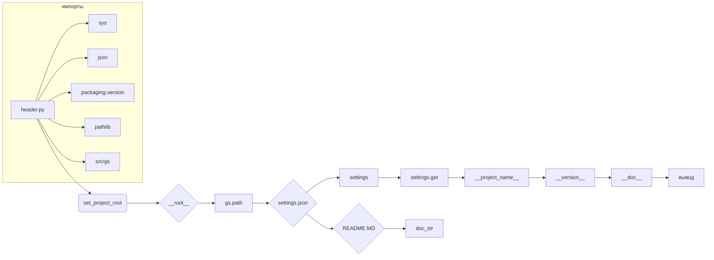

```MD
# <input code>

```python
## \file hypotez/src/bots/discord/header.py
# -*- coding: utf-8 -*-\
#! venv/Scripts/python.exe
#! venv/bin/python/python3.12

"""
.. module: src.bots.discord 
	:platform: Windows, Unix
	:synopsis:

"""
MODE = 'dev'

"""
	:platform: Windows, Unix
	:synopsis:

"""


"""
	:platform: Windows, Unix
	:synopsis:

"""


"""
  :platform: Windows, Unix

"""
"""
  :platform: Windows, Unix
  :platform: Windows, Unix
  :synopsis:
"""MODE = 'dev'
  
""" module: src.bots.discord """

import sys
import json
from packaging.version import Version

from pathlib import Path
def set_project_root(marker_files=('pyproject.toml', 'requirements.txt', '.git')) -> Path:
    """
    Finds the root directory of the project starting from the current file's directory,
    searching upwards and stopping at the first directory containing any of the marker files.

    Args:
        marker_files (tuple): Filenames or directory names to identify the project root.
    
    Returns:
        Path: Path to the root directory if found, otherwise the directory where the script is located.
    """
    __root__:Path
    current_path:Path = Path(__file__).resolve().parent
    __root__ = current_path
    for parent in [current_path] + list(current_path.parents):
        if any((parent / marker).exists() for marker in marker_files):
            __root__ = parent
            break
    if __root__ not in sys.path:
        sys.path.insert(0, str(__root__))
    return __root__


# Get the root directory of the project
__root__ = set_project_root()
"""__root__ (Path): Path to the root directory of the project"""

from src import gs

settings:dict = None
try:
    with open(gs.path.root / 'src' /  'settings.json', 'r') as settings_file:
        settings = json.load(settings_file)
except (FileNotFoundError, json.JSONDecodeError):
    ...

doc_str:str = None
try:
    with open(gs.path.root / 'src' /  'README.MD', 'r') as settings_file:
        doc_str = settings_file.read()
except (FileNotFoundError, json.JSONDecodeError):
    ...


__project_name__ = settings.get("project_name", 'hypotez') if settings  else 'hypotez'
__version__: str = settings.get("version", '')  if settings  else ''
__doc__: str = doc_str if doc_str else ''
__details__: str = ''
__author__: str = settings.get("author", '')  if settings  else ''
__copyright__: str = settings.get("copyrihgnt", '')  if settings  else ''
__cofee__: str = settings.get("cofee", "Treat the developer to a cup of coffee for boosting enthusiasm in development: https://boosty.to/hypo69")  if settings  else "Treat the developer to a cup of coffee for boosting enthusiasm in development: https://boosty.to/hypo69"
```

# <algorithm>

1. **Инициализация:**
    * Определяется константа `MODE`.
    * Определяется функция `set_project_root`.

2. **Поиск корневой директории проекта:**
    * Начальная директория устанавливается как директория текущего файла.
    * Цикл проходит по родительским директориям, пока не найдет директорию, содержащую один из файлов из `marker_files`.
    * Если корневая директория найдена, она добавляется в `sys.path`.
    * Возвращается корневая директория.

3. **Чтение настроек:**
    * Вызывается функция `set_project_root` для получения корня проекта.
    * Файл `settings.json` в корне проекта читается.
    * Если файл найден, данные из него парсятся с помощью `json.load`.
    * В противном случае, переменная `settings` остается `None`.

4. **Чтение документации:**
    * Файл `README.MD` в корне проекта читается.
    * Если файл найден, его содержимое сохраняется в переменную `doc_str`.
    * В противном случае, переменная `doc_str` остается `None`.

5. **Извлечение метаданных:**
    * Метаданные (`project_name`, `version`, `author`, `copyright`, `cofee`) извлекаются из словаря `settings`.
    * Если `settings` `None`, используются значения по умолчанию.
    * Метаданные сохраняются в переменные.

**Пример:** Если `pyproject.toml`, `requirements.txt` и `.git` находятся в директории выше текущего файла, `set_project_root` вернет путь к этой директории.  Данные из `settings.json` будут загружены, если файл существует, иначе `settings` будет `None`.  `__project_name__`, `__version__` и т.д. будут соответствующим образом инициализированы.

# <mermaid>



# <explanation>

**Импорты:**

- `sys`: предоставляет доступ к системным переменным и функциям.
- `json`: используется для работы с JSON-файлами.
- `packaging.version`: используется для работы с версиями пакетов.
- `pathlib`: предоставляет объектно-ориентированный способ работы с файлами и директориями.
- `src.gs`: предполагается, что это модуль, предоставляющий пути к файлам проекта.

**Классы:**

Нет определенных классов.

**Функции:**

- `set_project_root(marker_files=...)`:  Ищет корень проекта, начиная с текущей директории и ищет файлы в указанных `marker_files`.  Это полезно для определения корня проекта, независимо от того, как скрипт запущен.  Важно, чтобы эти файлы были в корневом каталоге проекта.


**Переменные:**

- `MODE`: строковая константа, вероятно, для определения режима работы (например, 'dev', 'prod').
- `__root__`: путь к корню проекта.
- `settings`: словарь с настройками проекта, загружаемый из `settings.json`.
- `doc_str`: содержимое файла `README.MD`.
- `__project_name__`, `__version__`, `__doc__`, `__details__`, `__author__`, `__copyright__`, `__cofee__`:  переменные с метаданными проекта, полученные из `settings`.

**Возможные ошибки или области для улучшений:**

- Обработка ошибок при чтении `settings.json` и `README.MD` более тщательная.  Использование `try...except` блока улучшает устойчивость кода.
- Документация к функциям может быть более подробной.
- Проверка наличия файлов `settings.json` и `README.MD` может быть сделана более явным образом для лучшей читаемости.
- Модуль `gs` не описан, поэтому трудно оценить, как он работает и как он связан с остальной частью проекта.  Необходимы дополнительные сведения о том, что содержит этот модуль.

**Взаимосвязи с другими частями проекта:**

Код извлечен из файла `header.py` в проекте `hypotez`.  Он использует модуль `gs`, который, по-видимому, предоставляет функции для работы с путями проекта. `settings.json` содержит настройки проекта, `README.MD` – документацию.  Код предполагает, что эти файлы находятся в корне проекта.