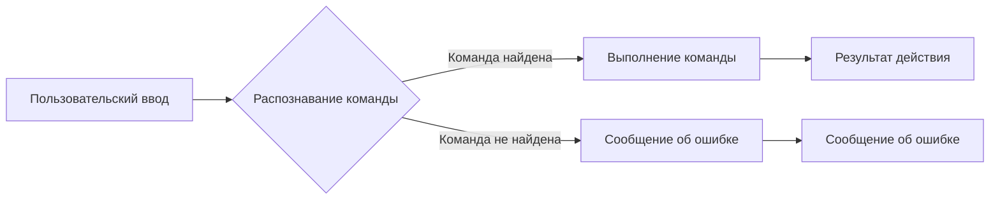

```MD
# Анализ кода

## <input code>

```
!hi: Greets the user.
!train <data> <data_dir> <positive> <attachment>: Trains the model with the provided data. Use data for a file, data_dir for a directory, or attachment for a file attachment.
!test <test_data>: Tests the model with provided JSON test data.
!test <test_data>: Tests the model with provided JSON test data.
!archive <directory>: Archives files in the specified directory.
!select_dataset <path_to_dir_positive> <positive>: Selects a dataset for training from the specified directory.
!instruction: Displays this instruction message.
```

## <algorithm>

Этот код представляет собой список команд (или инструкций) для некоторой системы (вероятно, бота или приложения), каждая из которых имеет уникальный идентификатор и описание действия.  Нет пошаговой обработки данных, как в алгоритме сортировки, например.  Система просто выберет соответствующую команду по входящему запросу.

**Пример:** Если пользователь введет `!train my_data my_directory positive.txt`, то система распознает команду `!train` и выполнит связанное с ней действие по обучению модели.


## <mermaid>



## <explanation>

Этот код представляет собой список команд, скорее всего, для консольного бота или подобной системы. Каждая строка – это отдельная команда, определяемая префиксом `!`.  Эти команды похожи на "внешние" API-методы или функции.

* **`!hi`**:  Приветствует пользователя.
* **`!train`**: Обучает модель. Принимает на вход несколько аргументов: данные (`data`), путь к директории с данными (`data_dir`), метки положительных (`positive`) и, возможно, вложение (`attachment`).
* **`!test`**: Тестирует модель с предоставленными JSON-данными для тестирования (`test_data`).
* **`!archive`**: Архивирует файлы в указанной директории (`directory`).
* **`!select_dataset`**: Выбирает набор данных для обучения из указанной директории (`path_to_dir_positive`) с метками (`positive`).
* **`!instruction`**: Отображает данное сообщение с инструкцией.

**Импорты:**  Нет импортов. Это скорее список доступных команд, а не код с импортами.


**Классы:** Нет классов.


**Функции:**  Нет явных функций. Это скорее определение команд для обработки.


**Переменные:**  Нет переменных.  Аргументы команд (например, `data`, `data_dir`) – входные параметры для системы, а не переменные внутри кода.


**Возможные ошибки и улучшения:**

* **Обработка ошибок:** Нет указаний, как система будет обрабатывать некорректные вводы (например, отсутствие требуемого аргумента).
* **Логика выполнения:** Нет информации о том, *как* каждая команда выполняется.  Потребуется дополнительный код для обработки указанных действий.
* **Структурирование:** Для больших систем команд полезно иметь структурированный способ описания и обработки команд (например, с использованием словарей или других структур данных).

**Цепочка взаимосвязей:**  Код не связан с другими частями проекта (файлами или модулями) так, как это указано.  Он описывает функциональность *для* какой-то системы.  Система должна иметь код, который распознаёт и обрабатывает эти команды.