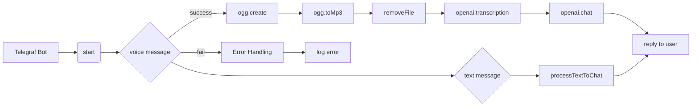

# Анализ кода Telegram бота

## <input code>

```javascript
import { Telegraf } from 'telegraf'
import { message } from 'telegraf/filters'
import { code } from 'telegraf/format'
import config from 'config'
import { ogg } from './ogg.js'
import { openai } from './openai.js'
import { removeFile } from './utils.js'

const bot = new Telegraf(config.get('TELEGRAM_TOKEN'))
bot.command('start', async(ctx) : {\n    await ctx.reply(JSON.stringify(ctx.message));\n})\n\nbot.on(message('voice'), async (ctx) : {\n    try {\n        await ctx.reply(code('Сообщение принял. Жду ответ от сервера...'))\n        const link = await ctx.telegram.getFileLink(ctx.message.voice.file_id)\n        const userId = String(ctx.message.from.id)\n        const oggPath = await ogg.create(link.href, userId)\n        const mp3Path = await ogg.toMp3(oggPath, userId)\n        removeFile(oggPath)\n        const text = await openai.transcription(mp3Path)\n        await ctx.reply(code(`запрос: ${text}`))\n        const messages = [{ role: openai.roles.USER, content: text }]\n        const response = await openai.chat(messages)\n        await ctx.reply(response.content)\n    } catch (e) {\n        console.error(`Error while proccessing voice message`, e.message)\n    } \n})\n\nbot.on(message('text'), async (ctx) : {\n    ctx.session ??= INITIAL_SESSION\n    try {\n        await ctx.reply(code('Сообщение принял. Жду ответ от сервера...'))\n        await processTextToChat(ctx, ctx.message.text)\n    } catch (e) {\n        console.log(`Error while voice message`, e.message)\n    }\n})\n\nbot.launch()\nprocess.once('SIGINT', () : bot.stop('SIGINT'))\nprocess.once('SIGTERM', () : bot.stop('SIGTERM'))
```

## <algorithm>

**Шаг 1:** Импортирует необходимые модули.  
**Шаг 2:** Создаёт экземпляр телеграм-бота с токеном.  
**Шаг 3:** Обрабатывает команду `/start`, отправляя в ответ JSON-представление сообщения.
**Шаг 4:** Обрабатывает голосовые сообщения (`message('voice')`):
    * Отправляет сообщение о принятии.
    * Получает ссылку на голосовое сообщение.
    * Преобразует голос в OGG, сохраняя с идентификатором пользователя.
    * Преобразует OGG в MP3.
    * Удаляет временный OGG-файл.
    * Переводит голос в текст с помощью API OpenAI.
    * Отправляет запрос в API OpenAI с полученным текстом.
    * Отправляет ответ пользователя.
**Шаг 5:** Обрабатывает текстовые сообщения (`message('text')`):
    * Инициализирует сессию, если она не задана.
    * Отправляет сообщение о принятии.
    * Вызывает `processTextToChat` для обработки текста.


## <mermaid>



## <explanation>

**Импорты:**

* `Telegraf`: Модуль для создания телеграм-ботов.
* `telegraf/filters`: Фильтры для обработки сообщений. `message` - фильтр, позволяющий обрабатывать только сообщения.
* `telegraf/format`: Модуль для форматирования выводимых сообщений. `code` - функция, которая позволяет отправлять сообщение в формате кода.
* `config`: Модуль для работы с конфигурацией (вероятно, `.env` или `.json`).  Получает токен телеграм бота.
* `ogg`: Модуль, вероятно, для преобразования аудио в формат OGG.
* `openai`: Модуль для взаимодействия с API OpenAI.
* `utils`: Модуль для общих задач, таких как удаление файлов.

**Классы:**

* `Telegraf`: Класс для создания и управления ботом.  Используется для инициализации бота с токеном и обработки сообщений.

**Функции:**

* `bot.command('start', ...)`: Обрабатывает команду `/start` и возвращает JSON-представление сообщения.
* `bot.on(message('voice'), ...)`: Обрабатывает голосовые сообщения. Эта функция содержит всю логику обработки голосового сообщения: загрузка, преобразование, отправка на сервер OpenAI и получение ответа.
* `bot.on(message('text'), ...)`: Обрабатывает текстовые сообщения.  Вызывает `processTextToChat`,  предполагается, что эта функция отвечает за дальнейшую обработку текста.
* `ogg.create`, `ogg.toMp3`: Функции для преобразования аудио в OGG и MP3.
* `removeFile`: Функция для удаления файлов.
* `openai.transcription`, `openai.chat`: Функции для взаимодействия с API OpenAI для транскрипции голоса и отправки сообщений в чат.

**Переменные:**

* `bot`: Экземпляр класса `Telegraf`.
* `config.get('TELEGRAM_TOKEN')`: Токен телеграм-бота, полученный из файла конфигурации.
* `userId`: Идентификатор пользователя, полученный из сообщения.
* `oggPath`, `mp3Path`: Пути к временным файлам OGG и MP3.
* `text`: Текст, полученный из транскрипции.
* `messages`: Массив сообщений для API OpenAI.
* `response`: Ответ от API OpenAI.

**Возможные ошибки/улучшения:**

* **Обработка ошибок:** Код содержит `try...catch`, но обработка ошибок не очень детальная,  необходимо добавлять более понятные сообщения об ошибках. Например,  при неудачной транскрипции или некорректном ответе от OpenAI.
* **Управление файлами:**  Важно обеспечить безопасное удаление временных файлов (`oggPath` и `mp3Path`),  чтобы избежать утечек памяти или конфликтов.
* **`processTextToChat`:**  Функция не определена, необходимо добавить её описание и реализацию.
* **`INITIAL_SESSION`:** Не определена.  Нужно знать, что это за переменная.
* **Безопасность:** Необходимо учитывать безопасность,  предотвращать уязвимости XSS и SQL injection, особенно если данные из запроса используются в последующих операциях.


**Взаимосвязь с другими частями проекта:**

* `ogg.js`, `openai.js`, `utils.js`: Эти файлы являются частью проекта и, вероятно, содержат функции для преобразования аудио, взаимодействия с API OpenAI и вспомогательные функции, соответственно.  Связь – использование экспортированных функций из этих модулей.

**Заключение:**

Код реализует телеграм-бота, который транскрибирует голосовые сообщения, отправляет их на сервер OpenAI и получает ответ, который отправляет пользователю. Код хорошо структурирован, но требует улучшения обработки ошибок и безопасности.